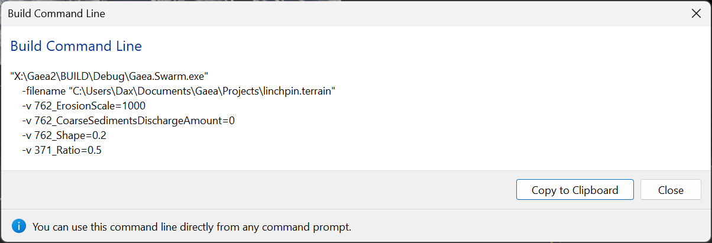

# Command Line Automation

Gaea's Build Swarm (`Gaea.Swarm.exe`) can be automated via the command line interface.

See [command-line-interface.md](../../getting-started/command-line-interface.md "mention") for details on the full CLI available in both Gaea.exe and Gaea.Swarm.exe&#x20;

## Arguments

The Build Swarm can accept the following arguments:

<table><thead><tr><th width="265" valign="top">Argument</th><th>Description</th></tr></thead><tbody><tr><td valign="top"><code>-filename &#x3C;filename></code></td><td>The fully qualified path to the .terrain file that should be built. It should be wrapped <code>""</code> quotes for safety.</td></tr><tr><td valign="top"><code>-interactive</code></td><td>Show interactive prompts when launched from the CLI.</td></tr><tr><td valign="top"><code>-ignorecache</code></td><td>Ignore baked cache when set to <code>true</code>.</td></tr><tr><td valign="top"><code>-verbose</code></td><td>Enable Verbose logging for diagnostics purposes.</td></tr><tr><td valign="top"><code>-safemode</code></td><td>Enforce Sade Mode for debugging or diagnostics purposes. Not recommended for production builds.</td></tr><tr><td valign="top"><code>-seed &#x3C;int></code></td><td>Mutation seed to use for the build.</td></tr><tr><td valign="top"><code>-v</code> or <code>--v</code></td><td><p>Variables. This argument marks the beginning of key-value pairs of variables.<br><br><span data-gb-custom-inline data-tag="emoji" data-code="26a0">⚠️</span> <em>This must ALWAYS be the last argument. All other switches and arguments should precede</em> <code>-v</code></p><p></p><p><span data-gb-custom-inline data-tag="emoji" data-code="26a0">⚠️</span> The <code>-v</code> argument must be repeated for each variable (key-value pair).<br><br>For example:</p><p><code>-v foo=bar -v value=0.35 -v erosion=1</code></p></td></tr><tr><td valign="top"><code>--va &#x3C;string></code></td><td><p>Comma separated variable values alphanumerically-sorted by variable names. Must include all values. This is to help reduce character count by not having to i</p><p></p><p>Variables passed this argument must be equal in count to the number of variables declared in the terrain file.</p></td></tr><tr><td valign="top"><code>-vars &#x3C;filename></code></td><td>Instead of <code>-v</code> the <code>-vars</code> argument can be used to pass a specifically formatted plain text or JSON file to provide Variable values.</td></tr></tbody></table>

<figure><figcaption></figcaption></figure>

The [build-options](../../using-gaea/build-and-export/build-options/ "mention") window has a helpful button to Show Command Line that will show the current file's Build Command Line including all variables. It is useful to copy this and then modify it as needed.


### Using Files for Variables

You can store variables in delimited files or JSON and pass them in the `-v` argument. This is useful for more complex automation where an external tool may save variables instead of passing them directly to a command line.

#### Text file

The text file is an INI style dictionary of key-value pairs.

```ini
variable=value
filename=C:\Path\File.ext
erosion=0.35
switchErosionProcess=1
```

#### JSON File

```json
{
  "variable": value,
  "filename": "C:\Path\File.ext",
  "erosion": 0.35,
  "switchErosionProcess": 1
}
```


Variable names cannot be repeated.


To see how variables can be bound to node properties, see [variables.md](../../developers/scripting-and-expressions/variables.md "mention")

