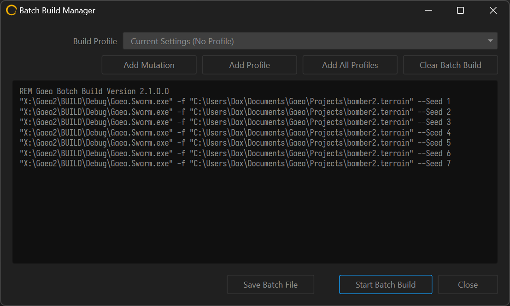

# Creating Mutations

Mutations are a great way to create multiple variations of the same terrain with minimal effort.

In its most basic form, mutations update the seeds used by all nodes in the terrain unless a node is baked. When you use the `--Seed <int>` command line argument, it increments each seed in every node by that amount.

This provides a clean and predictable way to generate multiple mutations.


To prevent specific nodes from being affected, you can try [baking-nodes](../../using-gaea/baking-nodes/ "mention").


### Using the Batch Build Manager

The fastest way to set up mutations, is to go to Build menu > Batch Build Manager and use the `Add Mutation` button to queue up as many mutations as you want.

<figure><figcaption></figcaption></figure>

If you find yourself repeating these builds, save the batch build as a Windows Batch (.bat) file.


Use the `[Mutation]` token in the [#build](../../using-gaea/build-and-export/build-options/#build "mention") Destination to add the current mutation as part of a folder name or subfolder.

For example:

`<Builds>\[Filename]\[+++]\[Mutation]`&#x20;

or&#x20;

`<Builds>\[Filename]\[Region]_[Mutation]`


