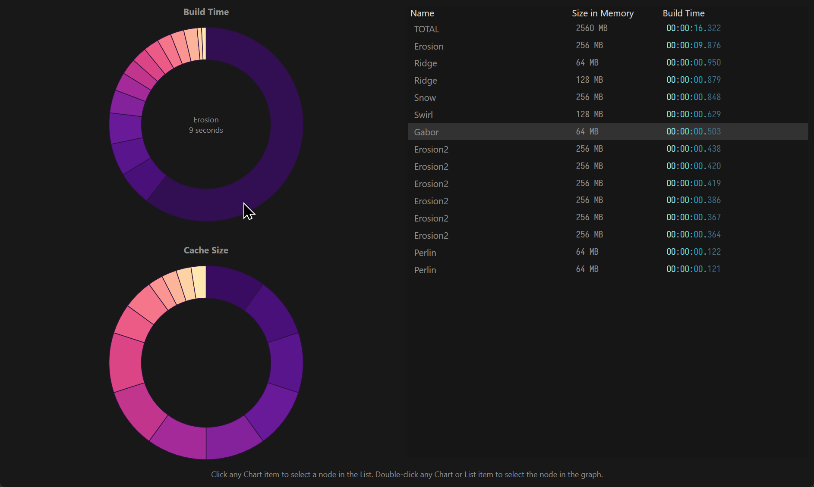
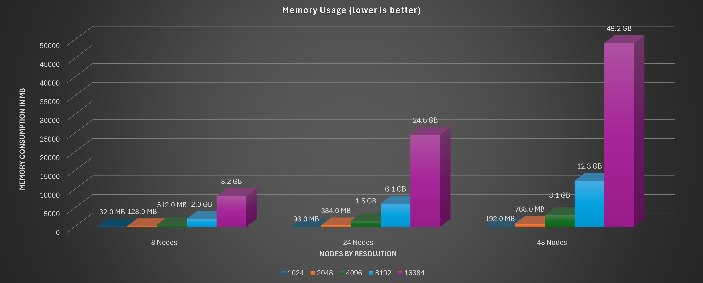
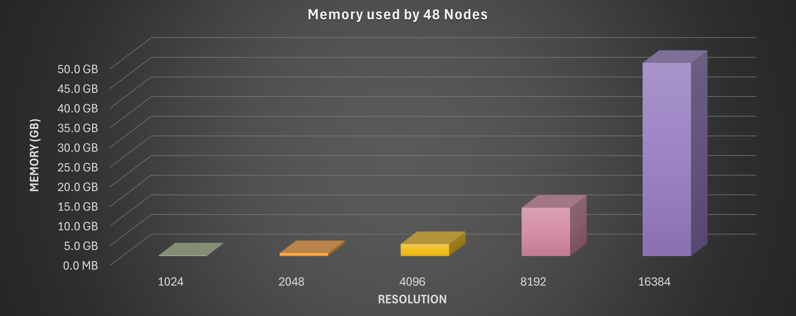
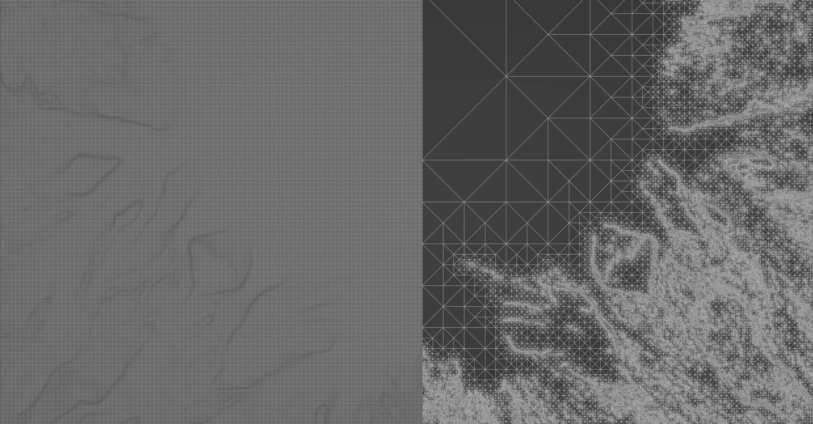

# Calculating Memory Requirements

## Understanding Memory Consumption

It is common to hear users say _"But I have an 8GB GPU"_ or _"But I have 64GB RAM"_ when a build fails. However, it is imperative to remember that, while terrains may seem like just simple objects, the procedural graph represents a LOT of data and this data takes up a lot of memory.

<figure><figcaption>
The Build Statistics window lets you keep an eye on how much time each node takes.
</figcaption></figure>

When working in a specific resolution, each node generates single channel (heightfield) or multichannel (RGB) data. The amount of data is multiplied by the number of output ports.

The table below describes the size of the cache of a single node at different resolutions.

<table data-full-width="false"><thead><tr><th align="center">Resolution</th><th align="right">Size in Memory (Heightfield)</th><th align="right">Size in Memory (RGB)</th></tr></thead><tbody><tr><td align="center">1024 x 1024</td><td align="right">4MB</td><td align="right">12MB</td></tr><tr><td align="center">2048 x 2048</td><td align="right">16MB</td><td align="right">48MB</td></tr><tr><td align="center">4096 x 4096</td><td align="right">64MB</td><td align="right">192MB</td></tr><tr><td align="center">8192 x 8192</td><td align="right">256MB</td><td align="right">768MB</td></tr><tr><td align="center">16384 x 16384</td><td align="right">1024MB</td><td align="right">3072MB</td></tr></tbody></table>

During the lifetime of a node's process, dozens - sometimes hundreds - of datasets may be created, altered, and discarded. This is one of the reasons why Gaea requires large amounts of memory when processing.

<figure><figcaption>
Allocated Memory readout in the Status Bar
</figcaption></figure>

Gaea's Status Bar shows the currently allocated memory in the bottom right corner of the screen. This updates every 5 seconds. However, it only counts the allocated cache - the amount used in between for temporary usage - so should only be considered an estimate.

## Working with Large Builds

### Excessive Nodes

<figure><figcaption>
Memory consumption increases 4X when you double the resolution.
</figcaption></figure>

The fewer nodes you use, the better. The higher number of nodes makes your graph more complex and slower to process. Also, each node takes up a certain amount of space. While Gaea tries to free up as much space as possible once a node is processed, it's not always possible to economize.


In all these examples, we are assuming that the node has a **single output port**. If it has multiple outputs, then the size of the node is increased.&#x20;

For example, at 4096 x 4096, **Ridge, Adjust,** or **Shaper** would be`64MB,`while **Erosion2** would be`256MB`because it has 4 output ports.


For a typical 8K terrain graph, if you use 20 nodes, you would have a cache size of 5-8GB. There would be some additional overhead for management and other processes. 16GB RAM would be the bare minimum amount that could handle this in theory. However, we recommend using 32GB to reduce the chances of paging (hard disk being used as RAM when memory runs out).

### Large Resolutions

<figure><figcaption>
Cache size requirements increase quadratically with resolution.
</figcaption></figure>

While 16K may not seem like much on the surface, the sheer processing power required for a relatively complex scene can overwhelm a computer. Using the table above, we can easily calculate that 20 nodes at 16K would require 20GB-30GB of memory for actual cache and up to 96GB of memory for the overall processing and management of the build.

This is why we recommend a minimum of 64GB RAM for processing 16K builds, increasing to 128GB whenever possible.

While Gaea would recycle memory in between, there would still be some large spikes.&#x20;

### Exporting Optimized Meshes

When exporting meshes, you can expect very large file sizes at higher resolutions. As terrain meshes use an equidistant grid system, it creates 1 vertex per pixel. So your 2048 x 2048 terrain will have 2048 (+1) x 2048 (+1) vertices. That's 4 million vertices!!

<figure><figcaption></figcaption></figure>

You can choose to export `Optimized` meshes when using the Mesher node. Our proprietary algorithms can help you reduce the polygon count based on the complexity of the terrain. This will budget more polygons where there are complex details and fewer polygons for flatter areas. This can lead to up to 60% reduction in polygon count in typical scenarios.

An additional way to reduce mesh size is to export a high resolution displacement map and a low resolution mesh. You can use the displacement map to add the additional details that would "cost" too much in polygons.

## How to Conserve Memory

* Break your project into multiple files - for example, terrain shape creation in one project and color production in another.
* [baking-nodes](../../using-gaea/baking-nodes/ "mention") allows you to offload large portions of data from active memory to disk.
* Try to use fewer nodes when possible. Use Modifiers instead of Nodes to reduce overhead.

