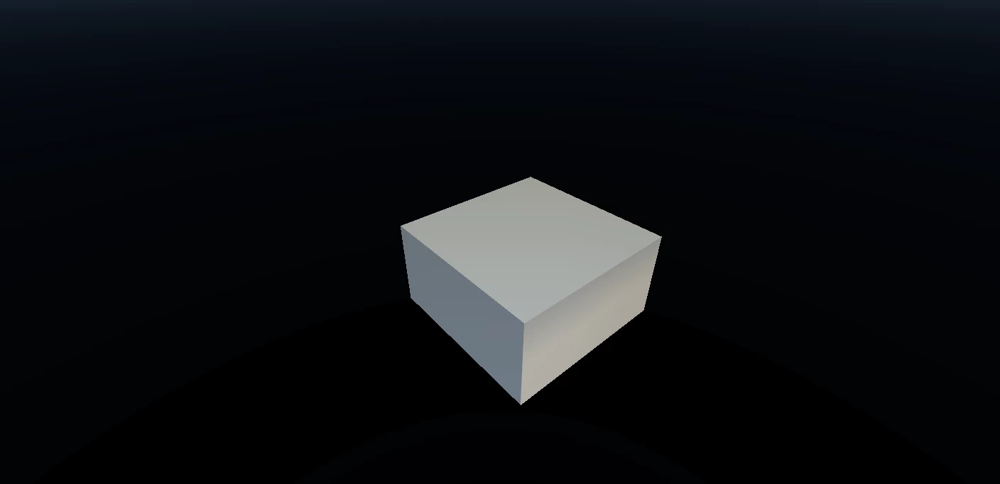

# Dimensions and Scale

### What is a pixel worth?

In Gaea, terrain is represented using a heightfield, which is essentially a grid of pixels where each pixel’s value (ranging from 0 to 1) corresponds to a specific elevation point on the terrain. This system allows Gaea to model the terrain’s slopes and elevations with high precision.

### Scale Philosophy

Gaea uses a vertical ratio to maintain scale. This is because we describe the world in meters (e.g., `5000m x 5000m x 2500m`) to retain a consistent scale, but we use pixels in specific sizes (e.g., `4096px x 4096px`) to store our data (as needed by CG applications) which is a finite and arbitrary unit which can't map to pixels. In addition, each pixel's value is stored as a high-precision decimal value (`0.005893f`) which is also an arbitrary, but ratio-based, unit.

Therefore, we use a simple formula to create and retain the height of the terrain:&#x20;

$$
\text{Compression Ratio} = \frac{\text{Height}}{\text{Scale}} = \frac{2500}{5000} = 0.5
$$

<figure><figcaption>
The default Gaea world is 5000m wide and 2500m tall, creating a perfect 0.5 ratio.
</figcaption></figure>

### Terrain Size and Height

**1. Size (Width and Sprawl)**

* **Size Specification**: In Gaea, you can specify the physical dimensions of the terrain, often referred to as the width or sprawl, in meters. This dimension determines the horizontal extent of the terrain.
* **Impact on Design**: Setting the size helps to define the scale of the landscape, affecting how terrain features like hills and valleys are spread across the terrain map.

**2. Height**

* **Height Values**: The heights within the heightfield are stored as values between 0 and 1. These values are scaled to represent the actual height range of your terrain in meters.
* **Example**: A height value of 0.5 in a terrain with a maximum elevation of 100 meters represents an elevation of 50 meters.

### Understanding Vertical Compression Ratio

**Vertical Compression Ratio = Height / Scale**

* **Height**: This is the maximum elevation difference in your terrain, from the lowest point (often represented as 0 in the heightfield) to the highest point (represented as 1).
* **Scale**: This refers to the specified horizontal dimensions of the terrain.

### **Purpose of the Compression Ratio**

* The vertical Compression Ratio helps maintain a realistic representation of vertical and horizontal scales. It ensures that the terrain’s vertical scale (elevation) is proportionate to its horizontal scale (width/sprawl).
* **Interpreting the Ratio**: A higher Compression Ratio indicates that the terrain features are more vertically exaggerated relative to their horizontal spread. Conversely, a lower ratio means the terrain is relatively flatter or more stretched out horizontally.

## Practical Example

Suppose you are creating a mountainous landscape:

* **Horizontal Size (Width/Sprawl)**: 2000 meters
* **Maximum Elevation (Height)**: 500 meters

The vertical compression ratio would be calculated as:

$$
\text{Compression Ratio} = \frac{\text{Height}}{\text{Scale}} = \frac{500}{2000} = 0.25
$$

This ratio tells us that for every 4 meters you move horizontally, there is a potential elevation change of 1 meter. This relatively low ratio indicates a gentle slope across the terrain.

### Importing a Mesh or Heightfield Object in your 3D App

**Scenario:** You have a terrain mesh exported from Gaea where the maximum height is set to a specific value and the horizontal dimensions are defined. You want to ensure the mesh retains realistic proportions when imported into a 3D CG application.

**Steps:**

1. **Import the Terrain Mesh**
   * Open your 3D CG application and import the mesh file (typically in formats like OBJ, FBX, or another application-specific format) that you exported from Gaea.
2. **Calculate the Vertical Compression Ratio**
   * Given **Height** (maximum vertical extent) and **Scale** (horizontal dimensions), compute the ratio. For example, if **Height** = 500 meters and **Scale** = 2000 meters, the ratio is (0.25).
3. **Adjust the Scale in Your 3D Application**
   * Select the imported mesh in your application.
   * Access the scaling tool or transformation properties.
   * Set the scale along the vertical axis (often Z-axis) to the calculated Compression Ratio (e.g., 0.25), making sure the terrain's vertical scale aligns with its real-world dimensions.
   * Keep the horizontal scales (X and Y axes) at their default (usually 1.0) to maintain the original width and sprawl.
4. **Apply the Scale**
   * Apply or confirm the scaling transformation. This step may vary by software; it typically involves confirming the scale adjustment through a transformation apply, freeze, or reset scale function.
5. **Verify and Adjust if Necessary**
   * Use tools available in your 3D application to check the terrain dimensions. This might include measuring tools or viewing properties that confirm the object's scale relative to the scene.
   * Adjust further if the visual scale does not seem realistic or consistent with the intended design.

By adhering to these steps, the imported terrain mesh will reflect accurate proportions and the visualization will maintain the intended topographical features and realism, regardless of the 3D CG software used.

### Tips for Users

* **Adjusting the Ratio**: You can manipulate the look and feel of your terrain by adjusting either the height or the sprawl. Increasing the height while keeping the sprawl constant will make the terrain steeper.
* **Visual Impact**: Use the Compression Ratio to guide the realism of your terrain. A ratio that closely matches real-world landscapes will yield more realistic results. A higher or lower ratio can be used to stylize the terrain according to specific artistic goals.

## Conclusion

Understanding and utilizing the vertical Compression Ratio in Gaea allows you to create terrains that are visually balanced and scaled appropriately for the intended application. By controlling the height and size parameters, you can effectively shape the overall character of your digital landscape.
