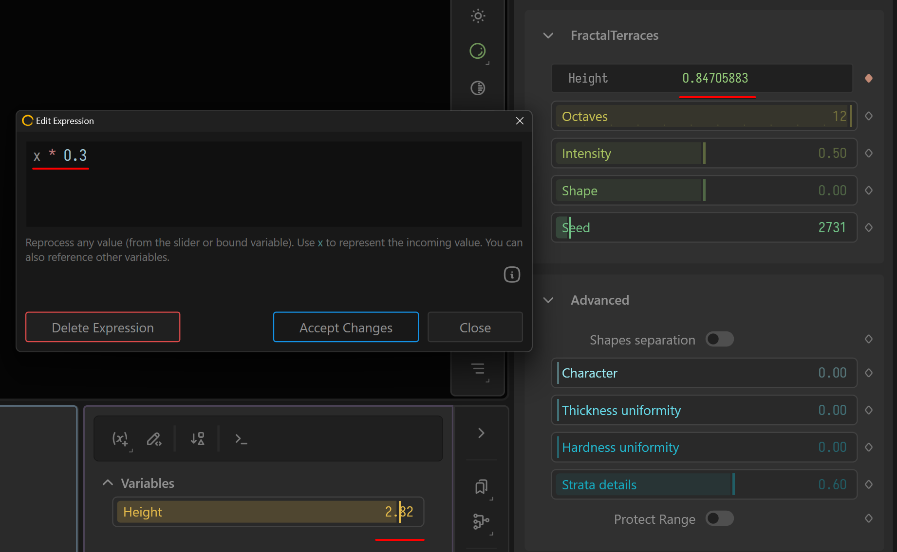

# Expressions

Expressions are modifiers applied to either a property, such as a slider, or to the variable bound to the property. It allows you to make modifications to the incoming value.

Unlike [variables.md](variables.md "mention"), Expressions are not centralized and reused. They exist on a single property.


At the moment, only Float (decimal) and Int (whole number) properties support Expressions.


## Create an Expression

Click the Property Binding menu next to a property and select Expression.&#x20;

<figure><figcaption></figcaption></figure>

This will bring up the Edit Expression dialog. In the expression, the slider's value is represented by `x` so any modifications you make to `x` will be applied to the property.

For example, let's say you want much finer control over your slider, then you can apply a multiplier of `0.01` to the value thereby reducing the value to 1% of its original.

<figure><figcaption></figcaption></figure>

### Modifying Variables

If your Slider is bound to a Variable, then `x` represents the variable. This is a powerful way of modifying a variable without having to create a second one.

For example, you have Mountain node with the `Height` property bound to a variable and then a FractalTerrace whose `Spacing` property is also bound to the same variable.

You want the Height of the FractalTerrace to be proportionally linked to the Height of the Mountain. So, you would enter the expression: <mark style="color:yellow;">`x * 0.3`</mark> so the FractalTerrace spacing is always 30% of the Mountain's height. This means no matter what the height, the FractalTerrace spacing remains consistently placed at the same location.

<figure><figcaption><p>The FractalTerrace spacing remains consistent no matter the height of the Mountain.</p></figcaption></figure>

<figure><figcaption><p>The expression takes the value of 2.82 and reduces it to 0.84.</p></figcaption></figure>

## Additional Functions and Strategies

You can also use other variables in your expressions by simply using their name as a variable.&#x20;

For example, if you have two variables called Height and Strength, you can create the expression:&#x20;

```
x * (Height / Strength)
```

Here are some additional ideas.

```clike
// Inverting the value:
         1 - x

// Dividing by other variable:
         x / Octaves

// Reducing the power:
         x * 0.01

// Use functions:
         median(Octaves, Ridge, Scale, Seed)

// Add with a random:
         random() + x

// If statements:
         if(SomeVar, 0.3, 0.6)
```

For a full list of available options, see [Broken link](broken-reference "mention")
