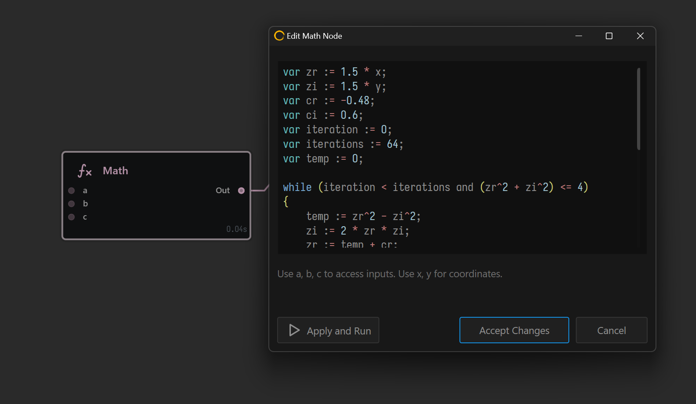

# Math Node

The Math node is a deceptively powerful node with a very simple interface. It is essentially a blank canvas for you to create any kind of mathematical functions or even complex algorithms.

<figure><figcaption></figcaption></figure>

The Math node can work standalone as a Generator, but can also accept up to 3 inputs. These inputs can be accessed as `a`,`b`,`c` respectively. Note, those are pre-defined variables and can't be used for any other purposes except to access data from the port.

You can also access coordinates per-pixel using `x` and `y` .

### Syntax and Functions

The Math node can accept the following.

```basic
// Mathematical operators
+, -, *, /, %, ^

// Equalities & Inequalities 
=, ==, <>, !=, <, <=, >, >=

// Assignment 
:=, +=, -=, *=, /=, %=

// Logical operators 
and, nand, nor, not, or, xor, xnor, mand, mor

// Functions
abs, avg, ceil, clamp, erf, erfc, exp, expm1, floor, frac,
hypot, iclamp, inrange, log, log10, log1p, log2, logn, max,
min, mod, mul, ncdf, pow, root, round, roundn, sgn, sqrt,
sum, swap, trunc, equal, not_equal

// Trigonometry
acos, acosh, asin, asinh, atan, atan2, atanh, cos, cosh,
cot, csc, sec, sin, sinc, sinh, tan, tanh, deg2rad,
rad2deg, deg2grad, grad2deg

// Control structures
if-then-else, ternary conditional, switch case, return-statement

// Loop structures
while loop, for loop, repeat until loop, break, continue

// Expression local variables, vectors and strings

// User defined variables, vectors, strings, constants and function support
```
