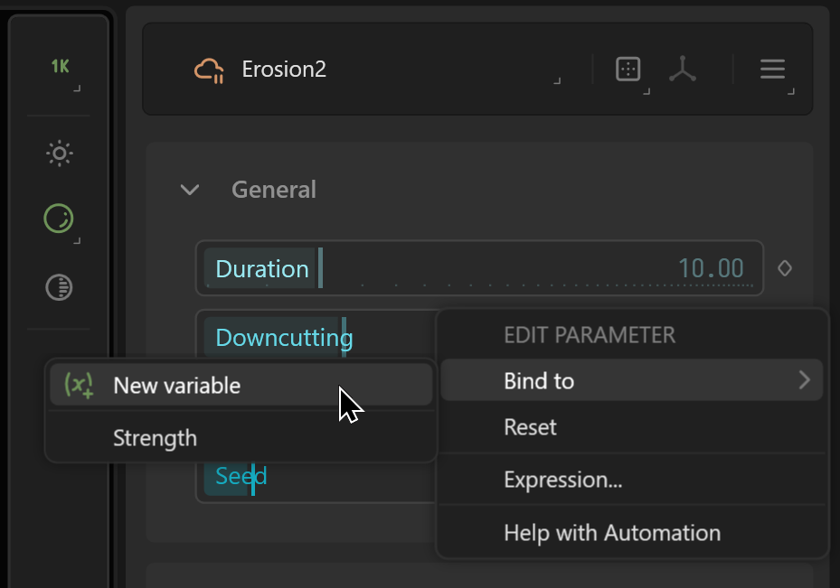

# Variables

Variables provide a "token" you can store values into, confine them to specific ranges, and then bind one or more node properties to them. This gives you an external way to control a node, and even create a concerted set of changes based on a single variable.

Gaea supports Float (decimal), Int (whole number), Choice (dropdowns), Color, Range (float2), and String. There is an additional Undefined variable type for advanced use and error handling.

## Creating a Variable

There are two ways to create variables: by creating a variable directly, or by creating one from a node property.

### Create an unbound variable

Go to the Vars panel in the Data View, and use the Create Variable menu to create a variable.

<figure><figcaption></figcaption></figure>

This will create a variable with an automatically given name, and then bring up the Edit Variable dialog so you can rename the variable and modify its properties.

<figure><figcaption></figcaption></figure>


While you can choose to name your variables anything, it is highly recommended that you keep the names to filename friendly characters such as `AZ`/ `az`/ `0-9` and underscores. Avoid spaces whenever possible, and non ASCII characters.

This will ensure code safety and easy CLI automation.


Now this variable is ready. It can be viewed in the Variables tab of the Data View.

<figure><figcaption></figcaption></figure>

### Creating a Variable from a Property

You can open the Property Binding menu represented by the diamond icon. Select `Bind to > New Variable`.

<figure><figcaption></figcaption></figure>

This creates a variable based on this property. If it is a float (decimal) value, then it will use its Min and Max values to define the range. It will automatically bind itself to this property.

<figure><figcaption></figcaption></figure>

## Binding Variables

Once you have one or more variables defined, you can open the Property Binding menu and bind the property to any variable. You can also unbind a property the same way.

<figure><figcaption></figcaption></figure>

Once a property is bound, the normal Slider or other control will be replaced with a Variable control. You will see the name of the variable and the current value. You can click the value to edit it but note that it will also change the Variable's value and affect any other property bound to this variable.

<figure><figcaption></figcaption></figure>

### Unbind a Property

If you open the Property Binding menu, and select to Bind to > Unbind, you can unbind that property.

<figure><figcaption></figcaption></figure>

When unbinding, you can choose to just unbind that property and leave the Variable as it is, or delete the variable as well.&#x20;


Deleting a variable will unbind any other properties that may be bound to it.


## Editing and Managing Variables

Gaea provides two easy way to display the Variables: as organized by you, or grouped by Nodes.

<figure><figcaption>
Ungrouped / Custom Order
</figcaption></figure> <figure><figcaption>
Grouped by Nodes
</figcaption></figure>

In the **Grouped By Node** view, all variables bound to a node are grouped by node, unless you have a variable bound to two or more properties, then those variables are separated into the **MultiBound Properties** group.

### Editing Variables

By toggling Edit Mode, you can switch to plain view of all variables. You can edit the values manually, rename the variables, and drag the variables to reorder them. You can also right-click a variable to bring up the Edit Dialog.

<figure><figcaption></figcaption></figure>

In this dialog, you can change all aspects of the variable including variable type. For Float, Range, and Int variables, you can also specify a Min and Max for the variable's range.


**Changing variable types can be dangerous!** It can cause large incompatibilities if you switch from say an Int to a String. The bound nodes may not know how to respond.


### Editing the User Interface

In the Create Variable menu, you can choose UI Decorations: specifically, Separator and Group.

You can see that Decorations are shown separately in Edit Mode. You can move them around and edit the UI as needed.

<figure><figcaption>
Edit Mode
</figcaption></figure> <figure><figcaption>
Custom UI modifications.
</figcaption></figure>

When you switch back from Edit Mode, you will see that the custom UI has been implemented.

### Deleting a Variable

To delete a variable, toggle Edit Mode, right-click the variable and select Delete. This will remove the variable and unbind any properties that were bound to this variable. They will return to their normal state.

## Manipulating Variables from the Command Line

See [command-line-automation.md](../../advanced-topics/automation/command-line-automation.md "mention")

