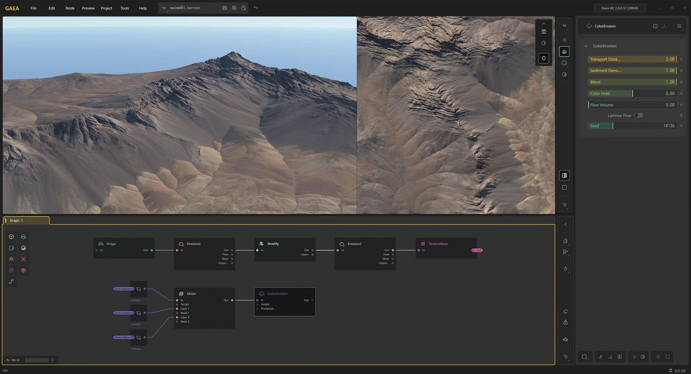
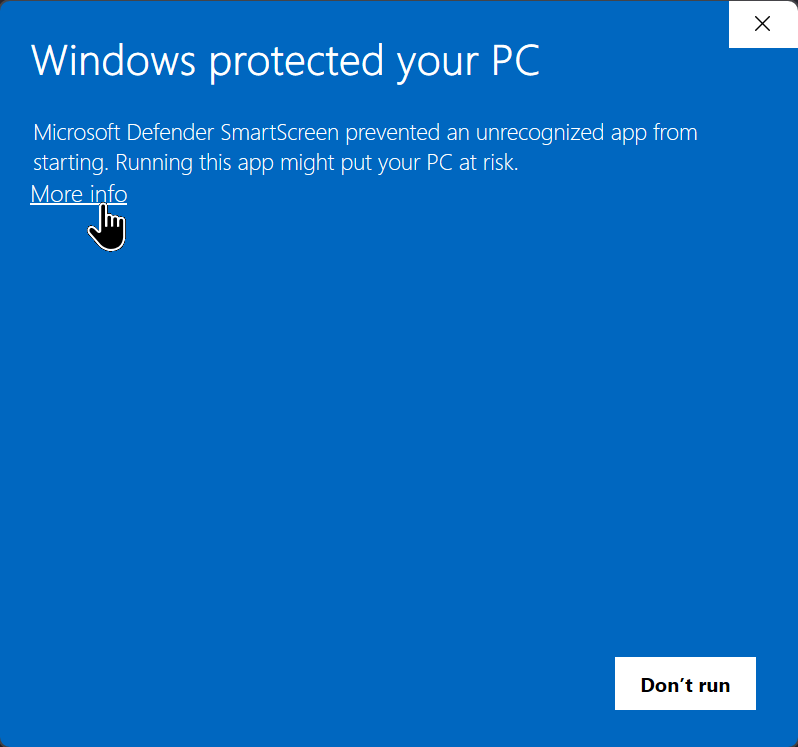
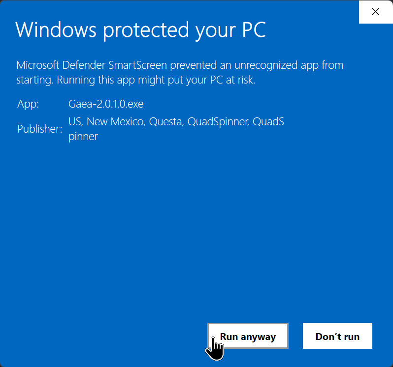
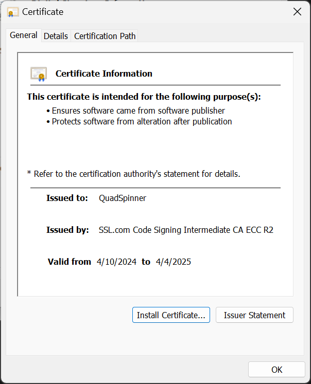

# Install Gaea

<figure><figcaption>
The Gaea 2.0 User Interface
</figcaption></figure>

## Download Gaea

Download Gaea from [https://quadspinner.com/download/](https://quadspinner.com/download/)

You will also require [.NET 8.0](https://download.visualstudio.microsoft.com/download/pr/7f4d5cbc-4449-4ea5-9578-c467821f251f/b9b19f89d0642bf78f4b612c6a741637/dotnet-runtime-8.0.0-win-x64.exe) and [Visual C++ Runtime](https://aka.ms/vs/17/release/vc_redist.x64.exe).&#x20;

The Gaea installer will download and install those if needed. An internet connection will be required to do that. If you are going to install in an air-gaped/offline environment, then you may want to install those beforehand.

### System Requirements

Before running Gaea, make sure your computer meets the minimum system requirements and that you have the latest CPU and GPU drivers.

| Minimum                                                    | Recommended                                                   |
| ---------------------------------------------------------- | ------------------------------------------------------------- |
| Windows 10 (April 2018 - Build 1803)                       | Windows 11 - 23H2                                             |
| Intel Core i5-4200U / AMD FX-8370                          | Intel Core i7-4770K / AMD Ryzen-5 1500X                       |
| 16GB RAM                                                   | 32GB RAM                                                      |
| 
NVIDIA GeForce GTX 1080

AMD Radeon RX Vega 64
 | 
NVIDIA GeForce RTX 3070 Ti

AMD Radeon RX 6800 XT
 |
| 10GB HDD space                                             | 50GB HDD space                                                |


For CPU compute: The CPU must support AVX2 instruction set.

For GPU compute: NVIDIA cards need CUDA 12.5; AMD cards need HIP 6.0.



RAM may depend on project requirements. See [calculating-memory-requirements.md](../../advanced-topics/technical-information/calculating-memory-requirements.md "mention").


***

## The Gaea Installers

Gaea is available in various forms to provide flexible methods of deployment, whether you are an individual or System Administrator.

### Setup Executable

<figure><figcaption>
EXE
</figcaption></figure>

The setup exe is our primary - and recommended - way of installing Gaea. It provides for both [regular-installation.md](regular-installation.md "mention")and [portable-installation.md](portable-installation.md "mention")while also setting up additional registry entries required for the [gaea2unreal](../../plugins/gaea2unreal/ "mention") and [gaea2houdini](../../plugins/gaea2houdini/ "mention") bridges.

### 7-Zip Package

<figure><figcaption>
7zip file
</figcaption></figure>

The 7-zip package contains the exact same files as the setup executable; however, it is purely portable and does not create registry entries. It is very useful for advanced users or for System Administrators to create custom deployments. See [mass-deployment.md](mass-deployment.md "mention") on how to enable Gaea2Unreal and Gaea2Houdini functionality in pure portable installs such as this.

### winget CLI Install

The [winget CLI tool](https://github.com/microsoft/winget-cli) is fantastic way to quickly install and manage tools on your computer. You can install Gaea through winget by using the command line:

`winget install gaea`


Due to the slower time PR acceptance on the winget-pkgs repo, there may be newer versions available on the Gaea website. If you have Gaea installed, you will get an update notification in the application to help you stay up-to-date.


## Security Concerns

### Windows SmartScreen&#x20;

When you run the Gaea installer, Microsoft SmartScreen may warn you about running the application. You can check the validity of the installer by clicking "More Info". If the Publisher information shows QuadSpinner, that means it is signed by a Certificate Authority verified certificate.

Click "**Run Anyway**" to proceed with the installation.

You can also check the SHA-256 hash of the file against the hash shown on the [download page](https://quadspinner.com/download/) for additional verification.

 

Our new installer makes it very easy to install Gaea, whether you are at home with full Administrator privileges or in a restricted environment at work.

To begin the installation select Regular or Portable Installation. In most cases, Regular Installation is the safest and recommended option.

### Antivirus False Positives

Antivirus software, especially so called "AI-powered" antivirus software, may falsely flag the Gaea setup or one of Gaea's sibling processes as a virus or malware.

This is a false positive because Gaea does not perform any malignant activity. Interacting with hardware drivers or performing other low-level tasks creates false positives in some antivirus software.

We provide a VirusTotal report for our installer on the download page.

### Signed Binaries

All Gaea binaries¹ are signed with a code-signing certificate provided after rigorous verification of our organization by a Certificate Authority. These signed files prevent tampering. You can open the file properties to see the certificate signature and ensure that each file has not been tampered with.

<figure><figcaption></figcaption></figure>

¹ Exe and DLL files legally within QuadSpinner's ownership.

