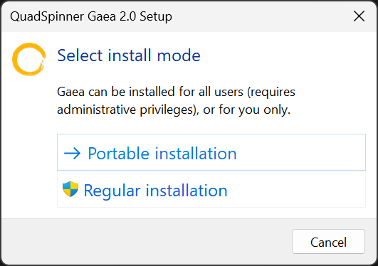
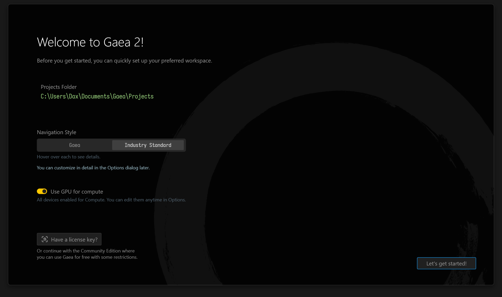
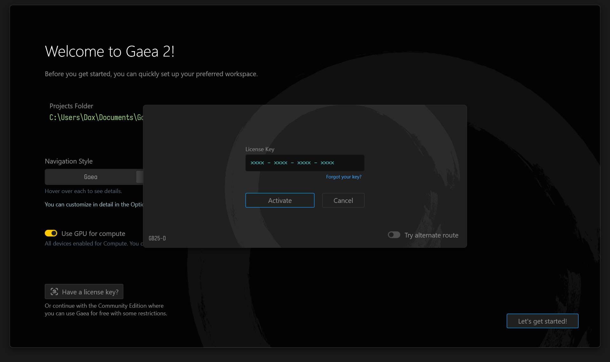

# Regular Installation

Please make sure you have read the [.](./ "mention")page.

## Running the Setup

Our new installer makes it very easy to install Gaea, whether you are at home with full Administrator privileges or in a restricted environment at work.

<figure><figcaption></figcaption></figure>

### Choosing the Installation Type

To begin the installation select Regular or [portable-installation.md](portable-installation.md "mention"). In most cases, Regular Installation is the safest and recommended option.


:shield: You will require Administrator Privileges for a Regular Installation. If you don't have them, you can choose to go for a [portable-installation.md](portable-installation.md "mention").


<figure><figcaption></figcaption></figure>

### Choosing the Path

Next, select the path where you would like to install Gaea. In most cases, saving to the Program Files folder is recommended for safety. Click Install to begin the process.


When installing to a network drive, it must be installed on a network share hosted as a drive and not a UNC path. Gaea may not work properly on UNC paths.


Gaea will now install. You will be given an option to launch Gaea once the installation is finished.

## Welcome to Gaea

<figure><figcaption></figcaption></figure>

Once Gaea launches, you will be presented with this Welcome dialog.

You can set your Gaea Projects storage path here, and select the navigation style for the Viewport.

<figure><figcaption></figcaption></figure>

### License Key

If you have a License Key, you can also enter it here to activate all the features of your Gaea Edition. You can find the License Key in the email you received after purchasing Gaea 2.&#x20;


If you have forgotten your License Key, you can click "Forgot your key?" to log into the User Area on the QuadSpinner website.


You can also enter your License Key from the Start Screen whenever you start Gaea, or from Help > About menu item. See Licensing for more details.

### File Licenses

For users who have been issued a file-based key, just drag and drop the file (usually a `XYZ123.lic` file) on the license dialog. Gaea will automatically consume the file to authorize your copy.

***

Gaea is now installed and you are ready to create [terrain-basics](../../using-gaea/terrain-basics/ "mention")!

Facing issues? See [troubleshooting.md](troubleshooting.md "mention")

