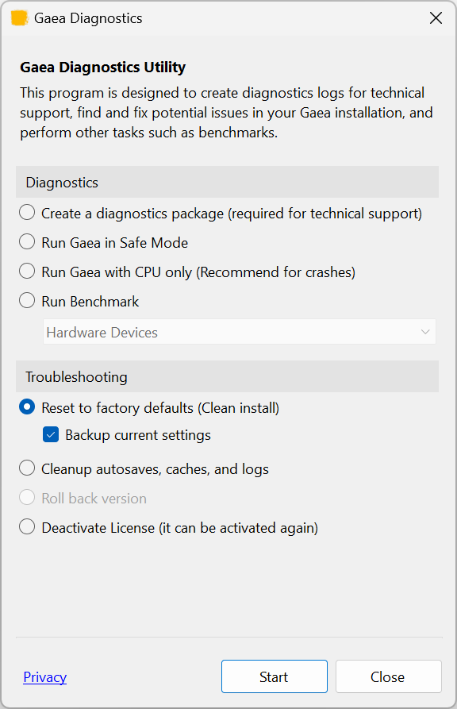

# Uninstall or Clean Install

## Uninstall Gaea

Before uninstalling Gaea, go to Help > About and select "**Release License**". This will release your license's activation slot. You can re-activate when you reinstall Gaea again or on another computer.

<figure><figcaption></figcaption></figure>

Once the license has been released, close Gaea. Go to Installed Apps in Windows Settings (or Add/Remove Programs in older versions) and uninstall Gaea.

## Clean Install

If you are experiencing any unusual behavior, it is often a good idea to try a clean install.

### Reset to Factory Defaults

Before performing a clean install, you can try a "Reset". Open Options in Gaea and select Factory Reset or open Gaea Diagnostics from the Start Menu and select "Reset to factory defaults". It also gives you an option backup your settings.

<figure><figcaption></figcaption></figure>

Once you have tried this reset, check if Gaea's errant behavior has been fixed.

If it is still not fixed, you can perform a clean install by first uninstalling Gaea completely. Before you uninstall Gaea, we recommend that you go to Help > About and select "Release License". This will release your license's activation slot. You can re-activate when you reinstall Gaea.

Releasing the license helps avoid re-authorization issues from a "double installation" on the same computer.

<figure><figcaption></figcaption></figure>

Once the license has been released, close Gaea. Go to Installed Apps in Windows Settings (or Add/Remove Programs in older versions) and uninstall Gaea.

Download a fresh installer from the [QuadSpinner Website](https://quadspinner.com/download/) and [.](./ "mention").

### Manually Delete All Data

To remove all traces of Gaea data, you can delete the following folders:

* Run `Gaea.exe -deactivate` to release the license.&#x20;
  * Or do it via the About box.
* Install Folder (usually `C:\Program Files\QuadSpinner\Gaea 2`)
* [Data Folder](../../advanced-topics/technical-information/paths-and-storage.md) (`C:\Users\<you>\AppData\Roaming\QuadSpinner\Gaea\2.0` or inside Install Folder in case of portable installation)
  * For just erasing settings: delete the `Settings` subfolder only.
* Viewport Logs `C:\Users\<you>\AppData\LocalLow\QuadSpinner\`
* Registry
  * `HKEY_LOCAL_MACHINE\SOFTWARE\QuadSpinner\Gaea\2.0`&#x20;
  * `HKEY_CLASSES_ROOT\.terrain`
  * `HKEY_CLASSES_ROOT\Gaea Terrain Files`
* Start Menu and Desktop shortcuts entries
