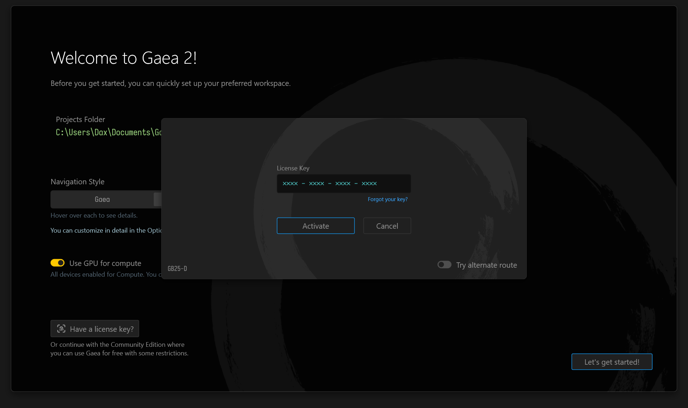

# Activation

## Types of Licenses

### **License Key**

A license key is an alphanumeric string in the format: `XXXX-XXXX-XXXX-XXXX` This is the preferred type of license and most users are given license keys.

### **License File**

A license file is usually provided as a `Gaea-XYZ123.lic` where `XYZ123` is your Transaction ID and should be kept private for your own security.&#x20;

## Loading a License

<figure><figcaption></figcaption></figure>

To load your license, enter the **License Key** in the Activation Dialog and click Activate. Gaea will communicate with the license server and authorize your installation.

If alternatively you have a **License File**, drag and drop the license file on the dialog and Gaea will activate using the license file.

### Where can I access the Activation Dialog?

When running Gaea for the first time, you will be presented with a "Welcome" dialog. You can click the "Have a license key?" button to bring up the activation dialog.

<figure><figcaption></figcaption></figure>

You can also access this same dialog in other ways:

* From the Startup Dialog when running the Community Edition.
* In Help menu > Manage License.
* In Help menu > About Dialog.

<figure><figcaption></figcaption></figure>

### Command Line Option

To authorize Gaea from the command line, you can use the following syntax:

```sh
## License Key
Gaea.exe -activate XXXX-XXXX-XXXX-XXXX

## License File
Gaea.exe -activate "C:\Downloads\Gaea-XYZ123.lic"
```


Please note, Gaea may not be able to use a UNC network path such as `\\path\share\file.lic` due to limitations in .NET. You should instead mount the share as a drive if possible.

Alternatively, see [mass-deployment.md](../install-gaea/mass-deployment.md "mention") for additional solutions for network deployments.


