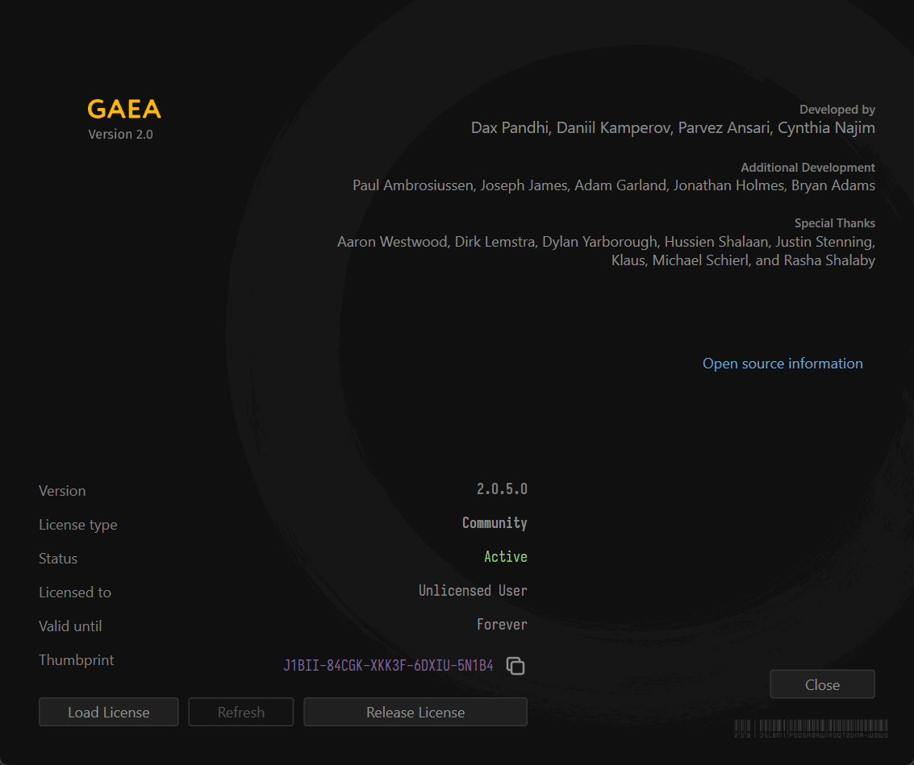

# Hardware Thumbprint

To generate an offline license, which will be node-locked, you will be asked to provide the hardware thumbprint for your computer. You can retrieve the thumbprint from Help > About menu.

* Go to Help > About.
* Click the Copy icon next to the purple Thumbprint readout in the bottom of the License text.
* Your thumbprint will now be copied to the clipboard.

<figure><figcaption></figcaption></figure>
