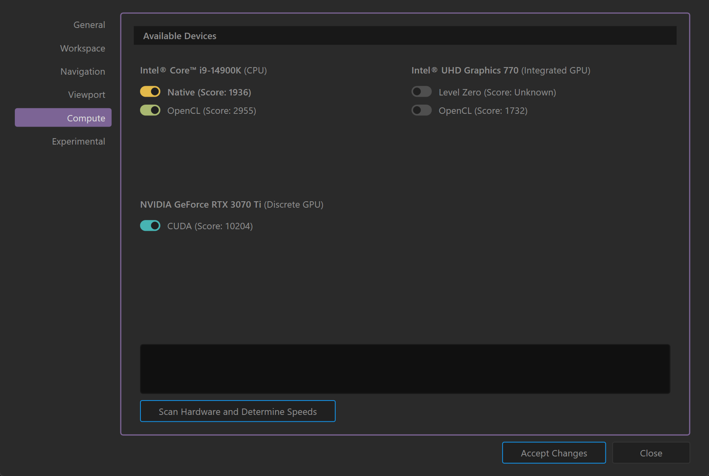

# Options

## **General**

<figure><figcaption></figcaption></figure>

**User Files:** Defines the default directory where user files are saved.

**Projects Files**: Defines the default directory where Gaea projects are saved.

* **Start Gaea on**: Choose the monitor on which Gaea will open (Monitor 0 or Monitor 1).
* **Move cursor to target when using the Lazy Menu**: Automatically moves the cursor to the selected target in the Lazy Menu.
* **Show Expert Tools**: Enables advanced tools and options for experienced users.
* **Check for updates on startup**: Toggles automatic checking for software updates each time Gaea starts.

### Diagnostics and Debugging

* **Enable Verbose Logging**: Activates detailed logging; requires a restart and can create large log files.
* **Report crash reports anonymously**: Allows Gaea to send crash reports to the developers without user-identifying information.
* **Report anonymous usage statistics**: Sends non-personal usage data to help improve the software.
* **Use Web Proxy**: Configures Gaea to connect to the internet via a specified proxy.

### Commands

* **Open Data Folder**: Opens the directory where Gaea stores data files.
* **Run Diagnostics**: Runs diagnostic tests to check for issues in Gaea.
* **Factory Reset**: Resets all settings and configurations to their original factory defaults.

***

## Toolbox

<figure><figcaption></figcaption></figure>

* **Layout (Compact, Buttons, Large)**: Selects the layout style of the toolbox, offering choices between a compact view, button-style icons, or larger icons for easier visibility.
* **Organization (Nested by Family, Show All)**: Allows users to organize toolbox items either nested by family groups or displayed all at once.
* **Show icons in Toolbox**: Toggles the visibility of icons next to the toolbox items for quicker identification.
* **Search Results (Show Family Name, Show Icons)**: Configures search results to display the family name and icons alongside tool names for more informative results.
* **Maximum Results (5, 10, 15)**: Sets the maximum number of search results displayed at one time, with options for 5, 10, or 15 results.
* **Show SatMaps List as a Single Stack**: When enabled, displays the SatMaps list items in a single, consolidated stack rather than individually.

***

## Graph

<figure><figcaption></figcaption></figure>

* **Force node shortcuts when cursor is within the graph**: node-specific shortcuts work only when the cursor is positioned within the graph area.
* **Hide Graph Tabs**: Conceals the tab interface above the graph, providing a cleaner workspace.
* **Hide Bookmark Shortcuts**: Hides shortcut icons for bookmarks within the graph interface.
* **Snap connections to available ports**: Enable automatic snapping of node connections to the nearest available ports.
* **Double-click on port to connect**: Enables quick connection of nodes by double-clicking on a port instead of dragging a connection.
* **Gaea 1 Style Mask Ports**: Uses the older Gaea 1 method for connecting mask ports; does not affect existing nodes or files.
* **Grid Snap Size (10, 20, 25, 50, 100)**: Sets the granularity of the snapping grid in the graph view, with options to adjust the grid size for aligning nodes more precisely.

***

## Node

<figure><figcaption></figcaption></figure>

* **Show shine effect on Node when build completes**: Activates a visual effect on the node to indicate when its build process has successfully completed.
* **Show build time on node**: Displays the duration it took to build the node directly on its interface, providing immediate feedback on performance.
* **Show values with high precision**: Offers the option to display numerical values with greater precision in the node properties.
* **Calculate variables values**: Enables automatic calculation of variable values within nodes for real-time updates and accuracy in data representation.

***

## Data View

<figure><figcaption></figcaption></figure>

* **cons**: Choose how icons are displayed in Data View (Colorful, Muted, or Hide).
* **Always Expand**: Automatically expands the Data View panel for quick access.

***

## Build

<figure><figcaption></figcaption></figure>

* Heightfield: Sets the default file format for output when user marks a node for export.
* Color Maps: Sets the default file format for color maps to export.
* Masks: Sets the default file format for Masks to export.
* **Remove Primary port name in Build output**: Hides the primary port name in the output of the build process.

***

## Cache

<figure><figcaption></figcaption></figure>

* **Delete after 45 days**: Automatically deletes logs and autosave files after 45 days to manage disk space and maintain performance.
* **Always Cache to Disk on Close**: Ensures that data is saved to disk upon closing Gaea, when project loads next time, it loads the saved cache.
* **Use Smart Cache**: Allows Gaea to dynamically manage caching based on current system usage and available resources.
* **Idle Threshold (0 minutes)**: Sets the time threshold for inactivity after which smart caching mechanisms kick in.

***

## Viewport

<figure><figcaption></figcaption></figure>

* **Antialiasing**: Set the level of antialiasing for smooth edges in the viewport (None, 2x, 4x, 8x).
* Do not clear viewport when unselecting a node: Keeps the viewport when node is unselected.
* **Show Grid**: Toggles the visibility of the grid in the viewport.
* **Show Compass**: Toggles the visibility of the compass to help orient the terrain.
* **Show Base Marker**: Displays a base marker for reference in the viewport.
* **Conserve memory when displaying 4K terrains**: Reduces memory usage when viewing large 4K terrains.
* **Viewport Background**: Select a custom background color for the viewport.

***

## Navigation

<figure><figcaption></figcaption></figure>

### **Mouse Navigation**

* **Rotate**: Set the mouse button (Left, Middle, Right) for rotating the viewport.
* **Pan**: Set the mouse button (Left, Middle, Right) for panning the viewport.
* **Zoom**: Set the mouse button (Left, Middle, Right) for zooming the viewport.
* **Hold Alt**: Option to hold the Alt key for each action (Rotate, Pan, Zoom).
* **Sensitivity**: Adjust the sensitivity for each action (Rotate, Pan, Zoom) from 0% to 100%.
* **Invert Y axis**: Flips the Y-axis direction for mouse movements.
* **Flip Y Pan Direction for QE keys**: Reverses the Y-axis direction when using the Q and E keys to pan.
* **Invert zoom direction**: Reverses the direction of zooming.

***

## Lazy Menu

<figure><figcaption></figcaption></figure>

Set brightness (Hide, Muted, Bright) for the different elements of the Lazy Menu.

***

## **Compute**

<figure><figcaption></figcaption></figure>

### Device List

**Available Devices:** Lists all available computer devices that Gaea can use for processing terrains.

* Sub-options under each device allow you to select which technology is enabled for that device. For example, OpenCL, Level Zero, CUDA, etc.

**Scan Hardware and Determine Speeds**: Initiates a scan of all hardware to evaluate processing capabilities and optimize device selection. Once done, a score for each device and technology is shown in the list.&#x20;

See [benchmark-devices.md](../../../troubleshooting/diagnostics-watson/benchmark-devices.md "mention") for additional information.

### Driver Issues

If Gaea detects driver issues with any devices, an error readout will be shown next to that device. Depending on the issue, the device may be prevented from loading in Gaea until the driver has been updated.

### CPU-only mode

Gaea can be forced to run using CPU only. This may not necessarily bring performance down too much as Gaea uses advanced techniques to keep performance up while using the CPU.

If you are experiencing instabilities, disabling GPU and Accelerators may improve stability.

See [cpu-only-mode.md](../../../troubleshooting/diagnostics-watson/cpu-only-mode.md "mention")

***

## Experimental

<figure><figcaption></figcaption></figure>

### **Preview Options**

* **Enhanced RAM Optimization**: Toggles experimental RAM optimization to improve memory management. Requires a restart to take effect; disabling is recommended if instability occurs.
* Disable UI animations: Selecting this option will disable UI animations.
* Custom Locations to show in File Dialogs: Paths entered in this textbox will appear on the left pane of file dialogs. Custom paths can be entered on per line.
* Show only these locations: Toggling this option will only show these paths in the file dialog.

***

Each setting in the Options dialog allows fine-tuning of Gaea’s behavior and performance to best suit your project requirements and hardware setup.
