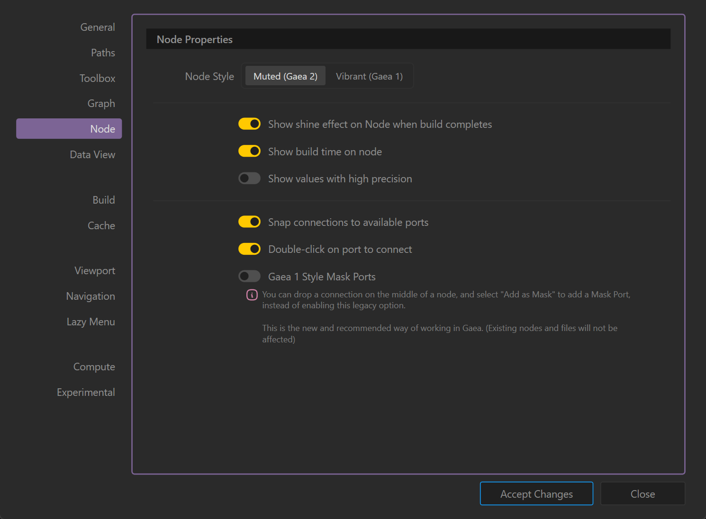

# Options

## General

The **General** tab provides essential application-wide preferences, controlling how Gaea launches, handles logs, updates, licensing, and diagnostic tools. These settings affect global behavior rather than project-specific options.

<figure><figcaption></figcaption></figure>

***

### **Startup Settings**

* **Start Gaea on:** Select which monitor Gaea will open on at launch. Useful for multi-monitor setups.
  * _Monitor 0_ – Opens on the first detected monitor.
  * _Monitor 1 (Primary)_ – Opens on the system’s primary display.

### **Interface Behavior**

* **Move cursor to target when using the Lazy Menu:** Automatically moves the mouse cursor to the selected target in the Lazy Menu for faster interaction.
* **Show Expert Tools:** Enables advanced tools intended for experienced users. May expose complex features not needed for beginners.

### **Update and Reporting**

* **Check for updates on startup:** _(Currently disabled)_ When enabled, Gaea will check for available updates every time it launches.
* **Enable Verbose Logging:** Creates more detailed log files for troubleshooting. This can generate large files. Requires a restart to take effect.
* **Report crash reports anonymously:** Sends crash reports to QuadSpinner without identifying data.
* **Report anonymous usage statistics:** Helps improve Gaea by sending non-identifiable usage patterns.

### **Licensing and Network**

* **Local License Server:** Specify the IP address and port of a floating license server for shared licensing environments. Example: `192.168.100.11:9000`.
* **Use Web Proxy:** Enable and configure a proxy server for network communications if your environment restricts direct connections.

***

### **Utilities**

* **Open Data Folder:** Opens Gaea’s data storage directory containing logs, cache, and settings.
* **Run Diagnostics:** Runs internal diagnostic tools to detect and troubleshoot common issues.
* **Factory Reset:** Resets all preferences and settings to their original defaults. _This cannot be undone._

***


Verbose logging should only be enabled when troubleshooting to avoid excessive disk usage.


***

## Paths

The **Paths** tab defines where Gaea stores and retrieves user data and project files. Properly configuring these paths ensures smooth operation, faster backups, and prevents accidental data loss or corruption.

<figure><figcaption></figcaption></figure>

***

### **File Thumbnails**

Specifies where thumbnail images for saved files are stored.

* **Don't Save:** Thumbnails are not generated or stored.
* **Central Data Folder:** Thumbnails are stored in a central location within Gaea’s data folder. _(Recommended)_
* **Next to File:** Thumbnails are saved alongside the corresponding file.

### **User Files**

Specifies the main directory where Gaea stores:

* Presets
* Screenshots
* Other Gaea documents

Default path: `C:\Users\<User>\Documents\Gaea`

***

### **Project Files**

Defines the default directory where all Gaea project files (`*.terrain`, `*.gmacro`) are stored. Default path: `C:\Users\<User>\Documents\Gaea\Projects`

***


**Do not store project or user folders inside the Gaea installation directory.**&#x20;

Example: If Gaea is installed in `D:\Gaea\`, avoid setting your paths to `D:\Gaea\Docs`.

**Separation of data and installation files** prevents conflicts during updates or reinstalls as well.



**Projects are lightweight**, but **Builds can be large**.&#x20;

Storing builds in a separate drive or location is recommended, especially if you frequently back up project folders.


***

### **Notes**

* These settings only affect the **default save/load locations**. You can still manually select other paths when saving projects or exporting data.
* Ensure the specified folders have full read/write permissions for Gaea to operate correctly.
* Changing paths does not automatically move existing files; manual migration is required.

***

## Toolbox

The **Toolbox** tab customizes the appearance, organization, and search behavior of the node toolbox, improving workflow efficiency and navigation within Gaea’s graph editor.

<figure><figcaption></figcaption></figure>

***

### **Layout**

Defines the visual presentation of the toolbox:

* **Compact:** Displays nodes in a minimal, space-saving list format. _(Default)_
* **Buttons:** Shows nodes as clickable buttons with labels.
* **Large:** Displays larger entries for improved readability, useful on high-resolution or touch screens.

***

### **Organization**

Determines how nodes are grouped:

* **Nested by Family:** Organizes nodes under their respective functional families (e.g., Primitives, Erosion).
* **Show All:** Displays all nodes in a single, flat list without categorization.

***

### **Icons in Toolbox**

* **Show icons in Toolbox:** Toggles the visibility of node icons in the toolbox list for quick identification.

***

### **Search Results**

Configures the appearance of search results:

* **Show Family Name:** Displays the node’s family (category) alongside its name in search results.
* **Show Icons:** Displays the node’s icon in search results for faster recognition.

***

### **Maximum Results**

Limits the number of search results displayed:

* **5 / 10 / 15:** Sets how many nodes appear in the search dropdown. _(Default: 10)_

***

### **SatMaps List Behavior**

* **Show SatMaps List as a Single Stack:** Consolidates all SatMap entries into a single stacked entry, reducing clutter in the toolbox. When disabled, all SatMaps appear individually.

***

### **Notes**

* A compact layout is ideal for users who prefer quick scanning of nodes.
* Enabling icons can improve recognition but may take more space in compact views.
* Nested organization is recommended for beginners to avoid overwhelming lists, while advanced users may prefer the flat view for speed.

***

## Graph

The **Graph** tab controls the behavior, snapping, and visibility of certain interface elements within the node graph workspace, allowing customization of layout precision and shortcut handling.

<figure><figcaption></figcaption></figure>

***

### **Grid Snap Size**

Determines the distance between snap points on the graph grid:

* **10 / 20 / 25 / 50 / 100**
  * Selects the pixel spacing for grid snapping when moving or placing nodes.
  * Smaller values allow finer positioning, larger values create coarser alignment. _(Default: 25)_

***

### **Allow Node Shortcuts Only When Cursor is Inside the Graph**

* **Enabled:** Keyboard shortcuts for creating nodes only work when the cursor is actively hovering over the graph workspace.
* **Disabled:** Shortcuts work globally, even when the cursor is outside the graph.

***

### **Hide Graph Tabs**

* **Enabled:** Hides the row of tabs at the top of the graph panel (used when working with multiple graphs).
* **Disabled:** Graph tabs remain visible for easy switching.

***

### **Hide Bookmark Shortcuts**

* **Enabled:** Hides bookmark shortcut buttons in the graph workspace to reduce visual clutter.
* **Disabled:** Bookmark buttons stay visible for quick navigation.

***

### **Notes**

* Adjust grid snapping based on personal preference or the scale of your graph layout.
* For multi-graph projects, keeping tabs visible is recommended for fast navigation.
* The **cursor-based shortcut restriction** is helpful to avoid accidental node creation while using shortcuts elsewhere in the UI.

***

## Node

The **Node** tab manages the appearance and interaction behavior of nodes in the graph workspace, allowing customization of visual style, connection handling, and data display precision.

<figure><figcaption></figcaption></figure>

***

### **Node Style**

* **Muted (Gaea 2)** – Uses a softer, less saturated color scheme for nodes, improving focus on the graph structure. _(Default)_
* **Vibrant (Gaea 1)** – Uses brighter, high-contrast colors from the earlier Gaea UI style.

***

### **Show Shine Effect on Node When Build Completes**

* **Enabled:** A visual shine animation plays on a node after it finishes building, providing a visual cue for completion.
* **Disabled:** No build-complete effect is shown.

***

### **Show Build Time on Node**

* **Enabled:** Displays the time taken to build each node directly on the node itself.
* **Disabled:** Build times are hidden.

***

### **Show Values with High Precision**

* **Enabled:** Displays node parameter values with extended decimal precision for finer adjustments.
* **Disabled:** Values are rounded for cleaner display.

***

### **Snap Connections to Available Ports**

* **Enabled:** Connection lines automatically snap to valid ports when dragging links between nodes. _(Recommended)_
* **Disabled:** Freeform connections without snapping, requiring precise placement.

***

### **Double-Click on Port to Connect**

* **Enabled:** Allows connecting two ports by double-clicking instead of dragging.
* **Disabled:** Only drag-and-drop connections are available.

***

### **Gaea 1 Style Mask Ports (Legacy Option)**

* **Enabled:** Adds explicit "Mask" ports to nodes, restoring Gaea 1 behavior.
* **Disabled (Recommended):** Modern Gaea workflow allows dropping a connection onto the node body and selecting **"Add as Mask"** instead of using dedicated ports.
* _(Legacy option retained for compatibility with old graphs; existing files are unaffected.)_

***

### **Notes**

* The **modern mask workflow** is the preferred approach, simplifying port layouts and improving graph readability.
* High precision display is useful for technical fine-tuning but may visually clutter the node UI.
* Visual effects such as **shine on build completion** can be disabled for performance on lower-end systems.

***

## Data View

The **Data View** tab controls the appearance and expansion behavior of the Data View panel, allowing you to choose how icons are displayed and whether the view should auto-expand for easier navigation.

<figure><figcaption></figcaption></figure>

***

### **Icons Display**

Determines the visual style of icons shown in the Data View:

* **Colorful** _(Default)_ – Displays icons in full color for easier visual recognition.
* **Muted** – Uses a softer, desaturated color scheme for a more subdued interface.
* **Hide** – Removes icons entirely, showing only text labels to save space.

***

### **Always Expand**

* **Enabled:** The Data View panel automatically expands all available categories by default, showing all listed data sources or items without requiring manual expansion.
* **Disabled:** Categories remain collapsed unless manually expanded, reducing on-screen clutter.

***

### **Notes**

* **Colorful mode** is ideal for quick recognition of data types and categories.
* **Muted or hidden icons** help create a cleaner, minimalistic look.
* Keeping **Always Expand** enabled is helpful for users frequently working with large data sets where quick access to all items is preferred.

***

## Build

The **Build** tab defines the default output location, file formats, and memory handling preferences for builds in Gaea. These settings apply globally unless overridden in individual project build settings.

<figure><figcaption></figcaption></figure>

***

### **Build Output**

* **Path:** Specifies the default folder where Gaea stores build outputs.
* The `<Builds>` token in **Build Settings > Destination** refers to this location.
* Click the folder icon to choose a new directory.

***

### **Default File Formats**

Specifies the output format for each data type:

* **Heightfield:** Options include `EXR`, `RAW`, `TIFF`, etc. (Default: `EXR` for high-precision terrain data.)
* **Color Maps:** `PNG16` (16-bit PNG) or other supported color image formats.
* **Masks:** `PNG16` or other supported formats for mask outputs.

***

### **Remove Primary Port Name in Build Output**

* **Enabled:** The build filenames exclude the primary port’s name, generating shorter, cleaner file names.
* **Disabled:** Output filenames include the primary port name for clarity.

***

### **Purge Unnecessary Cache During Build**

* **Enabled:** Frees up unused cached data during a build to reduce memory usage.
* **Disabled:** Retains all cache for faster re-builds at the cost of higher RAM consumption.

***

### **Timeout for Gaea Server**

* Sets the inactivity timeout (in minutes) for the background Gaea Server process before it shuts down automatically.
* Default: **5 minutes**.

***

### **Notes**

* Use a **fast SSD** for your Build Output folder to improve build times.
* `EXR` is recommended for heightfields due to its high precision and compatibility with major 3D tools.
* Enabling **cache purge** is helpful on low-memory systems but can slow down subsequent builds.

***

## Cache

The **Cache** tab manages how Gaea stores temporary data and autosaves, allowing you to balance memory usage, disk performance, and long-term cleanup.

<figure><figcaption></figcaption></figure>

***

### **Logs and Autosaves**

* **Delete after 45 days** _(Toggle)_
  * When enabled, automatically deletes log files and autosaves older than **45 days**.
  * Helps prevent disk clutter over time.

***

### **Smart Cache**

* **Always Cache to Disk on Close**
  * Forces all cached data to be written to disk when Gaea closes, ensuring a fresh start next time but potentially increasing shutdown time.
* **Use Smart Cache**
  * Offloads **2K or 4K cached terrain data** from RAM to disk if unused for the configured **Idle Threshold**.
  * Data is instantly reloaded to RAM when needed again.
  * **Recommended when the cache folder is on a fast SSD.**
* **Idle Threshold (seconds)**
  * Defines how long unused cached data stays in memory before being offloaded to disk.
  * Default: **600 seconds (10 minutes).**

***

### **Cache Locations**

* **Cache Output (Path)**
  * Sets the location for storing cached data.
  * SSD storage is recommended for faster read/write speeds.
  * Use the folder icon to select a new directory.
* **Save in Central Cache Folder** _(Toggle)_
  * **Enabled:** All caches are stored in the central cache directory.
  * **Disabled:** Cache files are saved next to the working project file, in a `\Cache` subfolder.
* **Smart Cache and Cache to Disk** _(Toggle)_
  * Forces use of Smart Cache with disk writing, overriding per-project settings.
* **Baked Cache** _(Toggle)_
  * Keeps baked (pre-computed) node results cached permanently, even across sessions, for faster graph reloads.
  * Useful for heavy projects where nodes rarely change.

***

### **Notes**

* Enabling **Smart Cache** on SSD can greatly reduce RAM usage without impacting performance.
* If using a slower HDD, keeping Smart Cache **disabled** may be preferable to avoid latency when reloading cached data.
* Large projects can quickly grow the cache folder; periodically clean it if disk space is limited.

***

## Viewport

The **Viewport** tab allows you to configure the visual display settings for Gaea’s 3D viewport. These options affect how terrains and masks are rendered during editing and previewing.

<figure><figcaption></figcaption></figure>

***

### **Antialiasing**

* Options: **None, 2x, 4x, 8x**
* Improves the smoothness of edges in the viewport rendering.
* Higher values provide cleaner visuals but may reduce performance on lower-end GPUs.
* **Default: 4x**

***

### **Display Options**

* **Do not clear viewport when unselecting a node** _(Toggle)_
  * When enabled, the last viewed terrain remains visible even when no node is selected.
* **Show Grid** _(Toggle)_
  * Displays a reference grid in the viewport for spatial orientation.
* **Show Compass** _(Toggle)_
  * Adds a small compass widget indicating cardinal directions.
* **Show Base Marker** _(Toggle)_
  * Shows a marker for the origin/base of the terrain.
* **Conserve memory when displaying 4K terrains** _(Toggle)_
  * Optimizes memory usage for high-resolution terrains (4K+).
  * Can reduce visual fidelity slightly to save RAM and GPU memory.

***

### **Background**

* **Color Picker**
  * Sets the background color of the viewport.
  * Click the color box to select a custom color or press **X** to reset to default.

***

### **Mask Gradient**

* Defines the color scheme used when displaying mask outputs in the viewport.
* Options:
  * **Greyscale** – Black-to-white gradient. _(Default)_
  * **Red** – Red intensity map.
  * **Blue** – Blue intensity map.
  * **Spectrum** – Multi-color gradient for better visual separation of mask values.

***

### **Notes**

* For best performance, use **2x or 4x antialiasing** on mid-range GPUs.
* Enabling grid and compass can help with orientation but may add slight visual clutter.
* Conserving memory is recommended for projects with multiple high-resolution terrains or limited VRAM.

***

## Navigation

The **Navigation** tab allows you to customize how you interact with the 3D viewport using your mouse and keyboard. It provides full control over button assignments, sensitivity, and directional preferences.

<figure><figcaption></figcaption></figure>

***

### **Mouse Navigation**

This section defines which mouse button performs each navigation action in the viewport.

* **Rotate:** Choose **Left, Middle, or Right** mouse button for rotating the camera.
* **Pan:** Choose **Left, Middle, or Right** mouse button for panning the view.
* **Zoom:** Choose **Left, Middle, or Right** mouse button for zooming in and out.

***

### **Hold Alt**

* Optional modifier for each action.
* When enabled, you must hold the **Alt key** while using the assigned mouse button for that action.
* Useful to prevent accidental navigation when performing other tasks.

***

### **Sensitivity**

* Adjustable per action (**Rotate, Pan, Zoom**) with a slider.
* Determines how responsive the navigation feels:
  * **Lower %:** Slower, more precise movement.
  * **Higher %:** Faster, broader movements.
* **Default: 100%**

***

### **Additional Options**

* **Invert Y Axis** _(Toggle)_
  * Reverses the vertical direction of rotation or panning (common in flight sim-style navigation).
* **Flip Y Pan Direction for QE Keys** _(Toggle)_
  * Changes the behavior of the **Q (up)** and **E (down)** panning keys.
  * **Disabled:** Q pans up, E pans down.
  * **Enabled:** Q pans down, E pans up.
* **Invert Zoom Direction** _(Toggle)_
  * Reverses the direction of zooming:
    * Scroll up = zoom out (when enabled).
    * Scroll up = zoom in (when disabled, default).

***

### **Notes**

* Settings are fully customizable to match common workflows (e.g., Maya, Blender, 3ds Max).
* Ideal for adapting navigation to personal or industry-standard control schemes.
* Use sensitivity adjustments to fine-tune navigation for precision terrain editing.

***

## Lazy Menu

The **Lazy Menu** tab lets you control the visibility and prominence of key panels and tools in the Lazy Menu interface. This helps declutter the UI or highlight frequently used options for faster access.

<figure><figcaption></figcaption></figure>

***

### **Menu Items**

Each listed item corresponds to a panel or tool within the Lazy Menu:

* **2D Viewport** – Toggles the dedicated 2D terrain preview panel.
* **Lighting Options** – Controls lighting settings for viewport visualization.
* **Graph** – Shows or hides the main node graph editor entry.
* **Properties** – Opens the selected node’s properties editor.
* **Modifiers** – Quick access to available terrain modifiers.
* **Node Tree** – Hierarchical view of all nodes in the project.
* **Variables View** – Displays project-wide variables and their current values.
* **Build View** – Shows the build process and status window.
* **Build Settings** – Accesses global build configuration options.

***

### **Visibility Modes**

Each menu item can be set to one of three modes:

* **Hide** – Removes the item from the Lazy Menu completely.
* **Muted** – Shows the item in a **dimmed state**, indicating it’s less important or rarely used.
* **Bright** – Highlights the item for quick access (default for most tools).

***

### **Usage Tips**

* Customize visibility to **streamline workflows**.
* Hide rarely used tools to **avoid clutter**.
* Use **Muted mode** to keep tools accessible but visually de-emphasized.
* Adjusting these settings can help new users focus only on essential panels.

***

## Compute

The **Compute** tab allows you to configure which available hardware devices are used for computation, optimizing performance across CPU and GPU resources.

<figure><figcaption></figcaption></figure>

***

### **Available Devices**

This section lists all detected compute-capable devices and APIs, with a **performance score** indicating their relative speed in Gaea’s benchmarks (higher is better).

### Device List

Lists all available computer devices that Gaea can use for processing terrains.

* Sub-options under each device allow you to select which technology is enabled for that device. For example, OpenCL, Level Zero, CUDA, etc.

**Scan Hardware and Determine Speeds**: Initiates a scan of all hardware to evaluate processing capabilities and optimize device selection. Once done, a score for each device and technology is shown in the list.

See [benchmark-devices.md](../troubleshooting/diagnostics-watson/benchmark-devices.md "mention") for additional information.

### Driver Issues 

If Gaea detects driver issues with any devices, an error readout will be shown next to that device. Depending on the issue, the device may be prevented from loading in Gaea until the driver has been updated.

### CPU-only mode 

Gaea can be forced to run using CPU only. This may not necessarily bring performance down too much as Gaea uses advanced techniques to keep performance up while using the CPU.

If you are experiencing instabilities, disabling GPU and Accelerators may improve stability.

See [cpu-only-mode.md](../troubleshooting/diagnostics-watson/cpu-only-mode.md "mention")

***

* **Toggle Switches** – Enable or disable each compute backend per device.
* **Score** – Benchmark performance metric; helps you select the fastest option.
* **Scan Hardware and Determine Speeds** – Detects devices and benchmarks their compute speeds.
* **Enforce Optimal Settings** – Automatically selects the **best-performing combination** of devices based on benchmark results.

***

### **Usage Tips**

* Prefer **CUDA** on NVIDIA GPUs for maximum performance.
* Use **Native CPU** mode if GPU is unavailable or reserved for other tasks.
* Disable low-scoring devices to prevent job scheduling on slow hardware.
* Re-scan after driver updates or hardware changes.

***

## Experimental

The **Experimental** tab provides access to preview and in-development features of Gaea. These options are **not final** and may change or be removed in future updates. They can improve performance or alter behavior but may cause instability.

<figure><figcaption></figcaption></figure>

***

### **Preview Options**

### **Enhanced RAM Optimization** _(Restart required)_

* **Function:** Frees up RAM more aggressively during heavy workloads.
* **When to use:** If you work on large graphs and experience high memory usage.
* **Note:** Disable this feature if you encounter unexpected crashes or instability.

***

### **Disable UI Animations**

* **Function:** Turns off non-essential UI animations for improved responsiveness.
* **Use case:** Recommended for low-end systems or users who prefer a static interface.

***

### **Use New Auto Layout Method**

* **Function:** Applies an updated experimental algorithm for automatic node graph layout.
* **Use case:** May provide cleaner arrangements but can behave unpredictably in complex graphs.

***

### **Use Adaptive Debounce for Smoother Node Updates**

* **Function:** Dynamically adjusts refresh timing to improve graph update smoothness during heavy edits.
* **Benefit:** Reduces stuttering when rapidly making changes to large graphs.

***

### **Custom Locations in File Dialogs**

* **Purpose:** Allows you to define specific folder shortcuts that appear in Gaea’s file open/save dialogs.
* **Usage:**
  * Enter one directory path **per line**.
  * Toggle **Show only these locations** to hide all other folders from the quick-access panel.
  * You can still access any path manually by typing or using breadcrumbs.

***

### **Usage Tips**

* Experimental features may change behavior across sessions.
* Restart Gaea after toggling **Enhanced RAM Optimization** for it to take effect.
* Avoid enabling multiple experimental features at once if troubleshooting stability issues.
