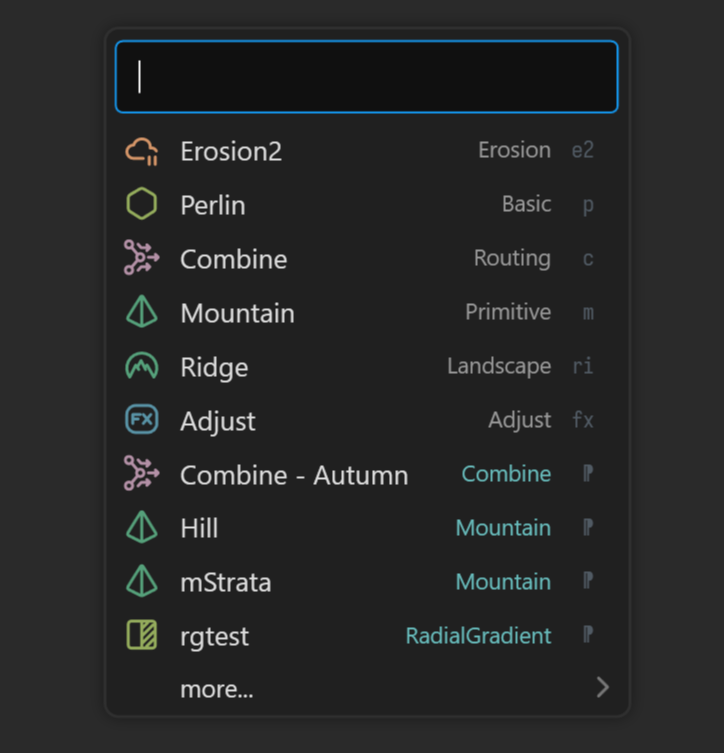

# Graph Conveniences

Gaea supplies numerous quality-of-life features to help you create and navigate complex graphs with as little effort as possible. These conveniences can reduce your workload dramatically when adopted into your standard workflow.

## Create Nodes

### Shortcodes

Each node has a corresponding shortcode. For example, Perlin is `p`, Mountain is `m`, Erosion2 is `e2`, Cone is `con`, and so on.

<figure><figcaption></figcaption></figure>

You can enter the shortcode instead of the full name when searching for nodes.

### Chained Creation

You can use shortcodes (or full names) to quickly create a linear sequence of nodes. As you press the `,` key, Gaea will expand the shortcode or the first matching node in the Search results.

Enter `m,e2,e2,tb,sm` to create `Mountain > Erosion2 > Erosion2 > TextureBase > SatMap`.

<figure><figcaption>
Chained creation can help you quickly create several nodes at once.
</figcaption></figure>

### Out to Out

When you drag a connection from an Out port and connect it to another Out port, instead of denying the connection as a disallowed right-to-left direction flow, Gaea will create a `Combine` node and route both Out ports to the Combine node.

<figure><figcaption></figcaption></figure>

### MultiMix

**Combine:** MultiMix can be called from the Graph toolbar or by simply pressing `F8`. It connects the primary Output of all selected nodes to one or more inputs in a **Combine** node.

**Mixer:** Alternatively, if you press `Ctrl + F8` or select the To Mixer option in the Graph toolbar, the outputs will be connected as Layer inputs for a **Mixer** node. This is useful when you want to layer multiple color textures and mask them using the Mixer node.

## Portals

For detailed information on Portals, see [portals-and-chokepoints.md](portals-and-chokepoints.md "mention")

### Convert Connection to Portal

Right-click on a connection and select "Convert to Portal" (or press `Ctrl + P` to convert an existing connection to a Portal. This will also convert the Out port to a Portal.

<figure><figcaption></figcaption></figure>

Other connections associated with that Port will not be affected.

## Insert Node

<figure><figcaption></figcaption></figure>

* Right-click on a connection and choose "Insert node." This action opens a search menu.
* Select the node you wish to insert from this menu, and it will be automatically placed between the existing connection.

### Connect to Portals

When you press `P` to bring up the Portal Management menu and select an In port, you will be presented with a list of available Portals that can be consumed.

## Navigation

### Navigate Menu

<figure><figcaption></figcaption></figure>

* Press the `,` key while a node is selected to open the navigate menu. This menu displays all incoming and outgoing connections linked to the selected node.
* Click on a connection within the menu to select and automatically navigate to the corresponding node.

### Node Bookmarks

Allows you to bookmark selected node. When a node is bookmarked, it is shown in the bookmark menu. Clicking on the node will select and navigate to that node.

<figure><figcaption></figcaption></figure>

## Organization

### Select Nodes

You can select all nodes upstream (ancestors) or downstream (descendants) of a specific node from the Node menu or the [#graph-toolbar](../user-interface/menus-and-toolbars/#graph-toolbar "mention").

<figure><figcaption></figcaption></figure>

### Group/Ungroup nodes

To create a group, select multiple nodes and choose "Group/Ungroup" from the menu. This action groups the selected nodes together. Clicking "Group/Ungroup" again while a group is selected will ungroup the nodes, placing them individually back onto the graph.

### Combine nodes

Select two or more nodes and click on the "Combine Nodes" menu option. This will connect the selected nodes using a combine node.

### Convert port to portals

This feature displays a list of output ports. Click on a port to convert it into a portal.

### Move to Tab

This option provides a list of graph tabs. Click on a tab to move the selected nodes to the selected tab.

### Auto Layout

Pressing `F4` when one or more nodes are selected will automatically layout the nodes.

### Push Nodes

Dragging the cursor on the graph while holding `Ctrl + Shift` lets you push all nodes to the right of the cursor. It is a handy tool to quickly organize portions of a graph.

<figure><figcaption>
Push nodes with <code>Ctrl + Shift + LMB</code>
</figcaption></figure>
