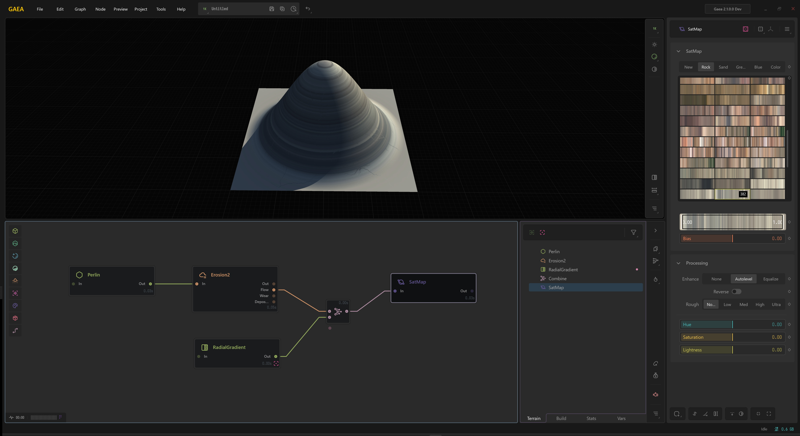

# Lock Preview and Underlays

## Lock Preview 

Locking preview to a node shows only the that node in the viewport. When a node preview is locked, changes made to the other nodes will force updates to all nodes between that node and the locked node. This allows you to see the end result of a change.

To pin a node, right-click it and select `Lock Preview`. You can also select the node and press `F`. Now when you edit any other node before the locked node, the changes will propagate all the way to the locked node every time.

The locked node can be accessed quickly from the Toolbar in the [data-editor](../user-interface/data-editor/ "mention"). It is shown as a green link.

<figure><figcaption>
NOTE: Nodes that are not a descendant of the Locked Node will not be updated until the lock is released.
</figcaption></figure>

## Using Underlays 

By default Gaea will use the nearest "Heightfield"/Terrain node to display the structure beneath the color or mask. However, if your graph splits or follows a secondary path to the color node, then it may use an incorrect node to display the terrain. To prevent this, all you have to do is go to the correct heightfield node, right-click and select "Use as Underlay".

<figure><figcaption>
The "top" branch is used by default by Gaea to show the terrain under a color map or mask.
</figcaption></figure>

To use a node as the underlay, right-click the node and select  `Use as Underlay`. You can also select the node and press `G`.

<figure><figcaption>
Now the RadialGradient, or bottom branch, is used as the underlay after being marked.
</figcaption></figure>

The Underlay node can be accessed from the toolbar in the Data Editor. It is shown as a purple link.


To see a flat preview, click `V` to temporarily toggle a flat preview in the viewport.


### **Beware of downstream underlays**

Be mindful when you modify nodes that are before the Underlay. If they are part of the chain that leads up to the Underlay node, modifying them will cause all nodes in between to update as well, much like normal Lock Preview. This can make Gaea slow when working in 2K or higher preview resolution.

If Gaea detects such an Underlay, it will show a warning in the [property-editor](../user-interface/property-editor/ "mention").
