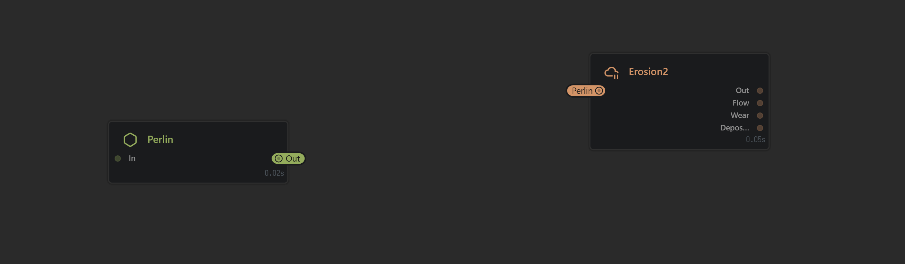
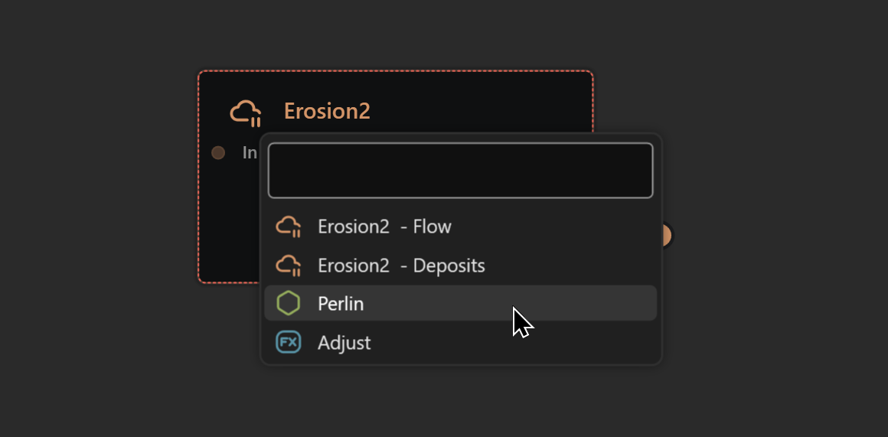

# Portals and Chokepoints

## Portals

Portals are a unique concept in graph-based applications. Pioneered in Gaea 1.0, Portals have now become a mainstay in many graph-based applications.&#x20;

Like a "wormhole", Portals allow you to connect nodes across vast gaps (or short ones) without visible connections. They not only improve your quality of life, but also dramatically change how you think of and use graphs.

When using the [organizing-with-tabs.md](organizing-with-tabs.md "mention"), Portals can be used to connect nodes across different graphs.

### Creating Portals

Any output port in a node can be converted to a portal. You can create a portal in many ways:

<figure><figcaption>
Right-click a connection to bring up the Connection menu and select "Convert to Portal
</figcaption></figure>

<figure><figcaption>
The connection is replaced with Portals.
</figcaption></figure>

Right-click an existing connection and select "Convert to Portal".

<figure><figcaption>
Press P to bring up the Portal menu.
</figcaption></figure> <figure><figcaption>
Create or delete Portal connections in the Portal menu.
</figcaption></figure>

Right-click a node and select `Manage Portals` (shortcut key `P`). Then select the port you wish to convert to a Portal. If the Port has existing connections, they will be converted to portal connections.


If you press `Shift` while Converting a Port to a Portal in the Manage Portals menu, a Chokepoint node will be created first and then its output will be turned into a Portal.

.png>)


<figure><figcaption></figcaption></figure>

When you select "Connect to Portal" in the Portal menu for any incoming ports, you will get a Search popup with a list of available Portals.

## Chokepoints

The Chokepoint node is a special node whose sole purpose is to help avoid re-connecting many nodes, while adding no memory overhead.

Often a graph ends up with natural chokepoints - a single node that is referenced by several other nodes. If at a later point you want to modify that important node, you would need to reconnect all the connections. This can be awkward, time consuming, and dangerous in some situations.

