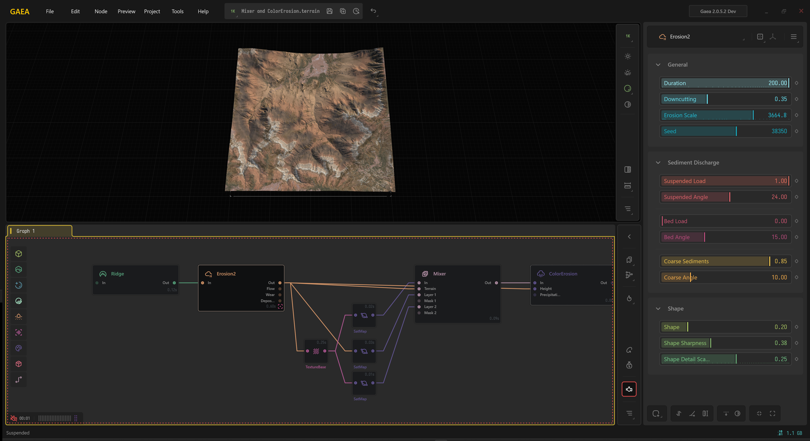

# Suspending Engine

The Suspend/Engine button, or the shortcut `` ` `` lets you toggle the Gaea engine. When the engine is suspended, all node processing is paused. You can still edit nodes and make changes, however nodes will not be updated and the viewport will be frozen.

<figure><figcaption>
When the engine is suspended, an animated red line appears around the Graph. The progress status icon (bottom left) and the Suspend Engine button in the Graph Toolbar (right) also turn red.
</figcaption></figure>

### Benefits of Suspending the Engine

* Make several changes and avoid long reprocessing on nodes.
* Edit more than one node, or restructuring a graph.
* Edit heavy nodes that may take a longer time to process.
* Edit nodes while working in 4K.
