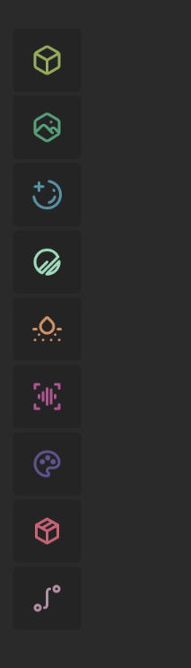

# Toolbox and Search

## Toolbox

The handy Toolbox sits inside the graph, giving you quick drag-drop access to all nodes.

Nodes are organized by function into families and are color-coded for easy identification. Each node has an icon that shows its family, making it easy to recognize at a glance its purpose.

You can click an item to create it in the center of the current graph view. Or you can drag and drop the node to a specific location from the toolbox to your Graph surface.&#x20;

If you drop it on a node, it will automatically connect itself to that node's output.

### Layouts

You can drag the right edge of the Toolbox to switch between three layout styles depending on your preferences for verbosity or compactness.

<figure><figcaption>
Expanded
</figcaption></figure> <figure><figcaption>
Compact
</figcaption></figure> <figure><figcaption>
Toolbar
</figcaption></figure>

### Organization

Nodes inside the Toolbox are organized by Family. You can choose how to visualize this organization.

<figure><figcaption>
Nested Menus
</figcaption></figure> <figure><figcaption>
Flat Menu
</figcaption></figure>

* **Nested (Default):** Toolbox menus are nested by Family then family members to avoid clutter.
* **Flat:** All Families and family members are shown in a flat menu.

## Search

Search in Gaea is more powerful than ever and is the recommended way to create nodes. You can bring up Search by right-clicking in an empty area of the Graph surface, or by pressing `Tab`.

<figure><figcaption>
Search for both Nodes (Grey) and Presets (Teal).
</figcaption></figure>

### Nodes

* The search menu allows users to find and create nodes on the graph. Simply type in the search bar to see the available nodes.

### Presets

* The search menu also displays presets alongside nodes. To specifically search for presets, begin your query with an underscore (\_). This will prioritize presets in the search results, showing them at the top of the list.

### Portals

* To manage portals, right-click on a node and select "Manage portals." Alternatively, you can press the \`P\` key to open the node portal menu directly.
* Click on the input port and select "Connect to portal." This will display all the portals created on the output port of other nodes.
* Choose the desired portal from the menu to establish a portal connection.

## Intelligent Search and Sorting

Gaea's internal (and fully local) Predictive System learns your node creation and connection patterns as you work. This system is built into the Search and the Toolbox.

Once you get used to the predictive suggestions, you can reduce your graph creation times by 50% in most instances.

### **How does the Predictive System work?**

Gaea keeps track of the nodes you use, and how different nodes are connected to each other. It then predicts the type of node you might want to create and puts that first in the list.

The predictions are just a suggestion. They show up separately from the Search menu and are completely optional.

### **Predicting Connections**

When Search appears, it will attempt to detect if any patterns exist and try to suggest nodes that you are likely to use.

For example, if you find yourself connecting Autolevel to the Flow output of the Erosion node, then dragging out a connection from the Flow port and dropping it into empty space on the Graph surface will bring up the Search menu, where Autolevel may be one of the suggested nodes.

