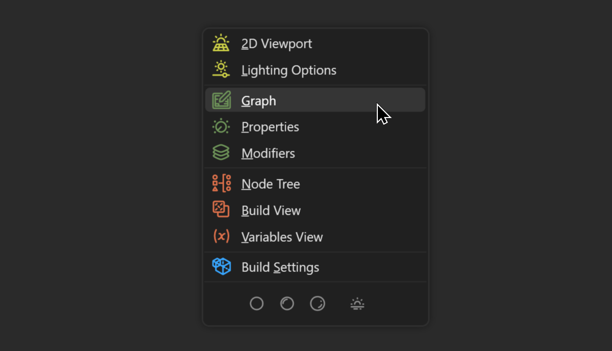
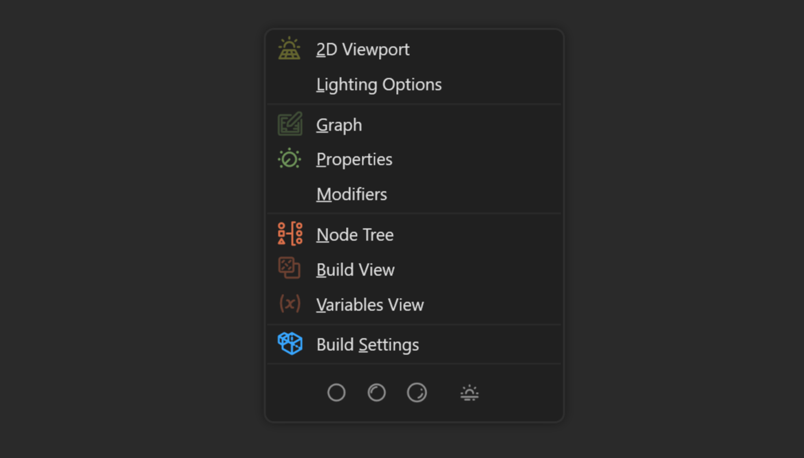

# Lazy Menu

The Lazy Menu can be brought up anywhere in the primary Gaea UI by pressing `F1`. The Lazy Menu gives you instant access to various areas of the UI without having to remember specific shortcuts.


In true lazy fashion, when you use the Lazy Menu to navigate to a section, your cursor will also be moved there!

This extra level of laziness can be disabled in the [#general](../managing-gaea/options/#general "mention") Options.


<figure><figcaption></figcaption></figure>

### Editing Options

You may not want all options to visible or maybe just want some options to stand out over others. You can edit the Lazy Menu in Options > [#lazy-menu](../managing-gaea/options/#lazy-menu "mention").

<figure><figcaption>
Lazy Menu options
</figcaption></figure>

This modifies the Lazy Menu with your desired levels of visibility.

<figure><figcaption></figcaption></figure>
