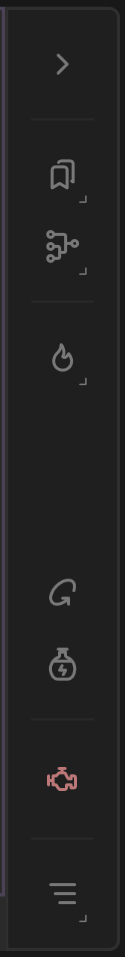

# Graph Toolbar

The Graph Toolbar is an essential interface within the graph environment, designed to enhance user efficiency and interaction. It hosts a variety of tools and menus that facilitate complex graph operations. Key features include:

<figure><figcaption></figcaption></figure>

*   **Bookmarks Menu**: Allows users to mark and quickly navigate to specific nodes.

    See[#node-bookmarks](../../the-graph/graph-conveniences.md#node-bookmarks "mention")
*   **Node Conveniences Menu**: Offers shortcuts to commonly used node functions.

    See [#organization](../../the-graph/graph-conveniences.md#organization "mention")
*   **Bake Menu**: Provides all baking related options.

    See [baking-nodes](../../../using-gaea/baking-nodes/ "mention")
*   **Refresh Node**: Refreshes the node.

    Builds the selected node.

    Right-clicking on "Refresh Node" Provides menu option to "Refresh all nodes", clicking on this refreshes all nodes in graph.

<figure><figcaption>
Refresh all nodes
</figcaption></figure>

*   **Mutate Node**: Mutates the selected node.

    Mutate node allows you to build different versions of the same terrain by simply randomizing the Seed properties of the selected nodes.

    Right-clicking on "Mutate Node" provides menu option to "Mutate all nodes", clicking on this mutates all nodes in graph.

<figure><figcaption>
Mutate all nodes
</figcaption></figure>

* **Suspend Engine**: Lets you toggle the Gaea engine, see [suspending-engine.md](../../the-graph/suspending-engine.md "mention")
* **Graph toolbar submenu**: Incorporate extended functionalities and settings found in the main graph menu for comprehensive control.

<figure><figcaption>
Graph toolbar submenu
</figcaption></figure>

* Add Note: Adds a note object to graph surface.
* Zoom: Zoom options.
* Selection: Zooms to fit the selected nodes within the view.
* Extents: Zooms to display all nodes.
* Reset Zoom: Resets the zoom level to the default view.
* Save Screenshot: Save graph screenshot.
* Screenshot Options: Options to save Graph, Viewport Screenshot and open screenshot folder.
* Show Grid: Toggle the visibility of the grid overlay on the graph.
* Snap to Grid: Enable or disable alignment of items to the grid lines.
* Snap to Items: Toggle whether items snap to align with other items on the graph.

This toolbar streamlines workflow by grouping critical tools in one accessible location, enhancing the user's ability to manage and optimize graph operations efficiently.
