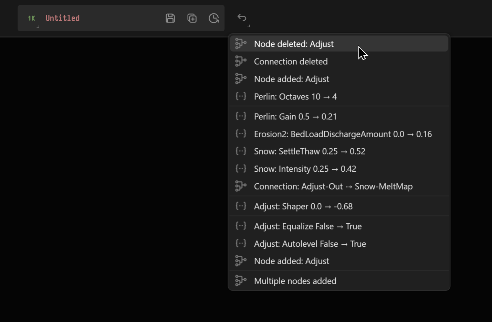

# Undo and Autosave

## Undo Menu

The Undo menu lists recent actions and allows you undo them.

<figure><figcaption></figcaption></figure>

The Undo menu also acts as a history readout, showing you exactly what changes were made in each step. For example, when a node value is changed, it will show you the name of the node, the name of the modified property, and the before and after values.

## Autosave Menu

The Autosave feature in Gaea is a crucial tool designed to automatically save your project at regular intervals. This ensures that your work is periodically backed up, minimizing data loss in the event of unexpected software shutdowns or system failures.

<figure><figcaption></figcaption></figure>

**Remind Me to Save Every.** This option allows you to set the frequency of the Autosave reminders. You can choose from the following intervals **5 minutes, 10 minutes, 15 minutes, 30 minutes.**


Selecting one of these options will configure the application to remind you to save your work at the chosen interval. Gaea autosaves every 10 minutes by default, and saves a Disaster Recovery file every 5 seconds (see [#disaster-recovery](undo-and-autosave.md#disaster-recovery "mention"))


**Reset Timer.** Selecting 'Reset Timer' will restart the countdown of the current Autosave interval. This is useful when you want to make sure that a save happens at a specific point during your work session.

#### Revert Options

**Revert to.** Under this sub-menu, you can find a list of the most recent Autosave points. Each entry is labeled with a sequential number and the time of the save (e.g., Autosave 4 @ 03:16:46). This feature allows you to revert your project to a previous state, which is extremely helpful if you need to go back to an earlier version of your work due to errors or changes that did not produce the desired outcome.

**Autosave Entry.** The 'Autosave Entry' option at the bottom of the 'Revert to' list represents the initial state of your project when the Autosave feature was first enabled.

**Revert to Saved.** The 'Revert to Saved' button allows you to quickly revert your project to the last manually saved state. This is used to discard any changes made after the last manual save if they are no longer needed or desired.

### Usage Tips

* **Regular Saves**: In addition to relying on Autosave, regularly save your work manually to capture significant changes.
* **Adjust Frequency**: Adjust the Autosave frequency based on the complexity and duration of your tasks. More frequent saves are recommended for larger, more complex projects.
* **Check Autosave Files**: Periodically check the Autosave files to confirm they are being created as expected. This verification helps to avoid potential data loss.

