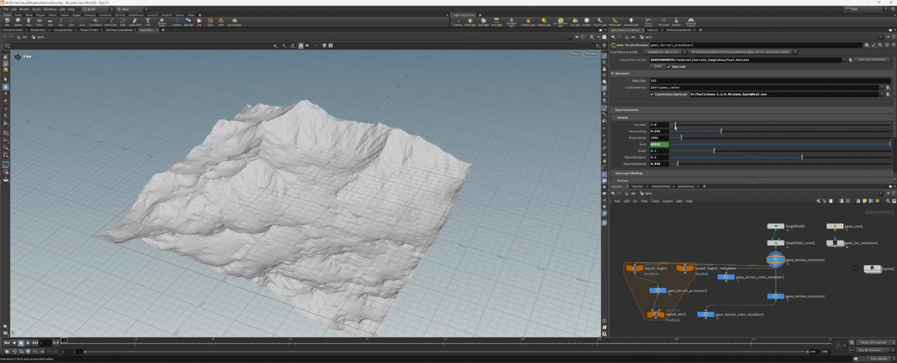

# Gaea2Houdini

The Gaea2Houdini plugin enables you to access select Gaea simulations and tools natively inside Houdini as standard Houdini nodes.&#x20;

Infuse your Houdini worlds with Gaea's 180+ nodes.

<figure><figcaption></figcaption></figure>
