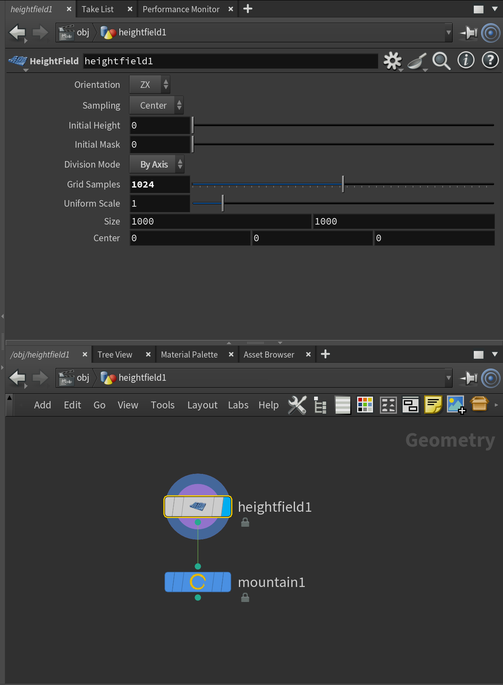
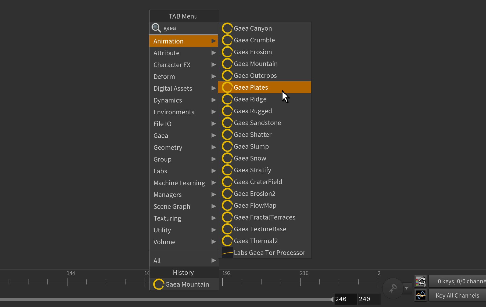
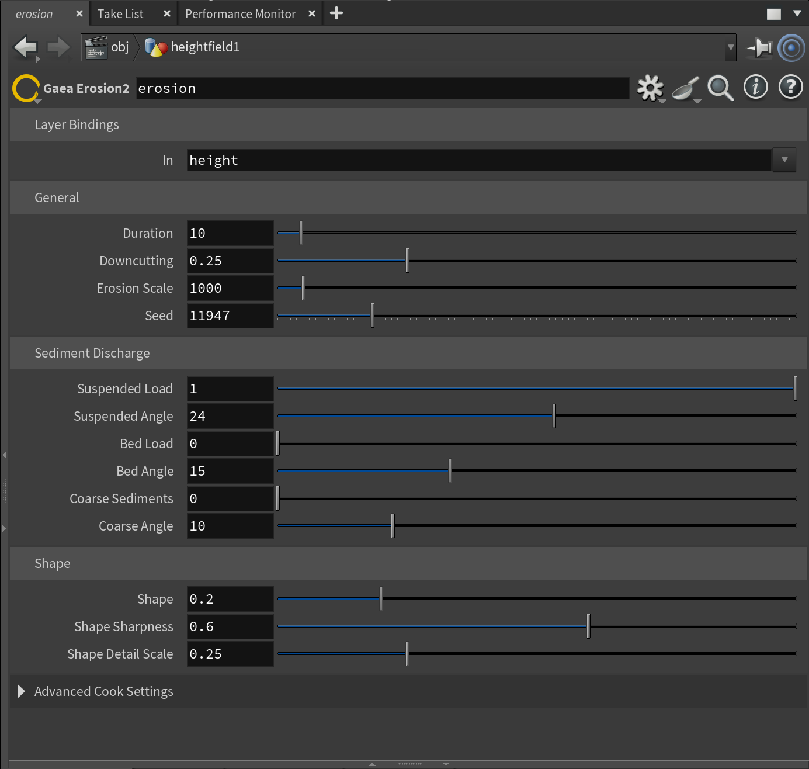
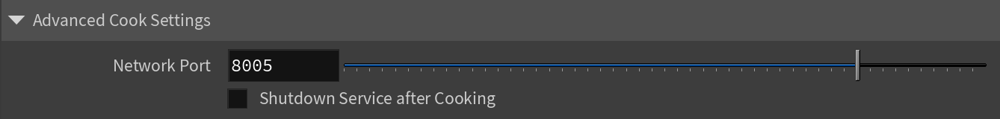

# Using Gaea Nodes

## Getting Started

Create a [Heightfield](https://www.sidefx.com/docs/houdini/nodes/sop/heightfield.html) node. Ensure the Division Mode is set to `By Axis` and Grid Samples are set to `1024`, `2048`, `4096`, or `8192`. These are the resolutions supported by Gaea.

<figure><figcaption></figcaption></figure>

Right-click and type `Gaea` to see a list of available Gaea nodes.

<figure><figcaption></figcaption></figure>

Create a Gaea node and connect it to the Heightfield output.

<figure><figcaption></figcaption></figure>

Select the Gaea node to edit its properties. Houdini will show you the results in the viewport.

<figure><figcaption></figcaption></figure>

### Primitives / Generators

Most Gaea nodes require an existing Heightfield shape to process. However, Gaea2Houdini ships with several primitives or generators that can create geological features such as Mountain, Craters, Hills, and so on.

When you create a generator such as Mountain, Houdini will automatically create a Heightfield node and attach it to the Gaea generator.

## Advanced Settings

Gaea nodes have two additional properties that control Gaea2Houdini's communication with the Gaea engine.

<figure><figcaption></figcaption></figure>

### **Changing Default Port Value**

By default, Houdini will set the Network Port to 8005. However, if you use a different port, change the value, then click the Parameter name and select "Make Current Value Default" in the menu.

This is set per-node so you may need to repeat it per node type. A near-future version of this plugin will make it easier to set the port by default.

### **Network Port**

This is the port used for TCP communication between Gaea and Houdini. This port must be [allowed through any local firewalls](../installing-gaea2houdini.md#firewall-considerations).

### **Shutdown Service after Cooking**

By default, the Gaea2Houdini server will run in the background. The server will stay awake until Houdini closes or Gaea nodes have been idle for several minutes.&#x20;

To force it shut down after each use, you can enable this setting. Next time a Gaea operation occurs in Houdini, the Server will be started again.


Restarting the service frequently decreases efficiency. You should use this setting sparingly and only when required in specific workflows or automation scenarios.


