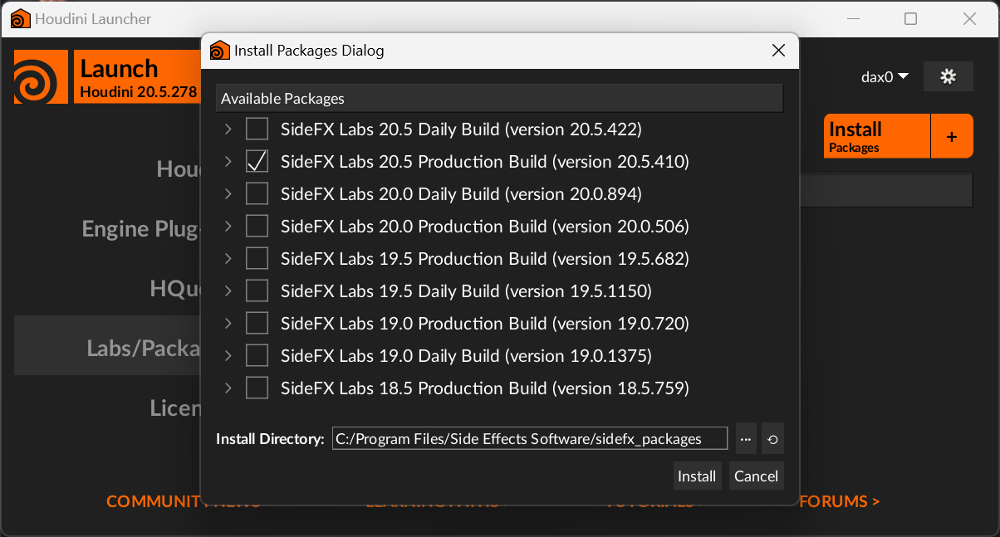

# Installing Gaea2Houdini

## Install Gaea2Houdini

Gaea2Houdini ships in [SideFX Labs](https://www.sidefx.com/products/sidefx-labs/) and can be installed directly from the Houdini Launcher.

<figure><figcaption></figcaption></figure>

You can find further details on SideFX Labs' Installation process [in their documentation](https://www.sidefx.com/docs/houdini/labs/#install).

## Install Gaea

Before using Gaea2Houdini, make sure Gaea 2.0 has been [installed ](../../getting-started/install-gaea/)and [activated](../../getting-started/license-management/activation.md). Gaea2Houdini requires a `Professional` or `Enterprise` license.


It is important to install Gaea as a [regular-installation.md](../../getting-started/install-gaea/regular-installation.md "mention") otherwise the communication between Gaea and Houdini may not work.&#x20;


## Firewall Considerations

Gaea2Houdini uses TCP/IP to communicate with the Gaea Engine. The port specified in the [#advanced-settings](archived-v2.1-or-older/using-gaea-nodes.md#advanced-settings "mention") for the Gaea nodes must be accessible for both Gaea and Houdini.

The default port value is `8005`.
