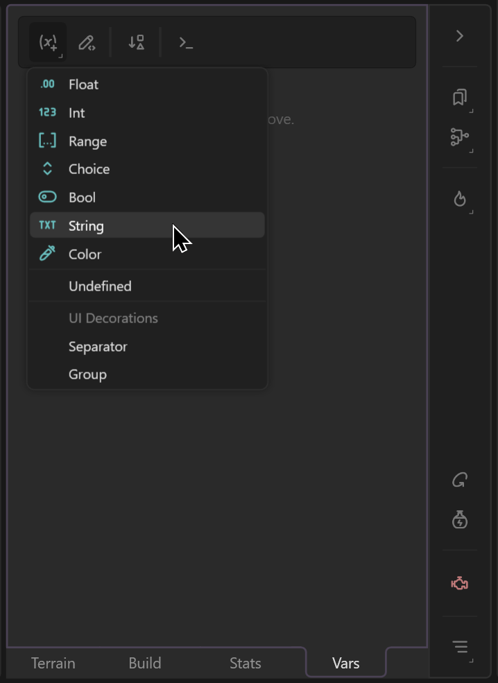
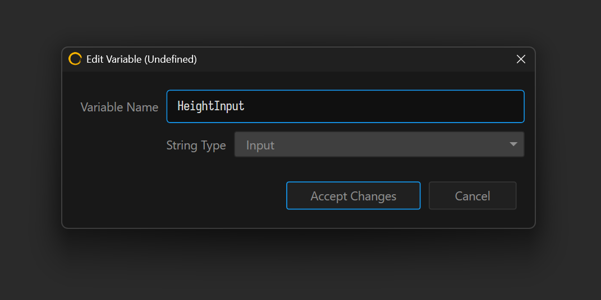
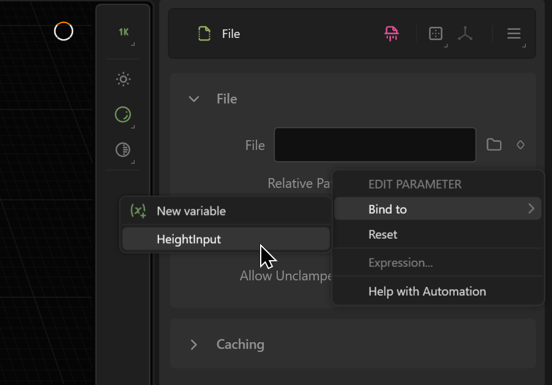
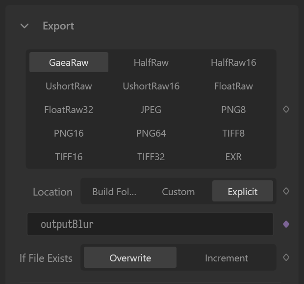
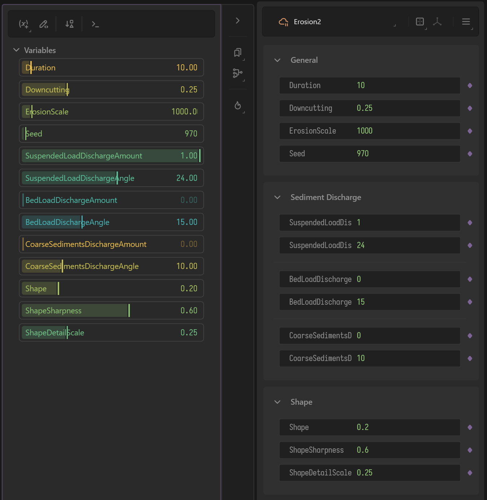
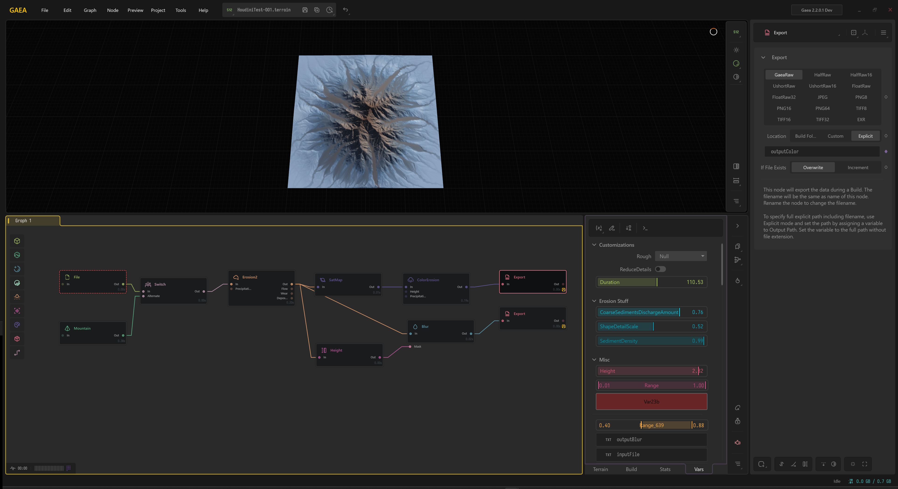

# Preparing a Terrain File

## Using Gaea2Houdini



## Examples

Your Gaea `.terrain` file can be as simple as one node, or have a hundred nodes with complex routing logic. In either case, your file still needs to follow a simple `In > Process > Out` structure or a `Generate > Out` structure.

## Basic Setup: In / Out

Create a new String variable. Give it a meaningful name, and set the Type to "Input". Then create a File node, and bind its File property to this Input variable.

<figure><figcaption></figcaption></figure> <figure><figcaption></figcaption></figure> <figure><figcaption></figcaption></figure>

For Output, create a variable and set the Type to Output. Create an Export node, set the format to `GaeaRaw`, the Location to `Explicit` and bind the Output Path to your variable.

<figure><figcaption></figcaption></figure>

Now you can put anything between these nodes and expose their properties. These properties will show up in Houdini in the [#gaea-terrain-processor-sop-node](gaea-sop-nodes.md#gaea-terrain-processor-sop-node "mention").

## Examples

### Simple Example: Erosion2

Let's say you only want to use Erosion2, create an Erosion2 node between the File and Export nodes.

For each parameter you wish to expose, open the Edit Parameter menu and select `Bind To > New Variable`.

<figure><figcaption></figcaption></figure>

Once all your properties are exposed, your .terrain file is ready for use in Houdini.


Not all properties can be exposed!

Some properties with custom UI like Curve, CLUTer, Draw, and others may not bind to a parameter.


<figure><figcaption></figcaption></figure>

### Complex Example

In this larger example, we have created two outputs - one for the heightfield and one for color, so we can use Gaea's ColorErosion tools.

<figure><figcaption></figcaption></figure>

#### Design-Time Tip

The Switch node allows you to pass a heightfield or mask but also provide an alternate if the main input is not available.

You can add a Switch node to your File and give it an Alternative Reference of a sample terrain. This lets your build and debug your Terrain file without requiring any input from Houdini.

Turn on `Discard Alt in Final Build` so this alternate route is never used during final builds, therefore saving you memory.

### Create Programmatic Setups

You don't need to always expose properties directly. You can create independent variables, bind them to one or more properties, and use Expressions to filter the values. This lets you create a fully functional node-based terrain process with properties of your own.

See [scripting-and-expressions](../../developers/scripting-and-expressions/ "mention") for further details.
