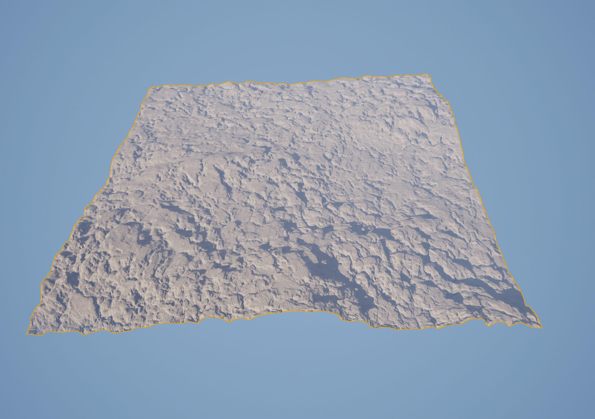

# Importing Terrains

## Importing Terrains

Use **Gaea2Unreal**, specifically the **Gaea Landscape Importer**, to easily import a Gaea terrain in Unreal Engine 5 with a single click.

Importing terrains into Unreal Engine can be a complicated process, especially when dealing with various scales. Gaea2Unreal aims to make this an easy, seamless experience for you.

### Exporting your Terrain 

See the [unreal-node.md](../../using-gaea/build-and-export/application-specific-export-nodes/unreal-node.md "mention") section on how to prepare your terrain for export.

### Importing into Unreal Engine 5 

Once you have installed the Gaea2Unreal plugin in your UE installation, you will see the Gaea Landscape Importer in the main toolbar in Unreal Engine.

<figure><figcaption></figcaption></figure>

Clicking it will bring up the Gaea Landscape Importer window. Click `Import Heightmap` and select the PNG file that was exported from Gaea. The Importer will read the heightmap file along with the metadata saved by Gaea for UE-scale conversion, and populate the specifics in the window.

<figure><figcaption></figcaption></figure>

Click `Create Landscape` and you're done!

<figure><figcaption></figcaption></figure>

See the [importing-weight-maps.md](importing-weight-maps.md "mention") section to see how to expand on this import process by importing additional assets as weight maps.
