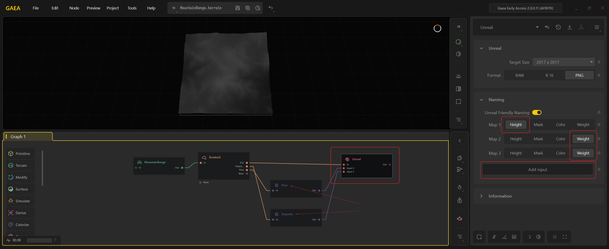
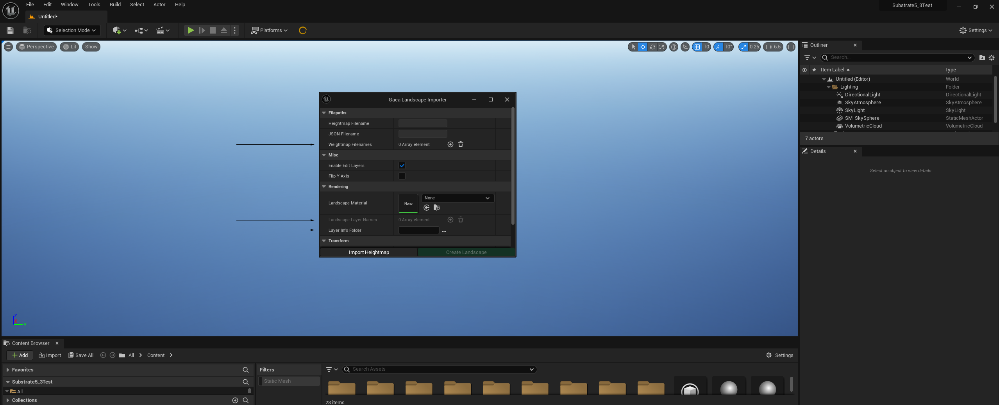
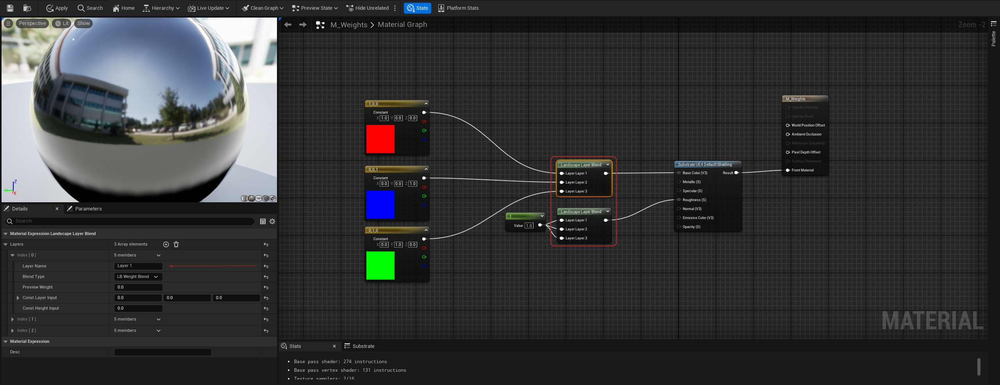
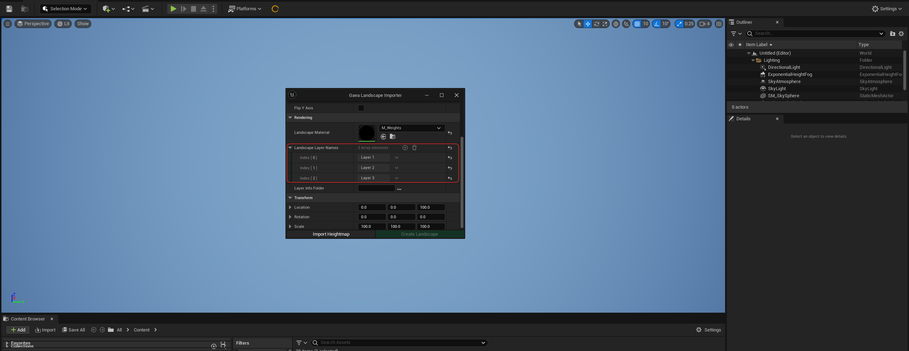
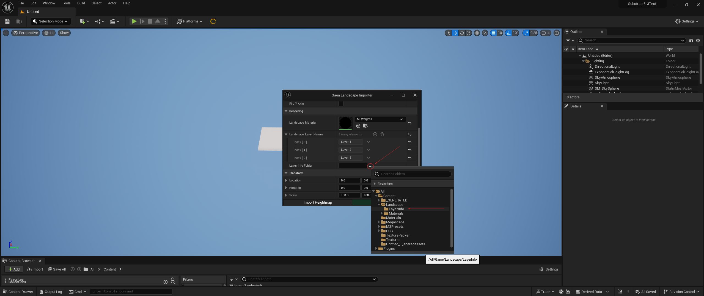
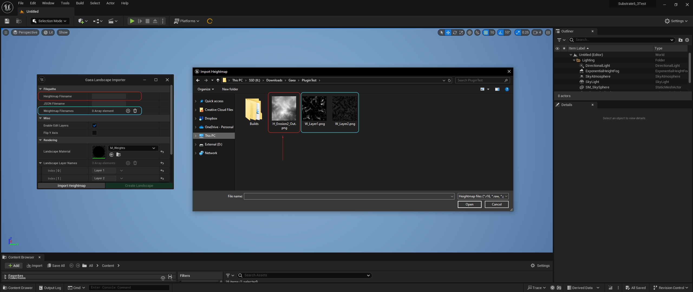
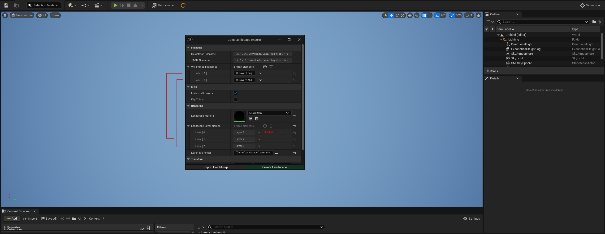
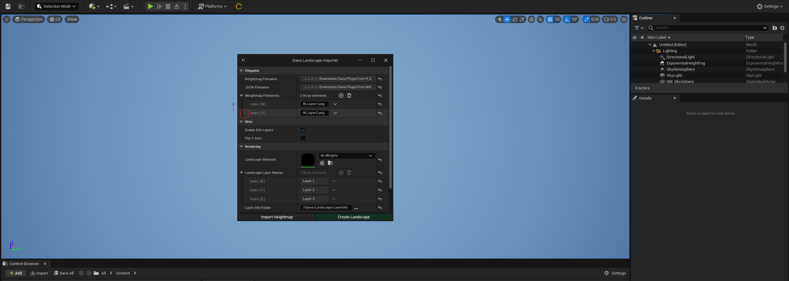

# Importing Weight Maps



## Importing Weightmaps

**Step 1: Exporting Heightmaps and Weightmaps in Gaea**

* Within Gaea, use the Unreal Export node to output your heightmaps and weightmaps with appropriate prefixes.
* Add inputs and wire them accordingly. Select "Height" for heightmaps and "Weight" for weightmaps.
* Assign unique names for nodes going into the Unreal Export node by right-clicking and renaming them. For example, if using two Gamma nodes on the Flow and Deposit outputs from the Erosion 2 node, rename these Gamma nodes to avoid naming conflicts during export.

<figure><figcaption></figcaption></figure>

**Step 2: Configuring the Gaea Landscape Importer**

* The Gaea Landscape Importer panel now includes three new properties: Weightmap Filenames, Landscape Layer Names, and Layer Info Folder.
* Start by setting up the Landscape Layer Names, which auto-populate when a landscape master material is provided.

<figure><figcaption></figcaption></figure>

**Step 3: Setting Up the Landscape Master Material**

* Make sure your Landscape Layer Blend nodes have the same number of layers as your landscape material, with unique layer names (e.g., avoid using "Layer 1" for multiple layers).
* Position these nodes at the top of the graph; avoid nesting them in material functions because the importer does not recursively search through the material.
* Make sure your layer nodes have at least two layers; otherwise, the importer will skip importing weightmaps when creating the landscape.

<figure><figcaption></figcaption></figure>

**Step 4: Linking the Landscape Material in the Importer**

* Once your landscape material is correctly configured, select it in the Landscape Material slot within the Gaea Landscape Importer.
* The Landscape Layer Names field will automatically populate with the layers found in your material.

<figure><figcaption></figcaption></figure>

**Step 5: Specifying the Layer Info Folder**

* Provide a content path for the Layer Info Folder property by clicking the three dots beside the empty text field. A content browser path picker widget will appear, allowing you to select a folder where your layer info objects will be created during landscape actor creation.

<figure><figcaption></figcaption></figure>

**Step 6: Importing the Heightmap and Weightmaps**

* With the rendering properties configured, select the heightmap you exported from Gaea (prefixed with "H\_"). Click "Open" and the importer will automatically detect and load all additional files with the "W\_" prefix.
* The Weightmap Filenames property will populate with the weightmap files exported from Gaea.

<figure><figcaption></figcaption></figure>

**Step 7: Finalizing Weightmap and Landscape Layer Settings**

* Before clicking "Create Landscape," make sure that Weightmap Filenames and Landscape Layer Names are correctly configured.
* Note that the first layer in the material will not receive a weightmap. Therefore, check that your number of weightmaps is always one less than the number of landscape layer names. If there are discrepancies, such as exporting more weightmaps than layers in the material, delete the extra entries in the Weightmap Filenames property.

<figure><figcaption></figcaption></figure>

**Final Notes:**

* If the importer does not order the Weightmap Filenames according to your Landscape Layer Names, you can manually adjust the order by dragging the entries up or down.
* If weightmaps fail to import when clicking "Create Landscape," check that Weightmap Filenames, Landscape Material, Landscape Layer Names, and Layer Info Folder are all properly set. All these properties must be correctly configured for successful weightmap import.
* The Weightmap Filenames array should always have 1 less entry than the Landscape Layer Names array - this is due to the first entry of the landscape layer system not needing a mask applied to it. If your arrays have an equal number of entries, the Create Landscape button will be disabled.

<figure><figcaption></figcaption></figure>

