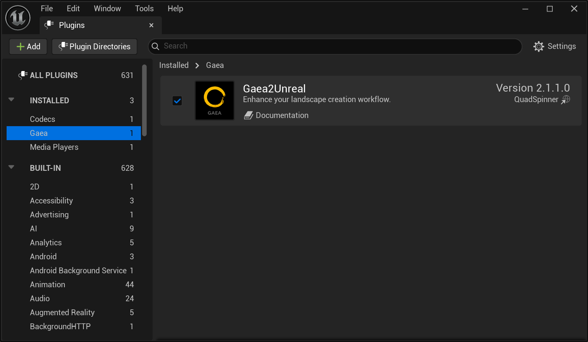

# Installing Gaea2Unreal

Download the Gaea Unreal Tools installer from the the Gaea `Tools Menu > Plugins`.


## Source Code Repository

Source code for the Gaea2Unreal plugin can be found on the [official GitHub Repository](https://github.com/QuadSpinner/Gaea2Unreal).


## Install to Engine Plugins

Open the Zip file for the version of Unreal Engine you are running, and extract the zip files to your Unreal Engine's install folder in this subpath: `\Engine\Plugins\`&#x20;

NOTE: The `GaeaUnrealTools` folder is already contained in the zip file, so you will be installing the plugin files to the path `\Engine\Plugins\GaeaUnrealTools`&#x20;

## Install to a Project

Instead of `Engine\Plugins` you can install to the `<Project>\Plugins` folder instead to keep the plugin contained within your project.

## Running the Plugin

Once installed, launch Unreal Engine. Open the Plugins window and check `Gaea2Unreal`

<figure><figcaption></figcaption></figure>

<figure><figcaption></figcaption></figure>

Once the plugin is loaded (a restart may be required) - you will find the Gaea Landscape Importer in the main toolbar.&#x20;


If you do not install to `GaeaUnrealTools`  folder then Unreal may have trouble recognizing the icon in the toolbar.&#x20;


