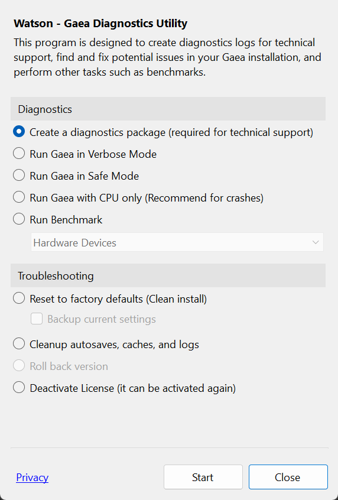

# Diagnostics (Watson)

The Gaea Diagnostics application, nicknamed WATSON, is crucial for diagnosing problems, helping tech support find solutions for you, and for benchmarking your hardware.

<figure><figcaption></figcaption></figure>

Use Watson to generate a [diagnostics-package.md](diagnostics-package.md "mention").
