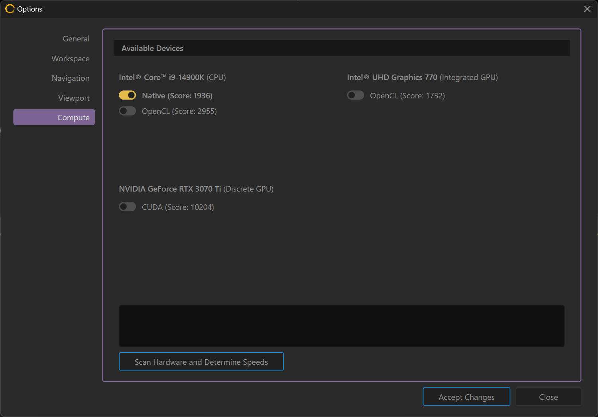

# Benchmark Devices

<figure><figcaption></figcaption></figure>

## Hardware Benchmark

The Hardware Benchmark runs tests to determine the general speed of your CPU, integrated GPU, dedicated GPU, and any other compatible devices that Gaea can utilize for [Broken link](broken-reference "mention").

You can choose between the normal, High Accuracy, or Very High Accuracy test. Higher accuracy tests require longer testing time.

<figure><figcaption></figcaption></figure>

The score signifies the performance factor of each device. A higher score indicates better performance.

### Compute Options

The benchmark data is also available via the [Broken link](broken-reference "mention") tab in [options.md](../../getting-started/options.md "mention").&#x20;

<figure><figcaption></figcaption></figure>
