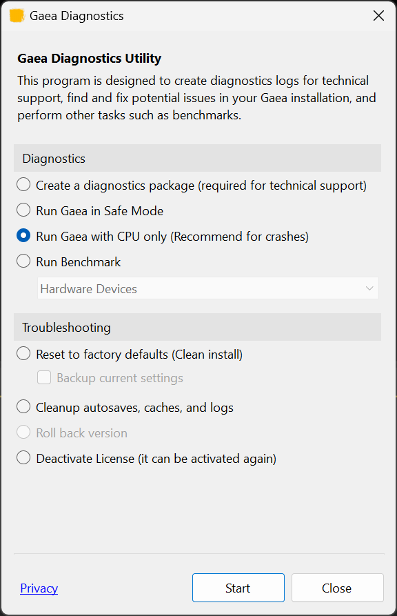
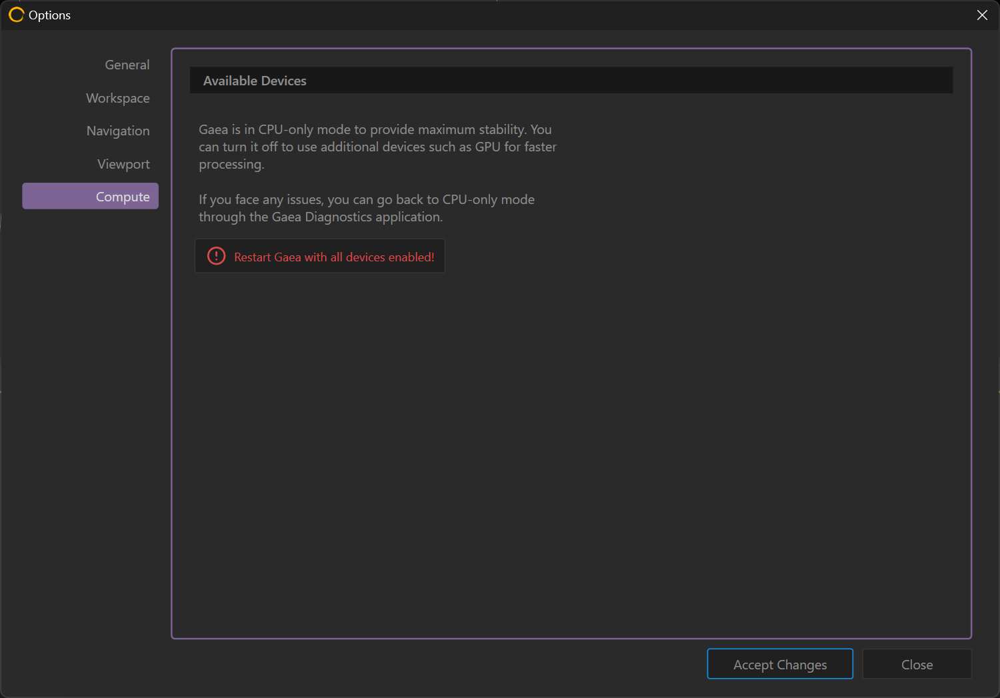

# CPU Only Mode

In some cases, Gaea may have trouble using your GPU device. Often this is because it is an [unsupported older device](../../getting-started/install-gaea/#system-requirements) or may have outdated drivers.

To enable CPU only mode, start Gaea Diagnostics from the Start Menu. Select "Run Gaea with CPU only" and click "Start".

<figure><figcaption></figcaption></figure>

This will start Gaea in CPU only mode. It will now remain in CPU only mode, including when running the Gaea Build CLI.

To re-enable multiple device usage, you can go to the [Broken link](broken-reference "mention") tab in [options.md](../../getting-started/options.md "mention").

<figure><figcaption></figcaption></figure>

