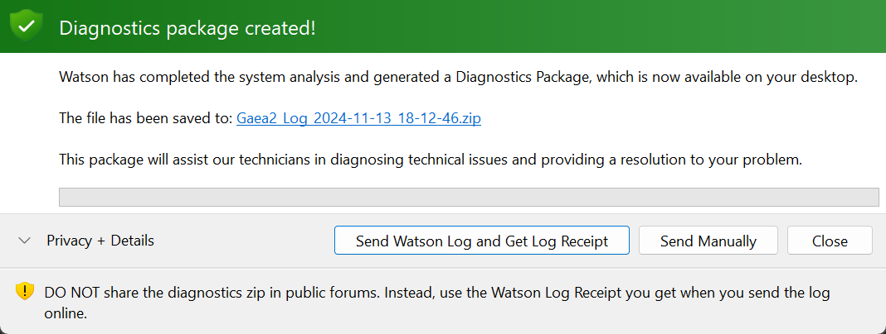
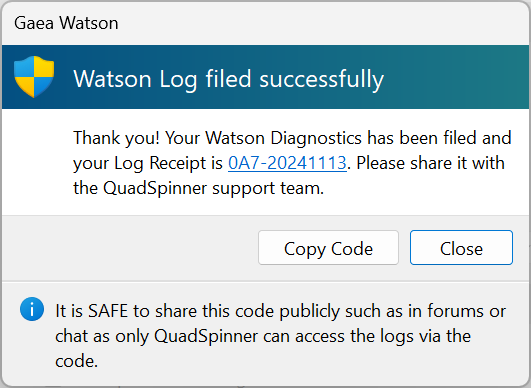
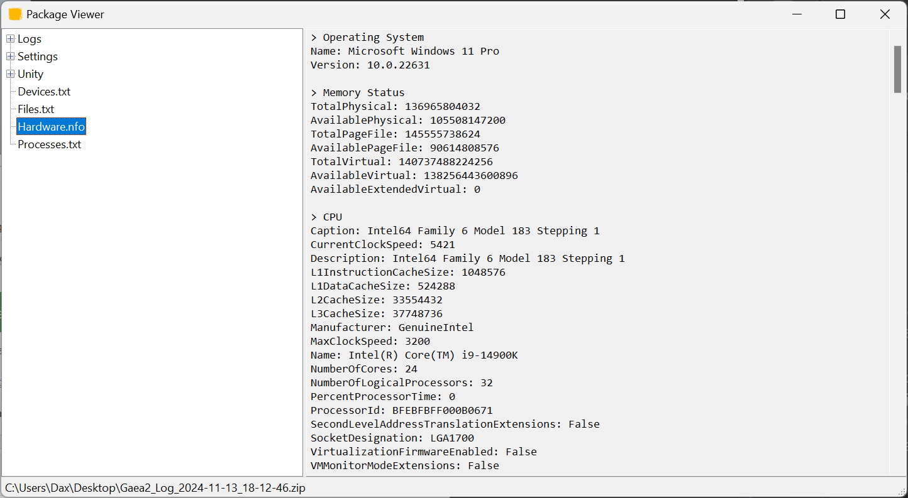

# Diagnostics Package

Gaea Diagnostics (Watson) can create a Diagnostics Package that can help our tech support technicians and developers examine crashes or incorrect behavior in Gaea.

<figure><figcaption></figcaption></figure>

It takes a few moments for the diagnosis to be completed. The resulting diagnostics package will be a `.zip` file that will be placed on your desktop for easy access. In most cases, you will want to email it to our [Tech Support team](https://quadspinner.com/support/).

<figure><figcaption></figcaption></figure>

You can expand this dialog to examine the contents of the package. Almost all data is plain text and can be examined.&#x20;

### Send Online

To enable quick and hassle-free sharing, you can choose to send the Watson Log directly to our secure server. In return, you will be given a Log Receipt code such as `0A7-20241113`. If you are contacting our Tech Support team, you can give this code to them along with a description of your issue and we will retrieve it from our server and diagnose the issue.

<figure><figcaption></figcaption></figure>


While it is risky to share a Diagnostics Log zip file publicly, like in Discord or Forums, it is completely safe to share the Log Receipt code. The code can only be used by authorized QuadSpinner team members to access your log.

While we do our best to ensure only non-secure technical information is stored in the logs, a clever person with malicious intent may still be able to glean some information from your logs. The Log Receipt ensures private access to your data.


### Send Manually

If you prefer to send the data directly, you can simply attach the `.zip` file generated by Watson to an email or [Support form](https://quadspinner.com/support).

## Package Contents

The diagnostics package contains:&#x20;

* Execution logs for Gaea, these are detailed chronological entries of events inside the program - especially technical readouts and error traces.
* Copy of your settings so we can recreate the same environment during our tests.
* Hardware information such as CPU type, model number, GPU type, driver version for various hardware, firmware version, and so on.
* Integrity check of the installation to make sure all files are intact and if an update may have failed to update specific files.

### Privacy

We do not collect any personal information in these logs. Our intention for the logs is solely to determine where the software or hardware may be malfunctioning and provide a solution to you.

In this age of extreme data collection and abuse of the user's trust, we try our best to treat your information with respect. If any personally identifiable or protected information is ever collected - for example, your username may be your name or a filename may describe an NDA protected project name - we disregard such information and do not use it any form.

All diagnostics logs are collected directly by QuadSpinner support - these are not outsourced personnel but our own dedicated in-house team. These logs are then shared with our development team. Most of the time they are discarded immediately. Other times they may be kept for a longer period in [accordance with our privacy policy](https://quadspinner.com/legal/) so that we can refer to it in solving larger problems in the software.

### Editable Logs

Lastly, as we ask you trust us with your data, we trust you with ours. The zip file is editable. If you find any information you prefer not to share, you may remove it before submitting the package.&#x20;

<figure><figcaption></figcaption></figure>

However, please note that removing any data critical to Gaea's operation may hinder our ability to provide effective technical support so please be sure you know what information your are removing.

