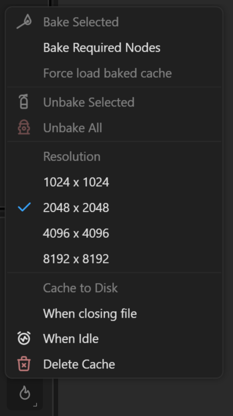

# Baking Nodes

The Baking feature in Gaea is a powerful tool designed to enhance workflow efficiency by locking nodes at a high resolution, enabling high-quality previews without compromising performance on the rest of the graph.

<figure><figcaption>
Baking Menu
</figcaption></figure>

## Baking Features

**Bake Selected.** Use this option to bake the selected node(s) in the graph. Baking a node saves its current state at a chosen resolution, which allows for faster loading and prevents the node from being recalculated unless explicitly unbaked or modified.

**Bake Required Nodes.** This option is used to bake nodes involved in tiling operations, ensuring seamless tiling across different segments of a terrain without needing to reprocess the entire terrain each time adjustments are made.

**Force Load Baked Cache.** Forces the application to reload the baked cache, useful for when changes in the system or project environment may prevent the automatic loading of cached data.

**Unbake Selected.** Reverses the baking process for selected nodes, making them editable again. This is necessary when adjustments are required on previously baked nodes.

**Unbake All.** Removes the baked status from all nodes in the project, allowing for full graph reprocessing and editing.

**Resolution Settings.** Choose the resolution at which the nodes will be baked. Available options are: **1024 x 1024, 2048 x 2048** (default), **4096 x 4096, 8192 x 8192**

Selecting a higher resolution for baking is beneficial when working on detailed sections of the terrain, as it provides clearer and more accurate previews.

### Cache Previews to Disk

The Cache Previews to Disk feature, previously known as "Session Cache," allows Gaea to save processed node previews to your hard drive instead of keeping them in memory.&#x20;

This feature is instrumental in optimizing the performance of Gaea by minimizing memory usage, which is especially beneficial in projects with extensive graphs or high-resolution data.

* **When Closing File:** Saves all previews and in-memory build results to disk when a file is closed. Next time when the file is opened,&#x20;
* **When Idle**: Automatically bakes the graph when the system is not actively being used, and a node has not been modified for a few minutes. It optimizes time by utilizing idle periods for processing. This also helps speed up caching when the file is closed (if that option is set).

Either option can be set independently.


The option "When Closing File" is saved with the file and persisted, however, "When Idle" is a session-specific option and will be reset next time you start Gaea.


**Delete Cache.** This command lets you delete any existing cache.

### Cache Management

## **Benefits**

* **Reduced Memory Usage**: By storing preview images on the disk, Gaea frees up RAM, which can significantly enhance system responsiveness, especially in memory-constrained environments.
* **Faster Reload Times**: When reopening a project, Gaea can quickly load the cached previews from the disk, speeding up the initialization process as the terrain does not need to be reprocessed from scratch.
* **Linchpin Nodes:** Gaea utilizes [linchpin-nodes.md](linchpin-nodes.md "mention")to reduce the amount of data that needs to be loaded into memory for any work session or build.

This feature is designed to strike a balance between performance and resource utilization, making Gaea more efficient, especially when dealing with complex and resource-intensive projects.

## Practical Usage

* **Optimizing Performance**: Baking nodes that are complex or are considered finalized can drastically reduce the computational load during subsequent previews and builds.
* **Managing Detailed Work**: For terrains that require high levels of detail, baking at higher resolutions can provide the necessary clarity to assess and refine work without slowing down the overall project workflow.

