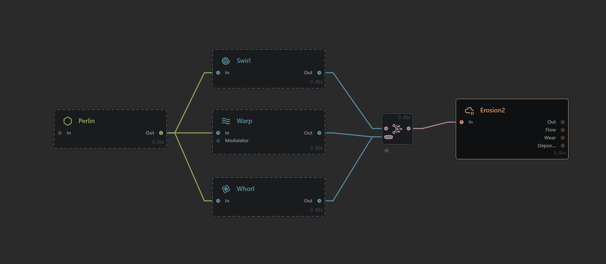

# Linchpin Nodes

## Reducing Memory Consumption

An added bonus of baking is that it can free up a lot of RAM. When loading a baked cache, Gaea will only load "linchpin nodes". A linchpin node is a baked node that is connected to unbaked nodes. Ancestors of linchpin nodes are not loaded, thereby saving processing power and memory.

When dealing with complex graphs made of dozens, sometimes hundreds of nodes, linchpins can dramatically reduce memory consumption and increase the overall speed of the terrain by offloading data that is not going to be modified.

## Example

<figure><figcaption></figcaption></figure>

Consider this graph. It shows how Gaea unloads 4 of the 5 baked nodes by identifying only the last baked node as a "linchpin". The memory/cache consumption is reduced by \~66%.

### Explanation

The Perlin node is connected to 3 different nodes, which eventually come to a single Combine node. The Erosion node here relies only on the Combine, so keeping the data for the previous 4 nodes is unnecessary.&#x20;

When you bake the Combine node, Gaea will detect that it is the linchpin and unload the previous nodes. Non-crucial nodes such as these are depicted with a dotted border to show that they are not loaded.


Baked nodes that are not loaded can be loaded through the property editor. However, if you wish to modify anything, it is recommended to unbake and bake portions of the graph.


