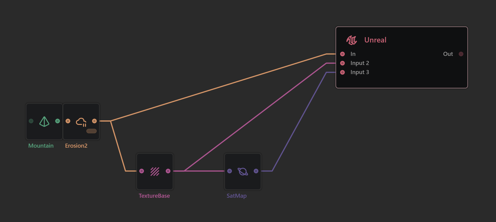
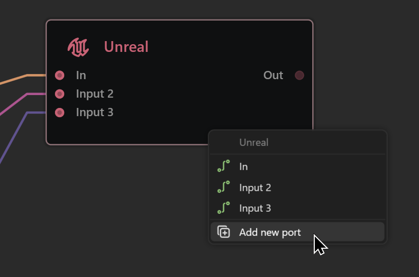
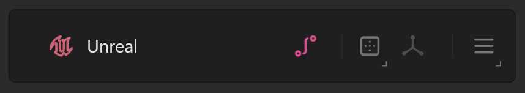

# Unreal Node

<figure><figcaption>
The Unreal Node can accept multiple inputs and save them for Unreal Engine consumption.
</figcaption></figure>

The Unreal node is made to prepare your data to be imported into Unreal Engine very easily using the Gaea2Unreal bridge plugin. The Unreal node will resample the data to a Unreal friendly resolution (for example, a 2048 x 2048 build will become 2017 x 2017 to accommodate UE's considerations).

### Adding Inputs

You can add multiple inputs to the Unreal node.

<figure><figcaption>
You can add additional Input Ports by dropping a connection in the middle of the Unreal node and selecting "Add new port"
</figcaption></figure>

<figure><figcaption>
You can also click the pink "Add Port" button in the Node Properties.
</figcaption></figure>

### Target Size and Format

The node's Target Size property lets you select the resample size. It is recommended that you select your Gaea build resolution to be the closest to the size you need. Based on your current Build Resolution set in the [build-options](../build-options/ "mention"), you will be given a recommended Target Size.

You can set the file format for all the exported files.


RAW is currently not fully supported. Both PNG and R16 are fully supported right now, but we recommend using PNG for maximum compatibility.


<figure><figcaption></figcaption></figure>

### Unreal Friendly Naming

By default, the filename for each input is decided by the name of the node. You can rename a node to rename the output filename.

To use the Gaea2Unreal bridge, you should enable Unreal Friendly Naming. This will prefix `T_` in front of masks and textures and `H_` in front of the heightfield.


The heightfield should always be the primary input.


## Building

When you build your terrain (See [..](../ "mention")) the Unreal node will save all the appropriate asset files along with a JSON definition file. This is the key file you will need for [importing-terrains.md](../../../plugins/gaea2unreal/importing-terrains.md "mention").

See the next section on how to set up your exported terrain in Unreal Engine.
