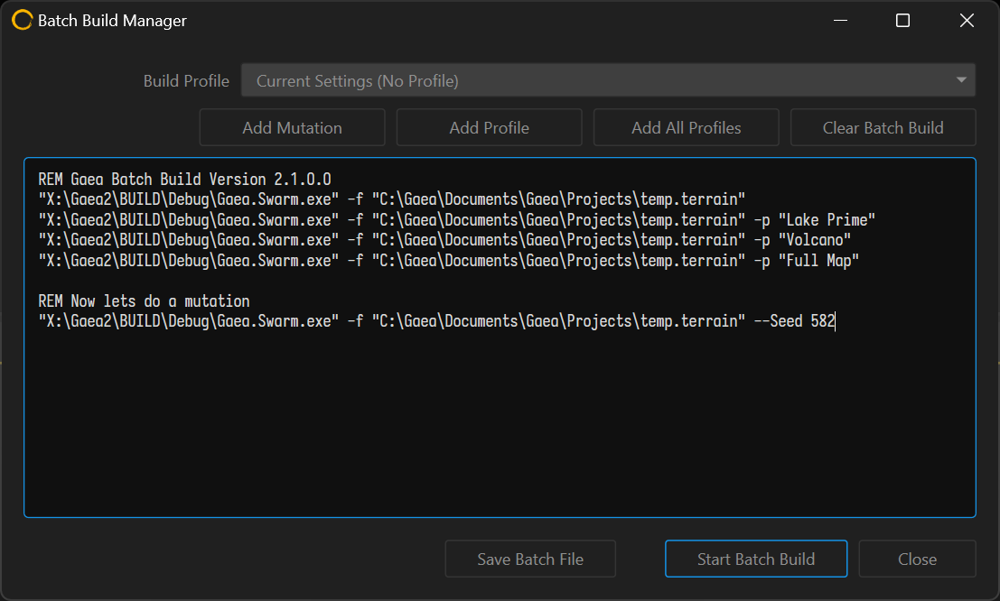

# Batch Builds



## Running Batch Builds

You can execute multiple builds using saved profiles using the Batch Builds dialog. Go to Build menu > Batch Builds to open the dialog.

<figure><figcaption></figcaption></figure>

Queue the different profiles you want to build and execute the batch. You can also save the batch as a `.bat` file for later execution or modification.

The `-profile <name>` or `-p <name>` argument can be used to specify a profile during a [build-swarm](../../advanced-topics/build-swarm/ "mention") execution. It is recommended that the \<name> be wrapped in `""` quotation marks to prevent incorrect parsing.

## Mutations

The Batch Build window also allows you to create various mutations of your terrain. You can add mutations with or without profiles.&#x20;

Mutations allow you to build different versions of the same terrain by simply randomizing the Seed properties of all nodes. The `--Seed` command line argument allows you to specify a specific "global seed" that serves as your Mutation Seed for predictable use.
