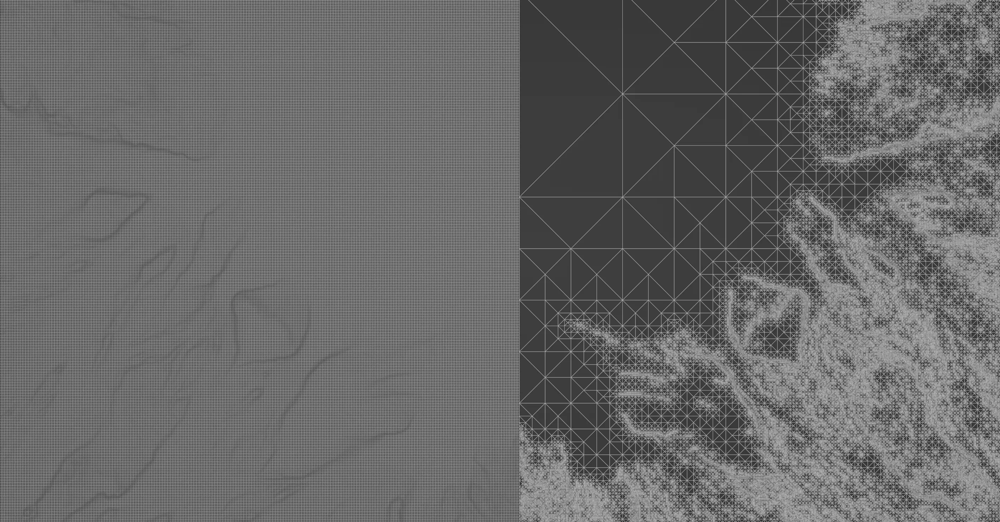
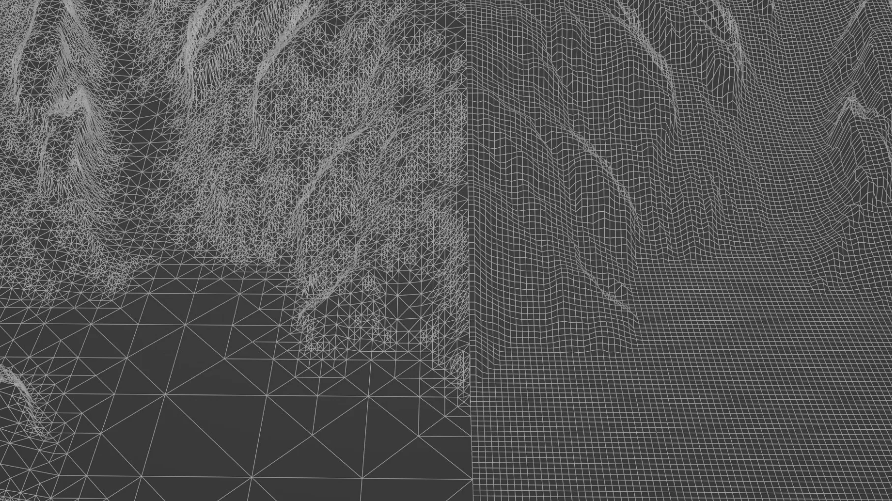

# Mesh Exports

## Exporting Meshes

Gaea uses the Mesher node to translate a heightfield/terrain into a structured mesh. It supports common major formats such as OBJ, FBX, DAE, and glTF.

You can choose between Triangles (Tris), Quads, and Adaptive Tris using our proprietary _Sophia_ algorithm.

<figure><figcaption></figcaption></figure>

## Displaced Grid Export

The standard, tried-and-trusted method of terrain meshes is a simple fixed-density mesh that is displaced on the vertical axis. It provides a uniform topology, using either triangles or quads.

The resulting mesh is the same as if you were to create a plane of a fixed number of segments and displace it vertically. It provides a strong, predictable topology that is very easy to manipulate.

The only downside of this method is that it uses the same number of polygons for any part of the terrain regardless of the complexity required. For example, a flat, featureless area would use the same number of polygons as a highly detailed peak.

<figure><figcaption>
Grid vs Adaptive Tris
</figcaption></figure>

## Adaptive Tris (Sophia)

This method creates optimized terrains using our "Sophia" algorithm. It creates clean triangles and subdivides them as needed based on the complexity of the underlying portion of the terrain. The main advantage of this method is that it can produce higher quality meshes while reducing the amount of polygons used. In most cases, Optimized meshes produce higher quality results than their Grid counterparts, and use fewer polygons.

<figure><figcaption></figcaption></figure>

Depending on the shape of your terrain, you can reduce polygon count by 20-40%. In extreme cases with large flat areas, it can decrease by up to 80%!

Optimized meshes, however, cannot provide quad output and are limited to triangles because of the intrinsic nature of the algorithm.

<figure><figcaption></figcaption></figure>

You can see that the mesh retains high-fidelity when imported into DCC application such as Blender with proper lighting.

<figure><figcaption></figcaption></figure>

### Comparison with Standard Tris Export

| Feature                                     |       Grid       |          Optimized          |
| ------------------------------------------- | :--------------: | :-------------------------: |
| Precise polygon count                       |        Yes       |         Approximate         |
| Tris support                                |        Yes       |             Yes             |
| Quad support                                |        Yes       |              No             |
| Quality-per-polygon                         |      Average     |             High            |
| Increase quality where needed               |        No        |             Yes             |
| Reduce polygons for flat or smooth surfaces |        No        |             Yes             |
| Topological Structure                       | Equidistant Grid | Organized Irregular Network |
| Automatic LOD generation                    |        Yes       |              No             |
| Suited for sculpting                        |        Yes       |              No             |

## Additional Settings

### **Object Scale**

Meshes can be exported in 2 scales: Normalized and Metric.

* Normalized scale enforces a strict `0..1` range for values along all 3 axes.
* Metric scale enforces `1 unit = 1 meter`, so a typical Gaea terrain of `5000` meters would be `0..5000` units.

The main advantage of Normalized meshes is that many modern OBJ importers let you apply a scale multiplier, which you can use to scale the terrain very easily. You just need to use the width of the terrain in meters (see [scale-and-resolution.md](../../terrain-basics/scale-and-resolution.md "mention")). For example, the default terrain is 5000 meters wide. You can use `5000` as a multiplier when importing, and your terrain should scale to 5000 meters.

### **Texture Mapping**

By default, all mesh exports include texture coordinates. In special circumstances, you can turn off texture coordinate generation.

Regardless of the method used to export the mesh, it will use simple planar mapping. In most 3D applications, you can apply simple planar mapping of the exact size of the object to get full UV mapping.


You can turn off texture coordinates and your file size can become up to 30% smaller. This can be quite helpful when you're working with very dense meshes. Once imported in your DCC application, you can apply planar UV mapping to the object.

This is especially useful with OBJ since it is plain-text format, most parsers can take quite a while to import.  Without texture coordinates, this process can be 33% faster.


### **Normal Mapping**

Mesher will generate normals in your mesh. However, if you want to generate global-space normals, you can use the Normals node, or for tangent-space normals you can use the MeshWarp node as shown in [tangent-space-normals-and-warped-maps.md](tangent-space-normals-and-warped-maps.md "mention").


Some DCC Apps will fail to import meshes if Normals are not available. You can alternatively use auto-smoothing/auto-normals at 30-degrees for a generic import.


