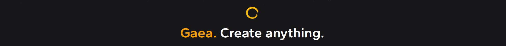

# Tangent-Space Normals and Warped Maps

## Tangent-space Normals

The MeshWarp node can create tangent-space normals maps that provide very high quality normals that can be used with lower-resolution Meshes/LODs.

Connect any Mesher node to a MeshWarp node, and enable 'Generate Normals' and set any flip/channel settings you need to. Make sure the MeshWarp node is set to Export.

This will produce a Normals map bitmap output that you can use on your meshes. In addition, you can Mesher's `Artifact Reduction` option to remove high-frequency detail to make the mesh even cleaner. The Normals will provide all the high-frequency, small detail to enrich your terrain.


MeshWarp will only work with Mesher nodes set to `Tris` export.


## Warping Texture Maps and Masks

The MeshWarp node, along with generating tangent-space normals, will also apply nuanced warping to mask and color maps to make them fit the exported Mesh and LODs with a higher level of fidelity.

<figure><figcaption></figcaption></figure>

Drag and drop a connection on the MeshWarp node and select "Add new port" to add additional ports.&#x20;

### LOD Export

If your Mesher node has LODS set, then MeshWarp will generate appropriately warped versions of your connected maps for each LOD.

<figure><figcaption></figcaption></figure>


MeshWarp will use the incoming node's Name as the prefix for the file. So if you have a node `PerlinMaskRocks` then the output will be `PerlinMaskRocks_LOD1` while the high-resolution version has no suffix.

It is also recommended that the previous node (PerlinMaskRocks, in this example) not be marked for Export as there may be file conflicts between the two as they save to the same name for the high-res version.


