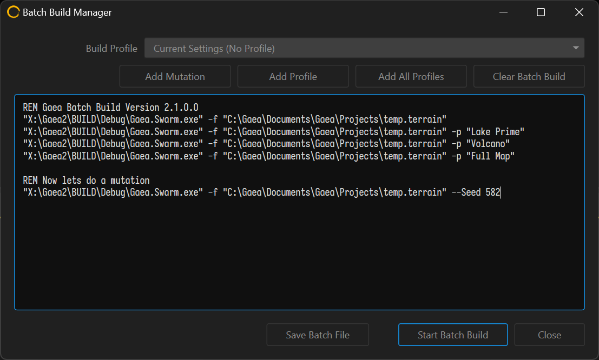

# Profiles and Batch Builds



Build Profiles let you save all Build Settings in a named preset. If you find yourself creating multiple versions of your terrain, or creating different output types, you can switch between the different build settings swiftly with Profiles.

<figure><figcaption>
The Profiles tab lets you preview and manage profiles.
</figcaption></figure>

## Using Profiles

To create a profile:

* Open Build Settings.
* Select the settings you want for a profile
* Go to the Profiles tab and click Save Profile.

The "Load" button imports the selected build profile into the current build settings.

The "Save As..." button allows you to create a new build profile based on the current build settings.

The "Delete" button removes the currently selected build profile.


Use ASCII-friendly names for the profile as you may wish to use them in command line or Batch executions.


## Running Batch Builds

You can execute multiple builds using saved profiles using the Batch Builds dialog. Go to Build menu > Batch Builds to open the dialog.

<figure><figcaption></figcaption></figure>

Queue the different profiles you want to build and execute the batch. You can also save the batch as a `.bat` file for later execution or modification.

The `-profile <name>` or `-p <name>` argument can be used to specify a profile during a [build-swarm](../../advanced-topics/build-swarm/ "mention") execution. It is recommended that the \<name> be wrapped in `""` quotation marks to prevent incorrect parsing.

See also [creating-mutations.md](../../advanced-topics/build-swarm/creating-mutations.md "mention")

