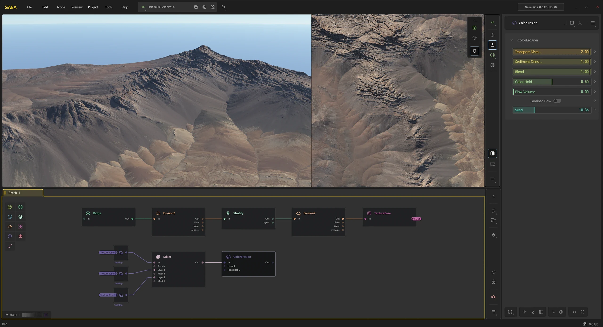
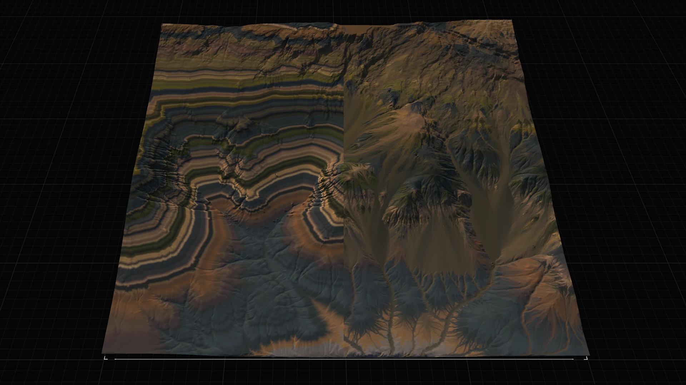

# ColorErosion

## Sedimentary Flows with ColorErosion

<figure><figcaption></figcaption></figure>

ColorErosion takes the principles of sedimentary erosion and applies it to color maps.

Gaea's Erosion algorithm creates powerful, realistic sedimentary flows and the ColorErosion nodes takes advantage of that to create realistic color flows that mimic minerals and other sediments as they shift and flow across a landscape.

ColorErosion is extremely powerful, yet very simple to use. In most cases, the default settings are more than enough to get the precise effect. It requires only two inputs, the color map you wish to erode and your terrain heightfield.

### Using Directly

You can apply a SatMap directly a terrain, with or without a TextureBase or Texturizer node in between, and simply apply ColorErosion to get decent layered sedimentary flows.

<figure><figcaption></figcaption></figure>

### Using with Mixer

The Mixer node is very helpful in preparing the color map before applying ColorErosion as you can change different color strata before eroding, and choose exactly how and where they may flow.

<figure><figcaption></figcaption></figure>

### Sophisticated Use

You can also create more subtle, sophisticated texturing with ColorErosion as shown in the `Complex Scene - Debris` example that is included with Gaea.

<figure><figcaption></figcaption></figure>

### Understanding How Color Moves

ColorErosion can be a very creative component whether you are creating something realistic or stylistic. The core understanding required is how color placed high up flows with existing sediment flows.

<figure><figcaption></figcaption></figure>

Experiment with various color layers, whether you use SatMap's Bias slider or various layers with Mixer, and see how the erosion reacts.

<figure><figcaption></figcaption></figure>
