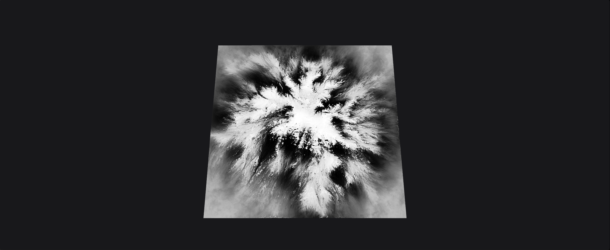

# Crafting Masks

## What is Color Lookup/CLUT?

All color texture generation in Gaea relies on applying color ramps (gradients) through a black-and-white mask.

A simple example: the darkest part of the gradient maps to the lowest terrain elevations, while the brightest part maps to the highest. Intermediate grayscale values distribute the gradient proportionally. This is known as a CLUT or Color Look Up Table.

<figure><figcaption></figcaption></figure>

In this example, the gradient from a CLUTer node is mapped directly to the heightfield.

<figure><figcaption></figcaption></figure>

Now, let's a try more detailed, colorful gradient.

<figure><figcaption></figcaption></figure>

You can see how it distributes across the terrain.

<figure><figcaption></figcaption></figure>

Now, if you use the same CLUT map but feed it a FlowMap instead of the terrain height, the texture will follow the flow lines defined by the FlowMap, producing a very different result.

<figure><figcaption></figcaption></figure>

### Colorization with Texture Nodes

Gaea provides nodes such as [TextureBase](https://app.gitbook.com/s/QDbwutRMkOIUKbLVMSQP/nodes/derive/texturebase "mention") and [Texturizer](https://app.gitbook.com/s/QDbwutRMkOIUKbLVMSQP/nodes/derive/texturizer "mention") provide complex colorization masks based on the terrain's inherent features.

<figure><figcaption></figcaption></figure>

<figure><figcaption></figcaption></figure>

Which can create more complex textures such as this:

<figure><figcaption></figcaption></figure>

## Data Maps

Data Maps are specialized masks for selecting key terrain properties like slope, angle, and curvature, or for generating complex simulation-based data such as water flow and soil deposits. Additional maps like TextureBase produce pseudo-random texture masks for quick, easy color texturing.

Unlike the classic approach that combines basic data (slope, angle) with noise (e.g., Perlin) or depends heavily on erosion flow outputs—often requiring careful seed tuning—Data Maps introduce controlled randomness derived from systematic terrain analysis. This produces more natural, believable color maps.

### Aspect Maps

Aspect Data Maps mask out aspects of the terrain such as Height, Slope, Curvature, Angle, Peaks, etc.

<figure><figcaption></figcaption></figure>

### Generative Maps

Generate Data Maps run various algorithms on the terrain to generate information such as Flows, Soil, Rock Occlusion, etc.

<figure><figcaption></figcaption></figure>

Data Maps can be combined together or with Texture nodes to create complex texture masks for colorization.

