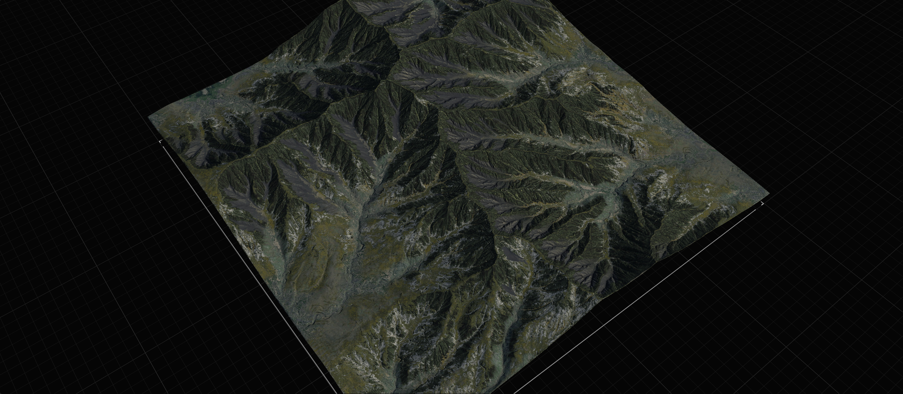
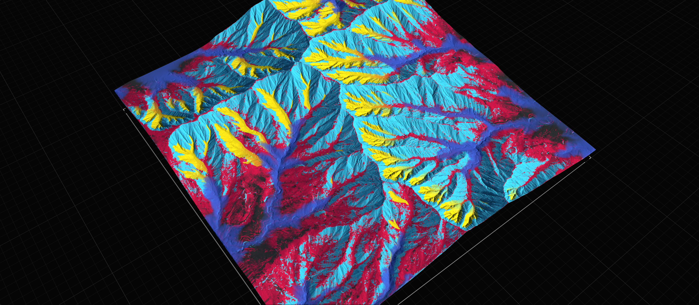

# Layering Textures

## Using Mixer

The Mixer node provides an easy interface to add and manage multiple color layers and combine them with various masks. Mixer supports built-in Height and Slope masks, as well as custom masks provided by other nodes.

<figure><figcaption></figcaption></figure>

By default, Mixer exposes three inputs. You can use the Add Input command in the Property Window toolbar, or drop a connection on the Mixer node and select "Add new port". You can add up to 15 layers.

<figure><figcaption></figcaption></figure>

You can change the order of layer-blending by simply dragging and changing the order of layers.

Each layer is assigned an ID color which is used to drive the "Simplified View" which is useful for checking how layers blend.

<figure><figcaption></figcaption></figure> <figure><figcaption></figcaption></figure>

When "Preserve Masks" is enabled, when in-built masks are such as Height or Slope are used, those masks are also exported as Out ports so you can use them for further masking later in the graph.

If you are coming from Gaea 1.0, or other older terrain software, the Mixer node is essentially an automation of Combine, Height/Slope, and Mask with additional convenience features.

