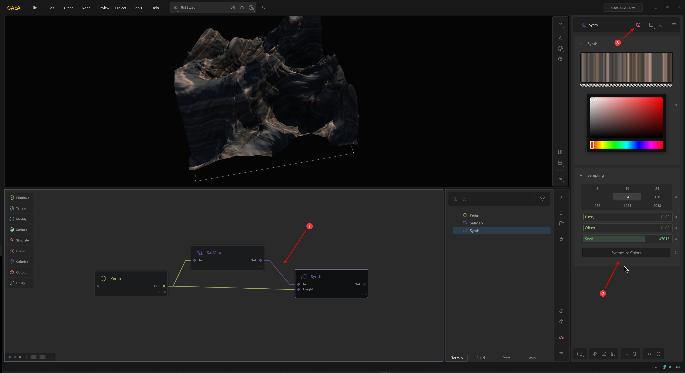

# Synthesizing Colors

Gaea's Synth node can take static color information and turn it into an editable gradient or color ramp just like the CLUTer node.

The process is quite simple:

<figure><figcaption></figcaption></figure>

1. Connect a static color map such as a SatMap or a File node with a color input to a Synth node.
   1. You will also need to provide a Height or Texture input, so you can apply the colors.
2. Select the number of Samples (gradient stops) and other settings, and click `Synthesize Colors`.
3. This will give you an editable gradient that you can edit.
4. Optionally, you can also export the data as a JSON or CSV for use in external applications.


Re-synthesizing will overwrite any modifications you make manually to the Gradient Editor.


