# Working with SatMaps

Our library of over 1400 color maps, derived from real satellite data, helps you colorize your terrains quickly without sacrificing realism.

<figure>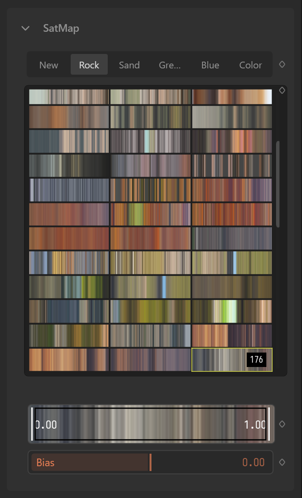<figcaption></figcaption></figure>

This tech was originally pioneered by QuadSpinner for GeoGlyph in 2014, Gaea's latest iteration provides an extensive library covering all natural locations, giving you a vast playground for colorizing your terrains.

<figure>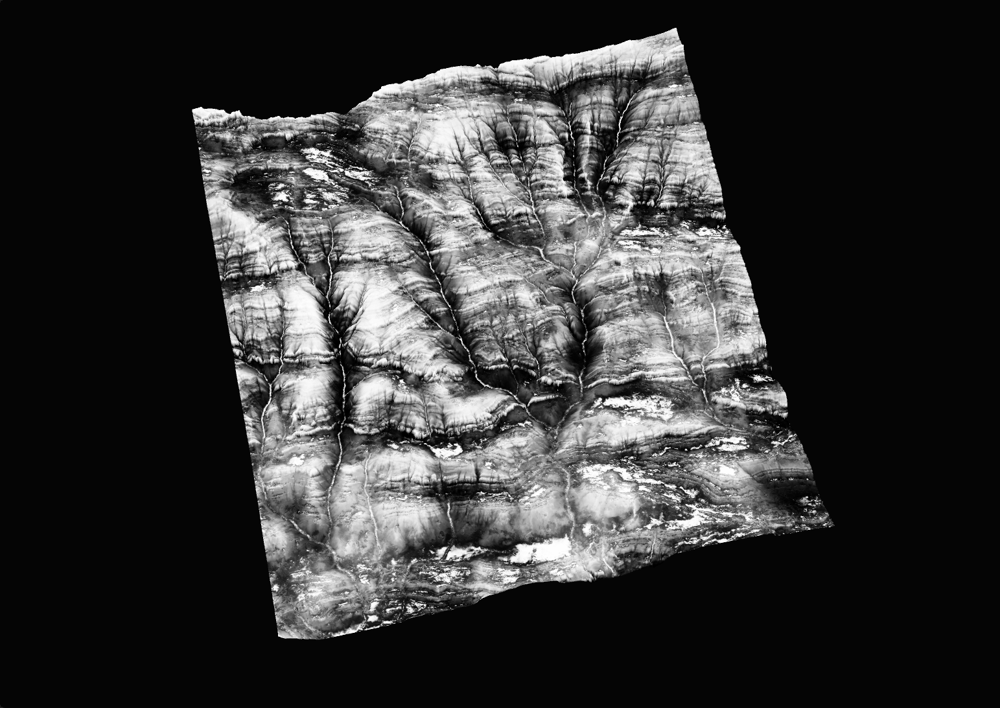<figcaption></figcaption></figure> <figure>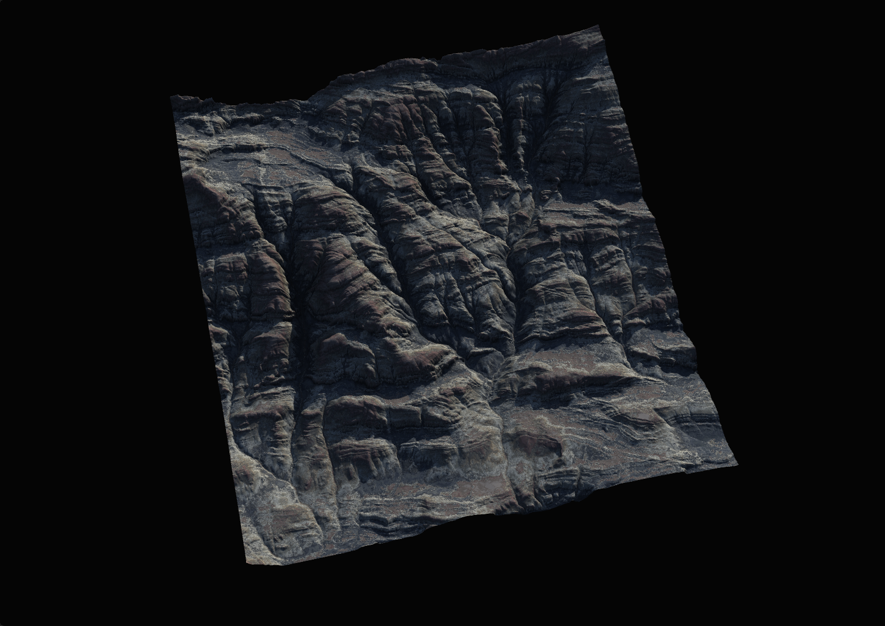<figcaption></figcaption></figure>

This TextureMap node is attached to a SatMap node. The SatMap is adapted to the mask as described in [crafting-masks.md](crafting-masks.md "mention").

## Editing SatMaps

There a few ways to quickly tweak the SatMaps to better fit your needs.

### Map Bias

By moving the Bias slider, you can have the SatMap apply more towards the left (negative values) or right (positive values) of the selected Color Map.

| 
<figure>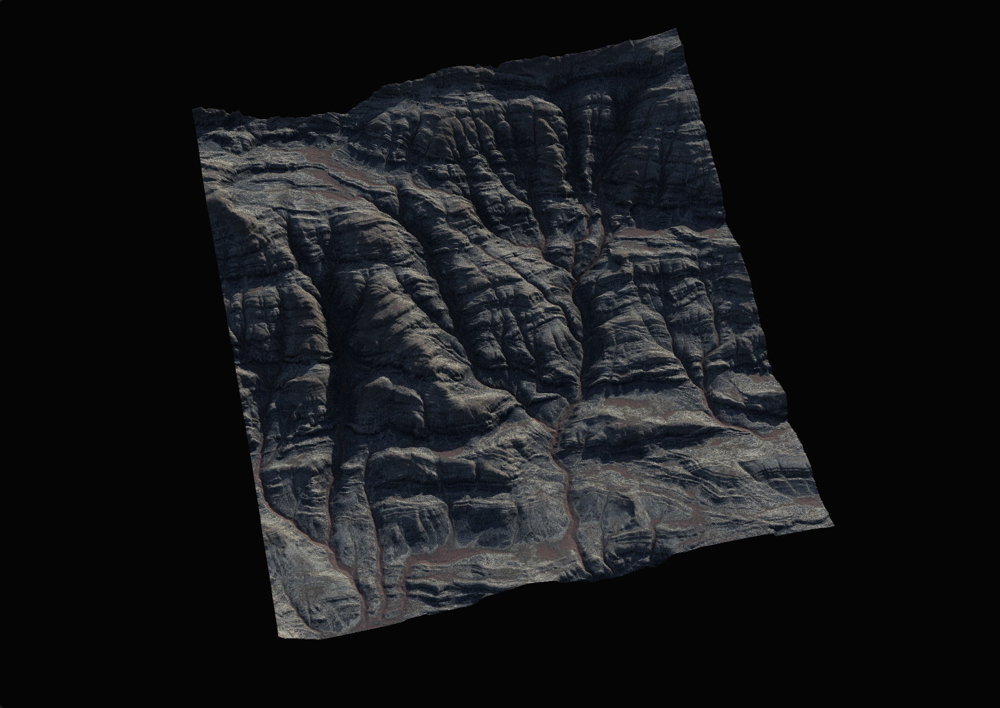<figcaption></figcaption></figure>
 | 
<figure>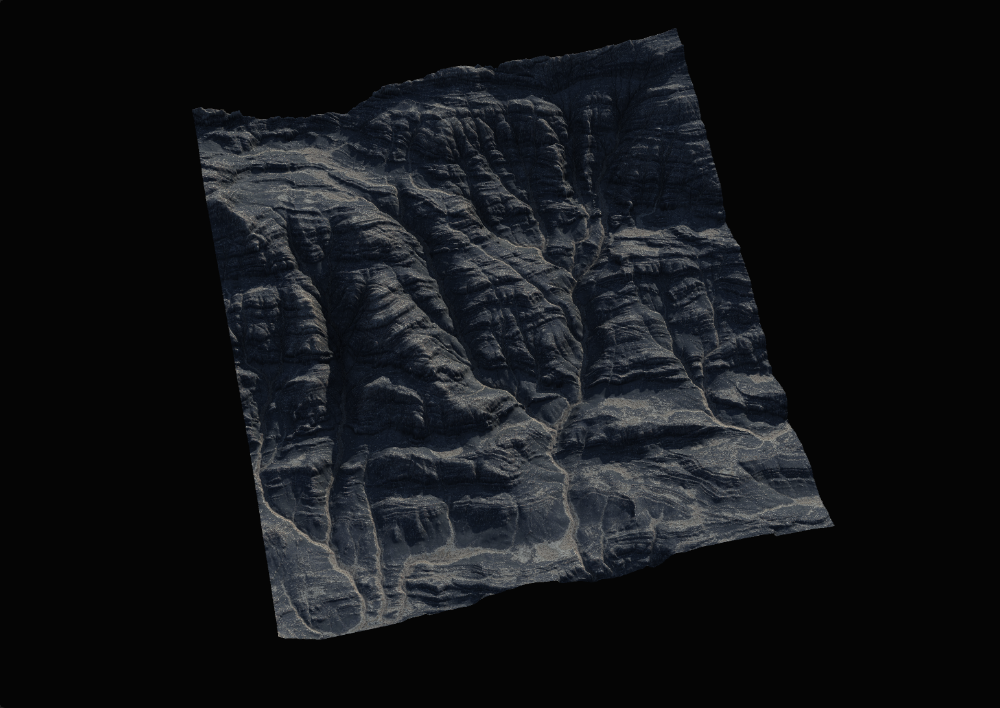<figcaption></figcaption></figure>
 | 
<figure>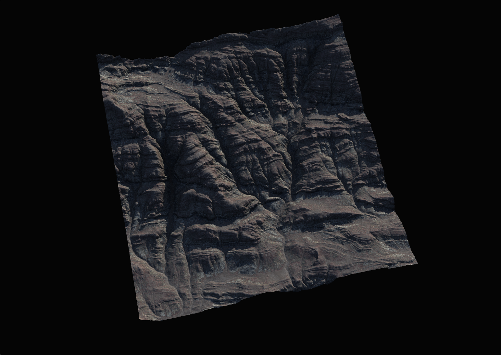<figcaption></figcaption></figure>
 |
| ----------------------------------------------------------------------------------------------------------------------------- | ----------------------------------------------------------------------------------------------------------------------------- | ----------------------------------------------------------------------------------------------------------------------------- |
| 
<figure>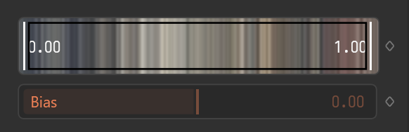<figcaption></figcaption></figure>
            | 
<figure>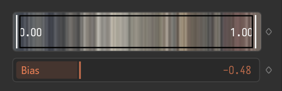<figcaption></figcaption></figure>
             | 
<figure>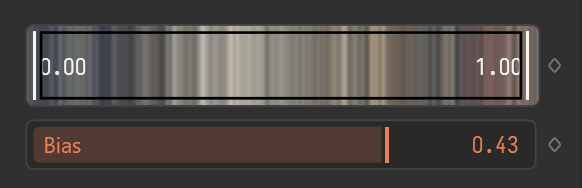<figcaption></figcaption></figure>
            |

### Map Clipping

You can use the Clip slider to tell SatMaps to only use the selected segment of the entire color map.

<figure>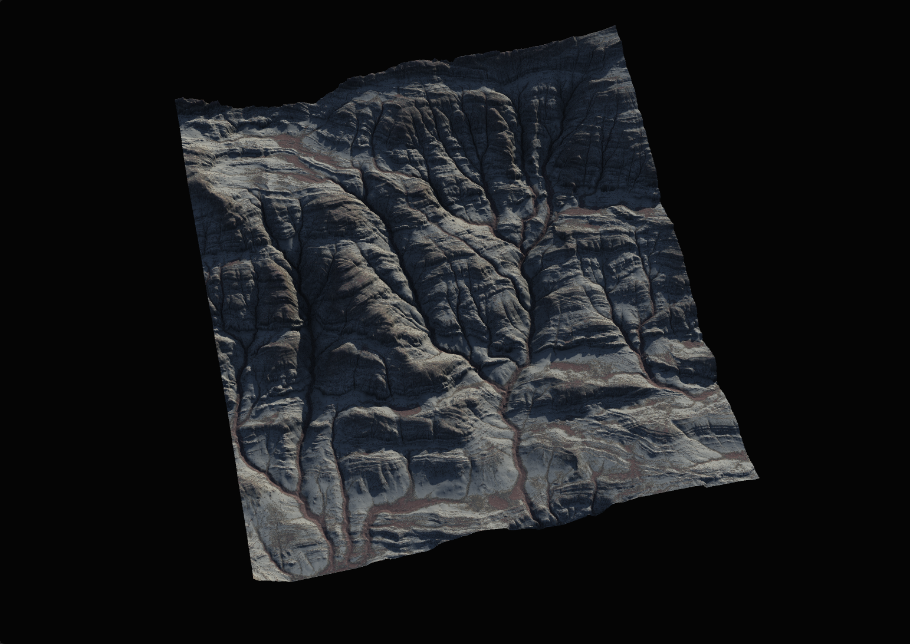<figcaption></figcaption></figure>

<figure>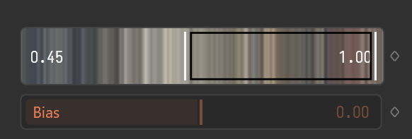<figcaption></figcaption></figure>

Here, we clip out most of the left half of the color map, and you can see how that changes the influence of the color map on the terrain.

#### Roughness

The Roughness setting scatters the pixels of the color map to add the desired level of chaos and distortion.

<figure><figcaption></figcaption></figure> <figure><figcaption></figcaption></figure> <figure><figcaption></figcaption></figure> <figure>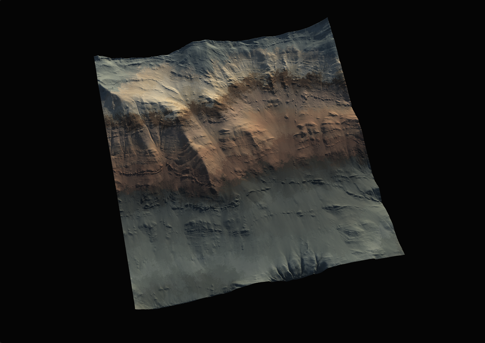<figcaption></figcaption></figure> <figure><figcaption></figcaption></figure>

#### HSL

The final tweaks come from Hue/Saturation/Luminosity editing.

***

SatMaps are one of the crucial aspects of colorizing your terrains. You can elevate your SatMaps by combining them with a Mixer as explained in [layering-textures.md](layering-textures.md "mention").

And finally, add [colorerosion.md](colorerosion.md "mention") to add a new level of realism to your texture maps.
