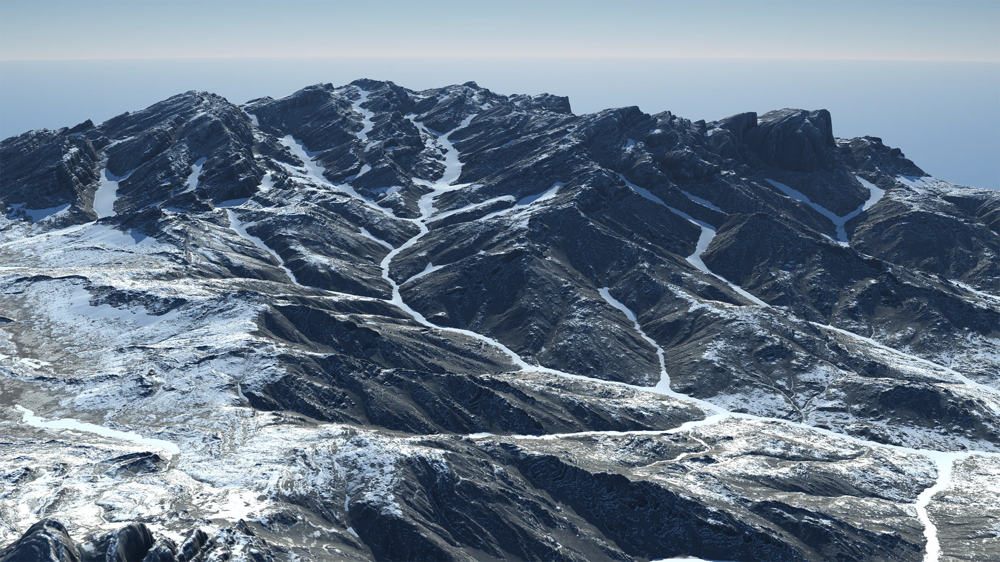

# Erosion

<figure><figcaption></figcaption></figure>

Erosion is the key simulation that helps you transform your terrain from a fractal noise or basic geometric shape (or even a complex shape) into a believable, realistic terrain.

Gaea's simulations of natural processes are the cornerstone of creating rich, believable digital terrains.

Creating simple erosion can give you great terrains, especially when powered by Erosion\_2. However, you can take it several levels further. Creating multiple erosion passes and infusing different processes in between, lets you create very complex visuals.

See [understanding-erosion](../understanding-erosion/ "mention") and [erosion\_2](../understanding-erosion/erosion_2/ "mention").

## **Erosion vs. Wizard**

Gaea gives you 2 ways to use our hydraulic erosion simulation process: the Erosion node, which provides absolute control over every aspect, or the Wizard node which offers easier access to the major aspects. Both use the same simulation underneath, but provide different interfaces. Both have pros and cons.

Erosion provides access to all the simulation controls, but it can take some time to find the sweet spot for many different settings. Wizard, on the other hand, offers fewer, easier choices and various "recipes" for creating different types of results, but it does not allow you to fine tune your results.

If you need the erosion effect, but don't want to art direct every tiny aspect, then Wizard is the perfect node. Even for experts, it is a quick and simple way to add erosion in your graph.

If you need precise control over different aspects of erosion and want to fine tune downcutting or deposits, then Erosion is the perfect node for your situation.

Selective Processing is only available in Erosion. However, common uses of Selective Erosion, such as eroding just the top to create channels or rivers, are provided as `Phase 2` options in Wizard.

| Feature                             | Erosion  | Wizard   |
| ----------------------------------- | -------- | -------- |
| Gaea's signature erosion simulation | Yes      | Yes      |
| Control over the erosion            | Complete | Limited  |
| Ease of Use                         | Limited  | Complete |
| Selective Processing                | Yes      | No       |
| Data Map Output                     | Yes      | Yes      |
| Built-in multi-pass erosion         | No       | Yes      |

We recommend using both to understand how they will benefit your personal process.

