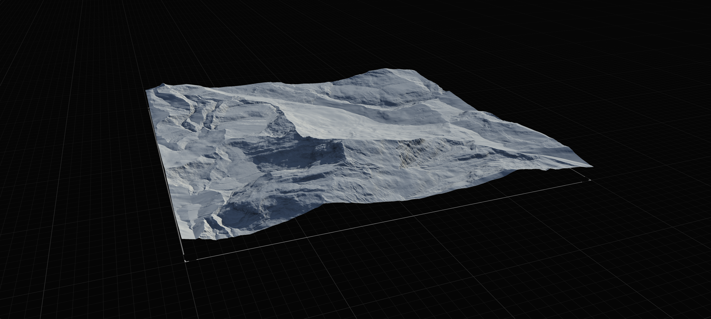
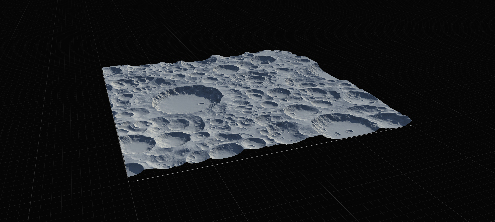

# Noises, Primitives, and Landscapes

Gaea provides three types of building blocks:

* Basic Primitives: Noises, Constants, File Inputs, Shapes.
* Geological Primitives: Standalone Mountains, Hills, Craters, etc.
* Landscapes: Mountain Ranges, Fields, Ridge Lines, Rolling Hills, etc.

## Building with Geological Primitives

The Geological Primitives and Landscapes are designed to provide fairly rudimentary yet clearly defined geological shapes to help you quickly establish a terrain. While you have the ability to wrangle Noises and Gradients/Shapes into various terrain-like shapes, these primitives provide a more efficient and friendly way of crafting terrains.

<figure><figcaption></figcaption></figure>

Landscapes help create the "ground", while the Primitives help create standalone features that can be placed on the ground, or sometimes be used by themselves to create free-standing assets.

<figure><figcaption></figcaption></figure>

Both Landscapes and Primitives will have some level of natural processing built-in, such as Erosion, and will mostly have the option to turn it off as well. However, these are meant only as a starting point. You will need to add proper [erosion.md](erosion.md "mention") and possibly other [surface-nodes.md](surface-nodes.md "mention") to turn it into a more realistic environment.

## Basic Primitives

Basic Primitives, while being deceptively simple, are foundational components of Gaea. They provide low-level access to shape generation that can be used to create both precise shapes - whether geometric or naturalistic - or create randomness that can mimic nature.

<figure><figcaption></figcaption></figure>

Advanced users will be able to craft complex outputs from these primitives.
