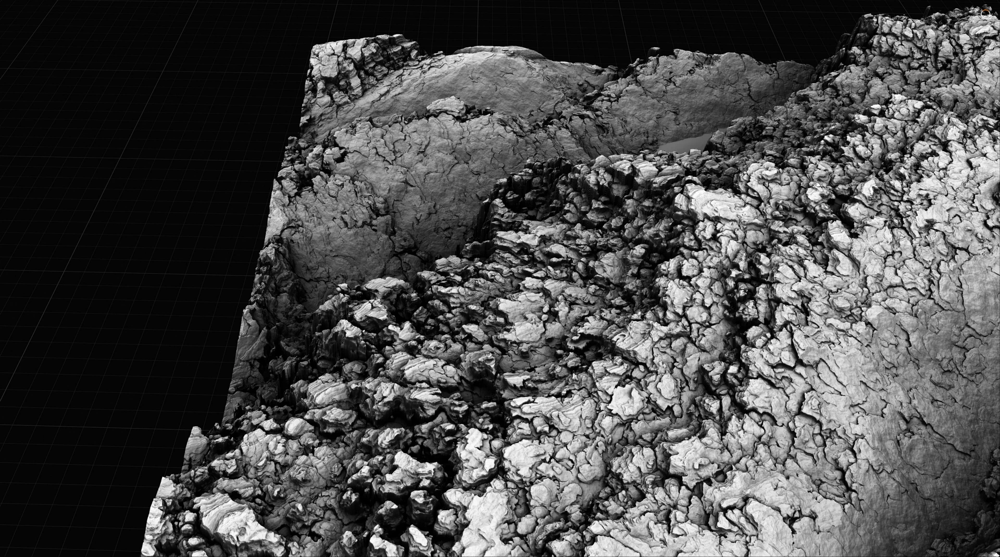
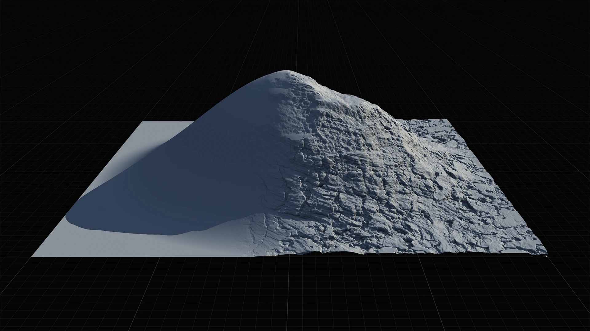
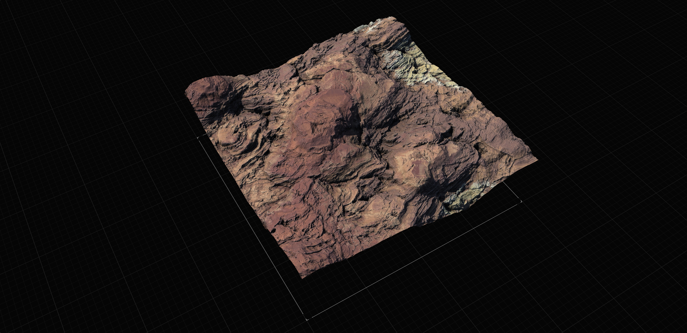
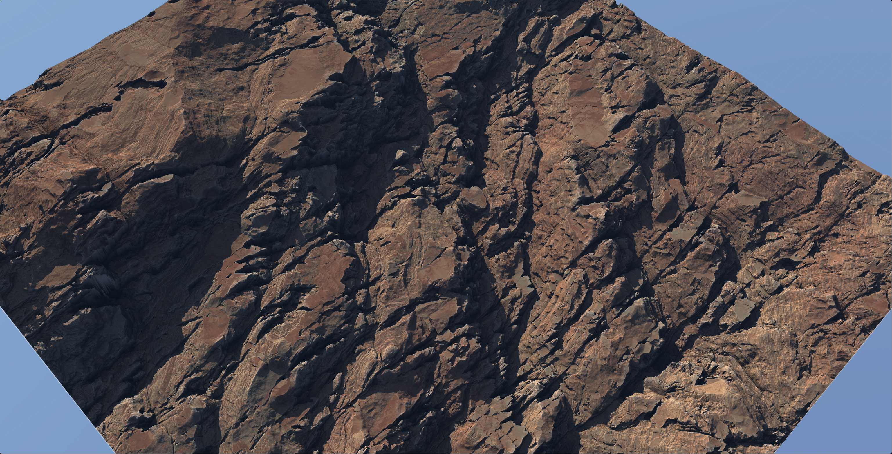
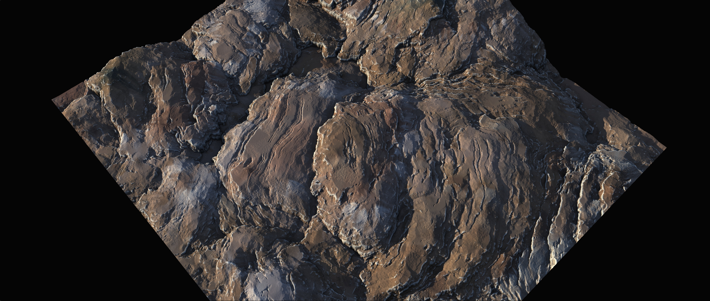
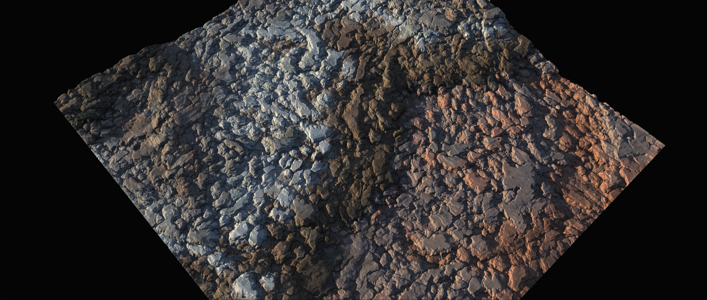
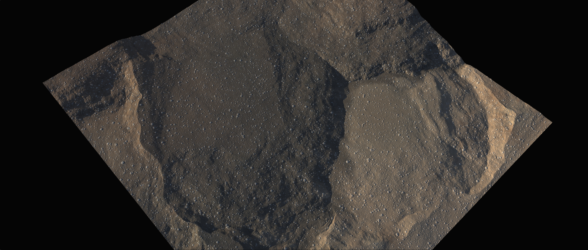

# Surface Nodes

## Surface Modification Tools

Terrain design has been plagued with a core issue for decades: when you erode a terrain or apply a strong effect filter, the overall terrain shape is diminished (sometimes even completely destroyed).

Gaea 2.0 introduces Surface Nodes, and as the name implies, they work on the surface level. They add and subtract shapes at the surface and avoid affecting the deeper structure of your shape.

Surface Nodes come in a large variety - from rock formations to simple superficial effects - and boast powerful realism coupled with volume preservation.

<figure><figcaption></figcaption></figure>

### Volume Preservation

Gaea's Surface tools separate the process of designing the overall terrain shape (or volume) and designing the superficial shapes on the surface.

<figure><figcaption></figcaption></figure>

This allows you to modify the surface without altering the overall shape, volume, or silhouette of the terrain - which is crucial when you already have the asset in your scene yet need to modify it.

## Sandstone, Limestone, and Generic Layering

Gaea takes terrain design towards new horizons by introducing key tools for sandstone, limestone, and generic rock layers that promote mechanical breakage as opposed to softer, sedimentary flow.

<figure><figcaption></figcaption></figure>

**Stratify** is a high-level node that provides large scale stratification, tilt, and uplift. It can be used for larger shaping.

**Sandstone** is a versatile node that works on both small and medium scale to add multi-level detail through multiple passes while also chipping the rock and excising large chunks as mechanical erosion. Sandstone can also create staggered stairstep patterns quite common in nature. This pseudo-self-similar repetition is the hallmark of such rock formations.

<figure><figcaption></figcaption></figure>

**FractalTerraces** provides a more low-level approach to stratification and tilting, giving you more primary control. This is useful when you want to achieve direct control over the erosion through a complex graph and don't want _Stratify_ or _Sandstone_ to introduce too many features into your terrain directly.

Creating a complex rock formation such as the one pictured above is quite easy. You simply create a sequence of `Stratify > Sandstone > Stratify > Sandstone`, or even simply `Stratify > Sandstone > Sandstone`. Experiment with multiple passes for Sandstone and varying heights for each node.


If you want to add more breakup to your shapes, introduce Erosion or one of the Rock nodes before you apply stratification.


## Rocky Nodes

The Rocky family of nodes provides powerful rock "growth" on your existing terrain shape.

**Outcrops** can help you turn any surface into a powerful, rugged, large-scale rock formation.

<figure><figcaption></figcaption></figure>

**Craggy** can help you turn any surface into a fragmented field of rocks.

<figure><figcaption></figcaption></figure>

**Stones** helps add small, superficial stones to the surface. These are random, and not physically driven like [debris.md](../simulations/debris.md "mention").

<figure><figcaption></figcaption></figure>

There are several other nodes in the Surface family that provide other functionality.

