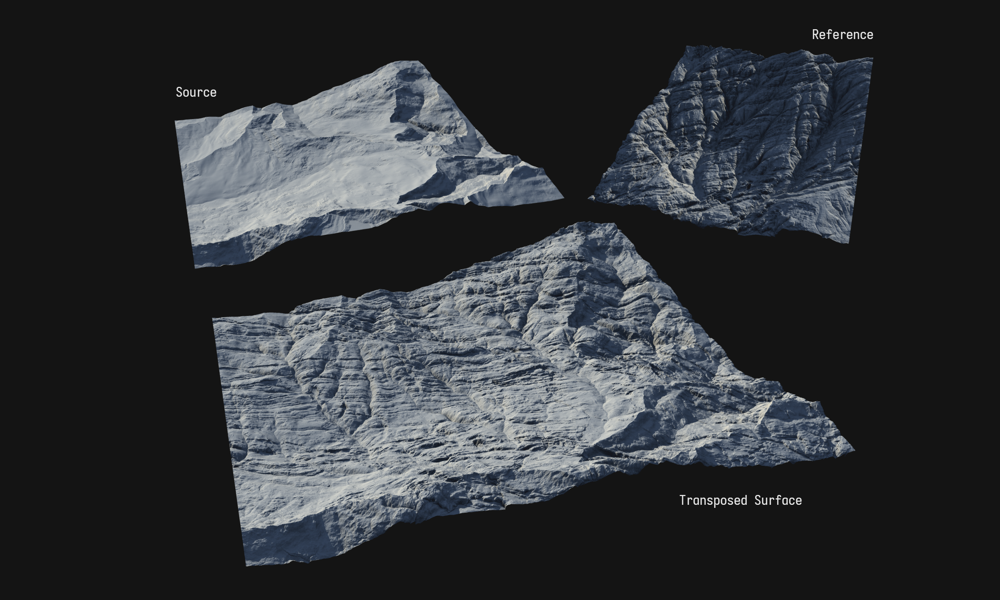

# Transpose Shapes

The Transpose node can take the surface shapes of one terrain and transpose them onto another, while preserving the volume of the target terrain.

You can create an terrain surface that you like, regardless of the shape it is built upon. Then create or bring in a terrain shape you like - an Unreal Engine drawn terrain, a ZBrush sculpted landscape, or even a full 3D model1. Then simply Tranpose the surface.

<figure><figcaption></figcaption></figure>

