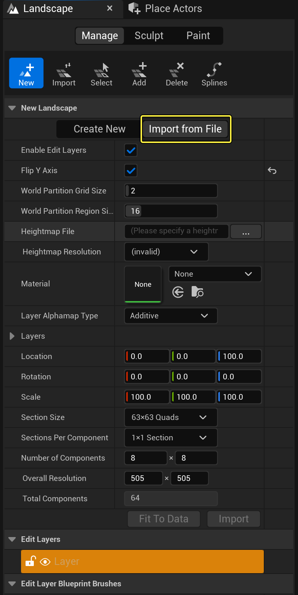

# Unreal

The easiest way to import a Gaea terrain into Unreal Engine is to use the [gaea2unreal](../../../plugins/gaea2unreal/ "mention") plugin.

If you wish to import it by yourself, use [unreal-node.md](../../build-and-export/application-specific-export-nodes/unreal-node.md "mention") to prepare the output to fit your terrain size as required by Unreal Engine. Then you can manually import the terrain.

<figure><figcaption></figcaption></figure>

1. Enter **Landscape** mode.
2. Click **Import from File**.
3. Click the button next to **Heightmap File** and select your heightmap.
4. Calculate the Z scale for your heightmap using the formula (Max height of your heightmap in meters) x (100 to convert to centimeters) x 0.001953125.
5. Click **Import**.


If the Z-scale calculation feels too complex or you are not getting accurate results, use the [gaea2unreal](../../../plugins/gaea2unreal/ "mention") plugin to import your terrain. Gaea will prepare these calculations and other factors for you.


You can follow the exact instructions on Unreal's official documentation:

[https://dev.epicgames.com/documentation/en-us/unreal-engine/importing-and-exporting-landscape-heightmaps-in-unreal-engine](https://dev.epicgames.com/documentation/en-us/unreal-engine/importing-and-exporting-landscape-heightmaps-in-unreal-engine)&#x20;

